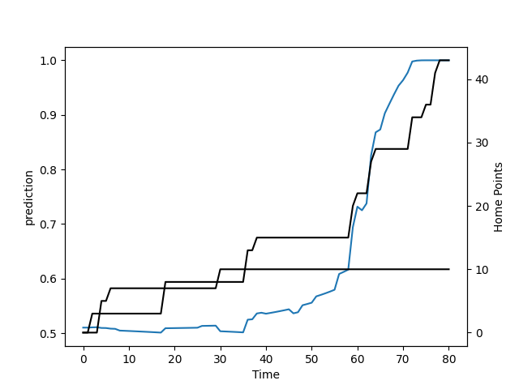

---  
layout: page  
title: Wellington at Canterbury; 10.0-43.0  
date: 2022-08-13 03:05:00 18:00:00 -0500  
categories: match review  
---
# Prediction: Canterbury by 6.8

Canterbury by 1.8 on a neutral field

# Pre-Match Prediction: Canterbury by 7.0

Canterbury by 2.0 on a neutral pitch
# Projection using minutes played for each player: Canterbury by 6.8

Canterbury by 1.8 on a neutral field

|   Away Minutes | Away Player           |   Away elo |   Away Percentile |   Number |   Home Percentile |   Home elo | Home Player       |   Home Minutes |
|---------------:|:----------------------|-----------:|------------------:|---------:|------------------:|-----------:|:------------------|---------------:|
|             70 | Xavier Numia          |      81.63 |                 7 |        1 |                64 |      98.69 | Dan Lienert-Brown |             46 |
|             66 | Asafo Aumua           |     103.25 |                73 |        2 |                14 |      85.29 | Brodie McAlister  |              8 |
|             51 | Pek Cowan             |      93.75 |                22 |        3 |                93 |     109.82 | Owen Franks       |             46 |
|             81 | James Blackwell       |      91.59 |                19 |        4 |                 9 |      78.65 | Sam Darry         |             81 |
|             56 | Dom Bird              |      99.25 |                49 |        5 |                12 |      82.62 | Zach Gallagher    |             38 |
|             81 | Caleb Delany          |      74.01 |                 0 |        6 |                79 |     100.95 | Billy Harmon      |             65 |
|             72 | Sione Halalilo        |      95.19 |                30 |        7 |                94 |     110.28 | Tom Christie      |             81 |
|             81 | Peter Lakai           |      78.93 |                 2 |        8 |                19 |      84.24 | Cullen Grace      |             81 |
|             81 | TJ Perenara           |     109.91 |                88 |        9 |                94 |     112.33 | Mitch Drummond    |             42 |
|             76 | Jackson Garden-Bachop |      94.29 |                25 |       10 |                16 |      83.97 | Fergus Burke      |             76 |
|             66 | Pepesana Patafilo     |      76.78 |                 1 |       11 |                98 |     119.49 | George Bridge     |             81 |
|             66 | Peter Umaga-Jensen    |      95.63 |                32 |       12 |                 7 |      76.79 | Rameka Poihipi    |             81 |
|             68 | Billy Proctor         |      97.47 |                38 |       13 |                18 |      84.46 | Dallas McLeod     |             81 |
|             81 | Julian Savea          |     123.77 |                98 |       14 |                83 |     103.14 | Manasa Mataele    |             65 |
|             81 | Ruben Love            |      87.67 |                18 |       15 |                26 |      89.63 | Chay Fihaki       |             81 |
|             11 | Solomona Sakalia      |     101.55 |                73 |       17 |                13 |      84.23 | Finlay Brewis     |             35 |
|             30 | PJ Sheck              |      78.26 |                 3 |       18 |                90 |     108.45 | Oli Jager         |             35 |
|              9 | Keelan Whitman        |      76.75 |                 3 |       20 |                12 |      83.52 | Corey Kellow      |             16 |
|              5 | Richard Judd          |     107.95 |                89 |       21 |                96 |     117.65 | Willi Heinz       |             39 |

