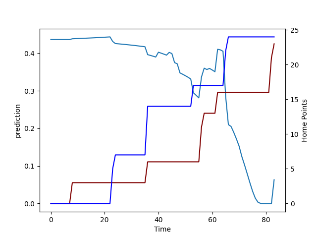

---  
layout: page  
title: Auckland at Southland; 24.0-23.0  
date: 2022-08-13 22:05:00 18:00:00 -0500  
categories: match review  
---
# Prediction: Auckland by 6.1

Auckland by 11.1 on a neutral field

# Pre-Match Prediction: Auckland by 5.3

Auckland by 10.3 on a neutral pitch
# Projection using minutes played for each player: Auckland by 6.1

Auckland by 11.1 on a neutral field

|   Away Minutes | Away Player     |   Away elo |   Away Percentile |   Number |   Home Percentile |   Home elo | Home Player      |   Home Minutes |
|---------------:|:----------------|-----------:|------------------:|---------:|------------------:|-----------:|:-----------------|---------------:|
|             40 | Alex Hodgman    |     104.69 |                82 |        1 |                18 |      88.35 | Joe Walsh        |             66 |
|             59 | Leni Apisai     |      90.94 |                18 |        2 |                 8 |      79.72 | Jacob Payne      |             44 |
|             67 | Marcel Renata   |     100.08 |                53 |        3 |                22 |      90.72 | Morgan Mitchell  |             66 |
|             64 | Jamie Lane      |      99.99 |                55 |        4 |                 8 |      79.6  | Caleb Aperahama  |             52 |
|             83 | Connor Vest     |      77.68 |                 1 |        5 |                22 |      88.93 | Josh Bekhuis     |             83 |
|             83 | Blake Gibson    |     101    |                61 |        6 |                17 |      81.03 | Grayson Knapp    |             83 |
|             83 | Adrian Choat    |      83.32 |                14 |        7 |                13 |      79.26 | Hayden Michaels  |             83 |
|             59 | Jackson Pugh    |      81.03 |                 8 |        8 |                14 |      80.81 | Arese Poliko     |             46 |
|             80 | Taufa Funaki    |      78.14 |                 1 |        9 |                65 |      98.22 | Jahvis Wallace   |             71 |
|             83 | Harry Plummer   |     115.18 |                93 |       10 |                69 |      98.77 | Marty Banks      |             83 |
|             83 | Salesi Rayasi   |     107.07 |                83 |       11 |                 0 |      71.33 | Rory van Vugt    |             62 |
|             48 | Corey Evans     |      81.62 |                11 |       12 |                16 |      82.48 | Scott Gregory    |             83 |
|             83 | AJ Lam          |      79.86 |                 4 |       13 |                 1 |      73.27 | Isaac Te Tamaki  |             83 |
|             83 | Tomas Aoake     |      98.72 |                45 |       14 |                10 |      78.14 | Viliami Fine     |             83 |
|             46 | Zarn Sullivan   |      81.93 |                11 |       15 |                92 |     111.39 | Solomon Alaimalo |             66 |
|             19 | Hamish Dalzell  |     103.38 |                78 |       19 |                 6 |      79.13 | Joe Robins       |             31 |
|             24 | Vaiolini Ekuasi |      80.12 |                 9 |       20 |                 4 |      77.29 | Charles Alaimalo |             37 |
|             35 | Simon Hickey    |     115.87 |                95 |       22 |                29 |      93.61 | Greg Dyer        |             17 |
|             37 | Jordan Trainor  |     112.45 |                92 |       23 |                 9 |      79.6  | Matt Whaanga     |             21 |

