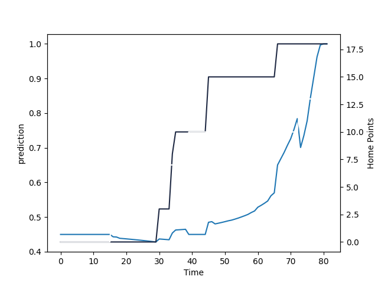

---  
layout: page  
title: Hawke's Bay at Otago; 13.0-18.0  
date: 2022-08-17 03:05:00 18:00:00 -0500  
categories: match review  
---
# Prediction: Hawke's Bay by 3.8

Hawke's Bay by 8.8 on a neutral field

# Pre-Match Prediction: Hawke's Bay by 2.3

Hawke's Bay by 7.3 on a neutral pitch
# Projection using minutes played for each player: Hawke's Bay by 3.8

Hawke's Bay by 8.8 on a neutral field

|   Away Minutes | Away Player     |   Away elo |   Away Percentile |   Number |   Home Percentile |   Home elo | Home Player            |   Home Minutes |
|---------------:|:----------------|-----------:|------------------:|---------:|------------------:|-----------:|:-----------------------|---------------:|
|             64 | Mark Braidwood  |      82.92 |                43 |        1 |                66 |      89.11 | Josh Hohneck           |             58 |
|             64 | Tyrone Thompson |      78.11 |                16 |        2 |                50 |      80.82 | Ricky Jackson          |             55 |
|             52 | Joe Apikotoa    |      82.06 |                48 |        3 |                50 |      81.23 | Saula Mau              |             58 |
|             76 | Bryn Evans      |     125.06 |                99 |        4 |                59 |      83.37 | Fabian Holland         |             81 |
|             81 | Tom Parsons     |      86.13 |                56 |        5 |                37 |      78.06 | Josh Hill              |             81 |
|             47 | Sione Tuipulotu |      63.36 |                 1 |        6 |                52 |      80.47 | Samuel Fischli         |             72 |
|             81 | Josh Kaifa      |      81.65 |                36 |        7 |                58 |      82.18 | Sean Withy             |             81 |
|             81 | Devan Flanders  |      85.7  |                56 |        8 |                42 |      79.15 | Rupeni Tamani          |             67 |
|             76 | Ere Enari       |      75.62 |                 8 |        9 |                47 |      80.62 | James Arscott          |             60 |
|             81 | Caleb Makene    |      90.16 |                62 |       10 |                53 |      81.64 | Cameron Millar         |             67 |
|             69 | Lolagi Visinia  |      85.11 |                56 |       11 |                36 |      75.32 | Vilimoni Koroi         |             80 |
|             81 | Nick Grigg      |      77.27 |                14 |       12 |                36 |      77.7  | Ray Nu'u               |             81 |
|             64 | Stacey Ili      |      94.94 |                75 |       13 |                 9 |      69.21 | Josh Timu              |             81 |
|             81 | Ollie Sapsford  |      85.62 |                56 |       14 |                28 |      74.69 | Freedom Vahaakolo      |             81 |
|             81 | Harry Godfrey   |      80    |                23 |       15 |                12 |      70.57 | Josh Ioane             |             81 |
|             29 | Joel Hintz      |      83.26 |                52 |       18 |                49 |      80.8  | Tau Koloamatangi       |             23 |
|             34 | Will Tremain    |      78.33 |                28 |       20 |                60 |      82.84 | Oliver Haig            |             23 |
|              5 | Connor McLeod   |      79    |                36 |       21 |                69 |      91.15 | Kemara Hauiti-Parapara |             21 |
|             17 | Kienan Higgins  |      82.15 |                47 |       22 |                57 |      84.64 | Sam Gilbert            |             14 |

