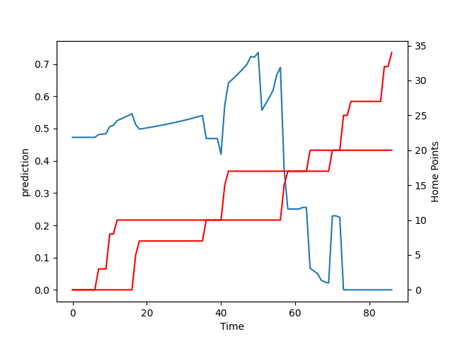

---  
layout: page  
title: Waikato at Counties Manukau; 34.0-20.0  
date: 2022-08-19 03:05:00 18:00:00 -0500  
categories: match review  
---
# Prediction: Counties Manukau by 0.3

Waikato by 4.7 on a neutral field

# Pre-Match Prediction: Waikato by 2.4

Waikato by 2.6 on a neutral pitch
# Projection using minutes played for each player: Counties Manukau by 0.3

Waikato by 4.7 on a neutral field

|   Away Minutes | Away Player          |   Away elo |   Away Percentile |   Number |   Home Percentile |   Home elo | Home Player        |   Home Minutes |
|---------------:|:---------------------|-----------:|------------------:|---------:|------------------:|-----------:|:-------------------|---------------:|
|             49 | Rob Cobb             |      74.67 |                12 |        1 |                 2 |      71.43 | Ezekiel Lindenmuth |             55 |
|             51 | Pita Anae Ah-Sue     |      80.3  |                46 |        2 |                43 |      81.72 | Zuriel Togiatama   |             36 |
|             62 | Sosefo Kautai        |      82.69 |                55 |        3 |                72 |      94.63 | Nepo Laulala       |             40 |
|             72 | Hamilton Burr        |      77.63 |                33 |        4 |                37 |      81.55 | William Furniss    |             58 |
|             86 | Laghlan McWhannell   |      92.49 |                73 |        5 |                 4 |      72.63 | Sam Slade          |             86 |
|             51 | Samipeni Finau       |      86.01 |                64 |        6 |                90 |     104.17 | Dalton Papalii     |             86 |
|             86 | Mitchell Jacobson    |      75.13 |                20 |        7 |                74 |      95.08 | Sean Reidy         |             86 |
|             86 | Te Rama Reuben       |      80.53 |                50 |        8 |                72 |      95.09 | Hoskins Sotutu     |             67 |
|             48 | Rhys Dickinson       |      80.97 |                46 |        9 |                49 |      84.56 | Cam Roigard        |             67 |
|             86 | Damian McKenzie      |      97.74 |                86 |       10 |                19 |      78.66 | Riley Hohepa       |             86 |
|             86 | Mosese Dawai         |      88.99 |                70 |       11 |                28 |      79.48 | Peniasi Malimali   |             58 |
|             69 | D'Angelo Leuila      |      84.19 |                58 |       12 |                36 |      82.06 | AJ Alatimu         |             86 |
|             86 | Bailyn Sullivan      |      76.13 |                28 |       13 |                 0 |      65.07 | Nikolai Foliaki    |             86 |
|             79 | Daniel Sinkinson     |      79.4  |                46 |       14 |                 4 |      72.47 | Jared Page         |             86 |
|             86 | Liam Coombes-Fabling |      82.67 |                52 |       15 |                 3 |      71.76 | Etene Nanai-Seturo |             69 |
|             38 | Xavier Roe           |      76.57 |                18 |       21 |                38 |      79.2  | Liam Daniela       |             19 |

