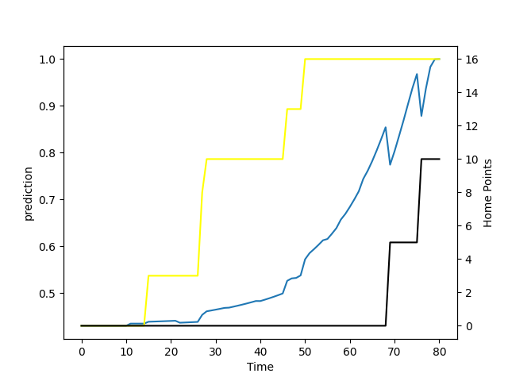

---  
layout: page  
title: Canterbury at Taranaki; 10.0-16.0  
date: 2022-08-19 22:05:00 18:00:00 -0500  
categories: match review  
---
# Prediction: Canterbury by 7.2

Canterbury by 12.2 on a neutral field

# Pre-Match Prediction: Canterbury by 6.9

Canterbury by 11.9 on a neutral pitch
# Projection using minutes played for each player: Canterbury by 7.2

Canterbury by 12.2 on a neutral field

|   Away Minutes | Away Player       |   Away elo |   Away Percentile |   Number |   Home Percentile |   Home elo | Home Player            |   Home Minutes |
|---------------:|:------------------|-----------:|------------------:|---------:|------------------:|-----------:|:-----------------------|---------------:|
|             65 | Dan Lienert-Brown |      80.21 |                23 |        1 |                25 |      76.01 | Jared Proffit          |             71 |
|             33 | Shilo Klein       |      80.54 |                35 |        2 |                26 |      76.12 | Ricky Riccitelli       |             58 |
|             58 | Oli Jager         |      93.5  |                68 |        3 |                 4 |      71.25 | Donald Brighouse       |             38 |
|             51 | Luke Romano       |      90.87 |                62 |        4 |                12 |      72.04 | Jesse Parete           |             82 |
|             82 | Sam Darry         |      78.67 |                15 |        5 |                57 |      84.16 | Mitch Brown            |             59 |
|             82 | Billy Harmon      |      83.06 |                41 |        6 |                23 |      75.04 | Kaylum Boshier         |             82 |
|             63 | Tom Christie      |      98.63 |                80 |        7 |                41 |      77.64 | Michael Loft           |             82 |
|             82 | Cullen Grace      |      88.11 |                57 |        8 |                59 |      83.79 | Pita Gus Sowakula      |             64 |
|             48 | Mitch Drummond    |      95.09 |                71 |        9 |                58 |      85.08 | Liam Blyde             |             49 |
|             82 | Fergus Burke      |      80.44 |                25 |       10 |                46 |      78.98 | Jayson Potroz          |             72 |
|             82 | George Bridge     |     106.46 |                92 |       11 |                62 |      84.4  | Vereniki Tikoisolomone |             55 |
|             82 | Rameka Poihipi    |      79.96 |                22 |       12 |                10 |      70.9  | Teihorangi Walden      |             82 |
|             82 | Dallas McLeod     |      85.52 |                49 |       13 |                61 |      84.8  | Daniel Rona            |             82 |
|             40 | Willi Gualter     |      81.13 |                39 |       14 |                43 |      78.05 | Meihana Grindlay       |             82 |
|             82 | Chay Fihaki       |      90.46 |                59 |       15 |                81 |      95.19 | Stephen Perofeta       |             82 |
|             24 | Owen Franks       |      93.48 |                71 |       18 |                33 |      79.15 | Kyle Stewart           |             44 |
|             34 | Willi Heinz       |     102.81 |                85 |       21 |                17 |      76.35 | Logan Crowley          |             33 |
|             42 | Braydon Ennor     |      86    |                55 |       23 |                20 |      77.23 | Adam Lennox            |             10 |

