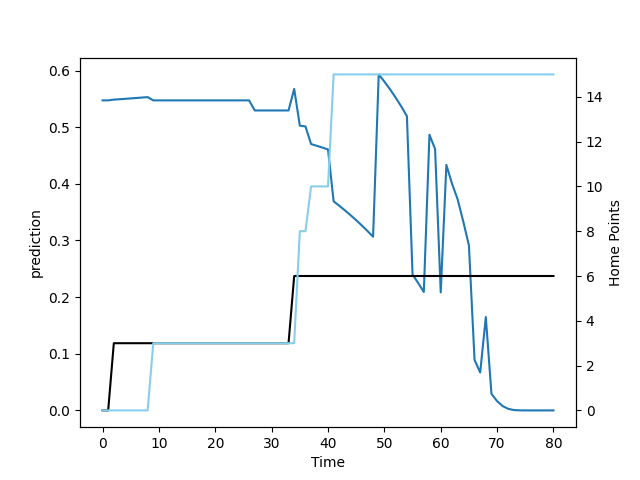

---  
layout: page  
title: Northland at Wellington; 15.0-6.0  
date: 2022-08-19 22:05:00 18:00:00 -0500  
categories: match review  
---
# Prediction: Wellington by 13.3

Wellington by 8.3 on a neutral field

# Pre-Match Prediction: Wellington by 9.0

Wellington by 4.0 on a neutral pitch
# Projection using minutes played for each player: Wellington by 13.3

Wellington by 8.3 on a neutral field

|   Away Minutes | Away Player           |   Away elo |   Away Percentile |   Number |   Home Percentile |   Home elo | Home Player           |   Home Minutes |
|---------------:|:----------------------|-----------:|------------------:|---------:|------------------:|-----------:|:----------------------|---------------:|
|             27 | Ross Wright           |      77.34 |                20 |        1 |                63 |      88.3  | Xavier Numia          |             77 |
|             61 | Matt Moulds           |      74.27 |                11 |        2 |                74 |      95.08 | Asafo Aumua           |             49 |
|             58 | Ofa Tu'ungafasi       |      96.19 |                79 |        3 |                58 |      85.44 | Pek Cowan             |             55 |
|             63 | Allan Craig           |      80    |                48 |        4 |                20 |      77.69 | James Blackwell       |             81 |
|             81 | Liam Hallam-Eames     |      70.99 |                 7 |        5 |                 3 |      69.36 | Caleb Delany          |             81 |
|             81 | Rob Rush              |      76.49 |                38 |        6 |                11 |      77.79 | Keelan Whitman        |             81 |
|             68 | Jonah Mau'u           |      79.21 |                48 |        7 |                70 |      91.14 | Du'Plessis Kirifi     |             81 |
|             81 | Sam McNamara          |      74.51 |                24 |        8 |                 8 |      75.33 | Peter Lakai           |             69 |
|             63 | Sam Nock              |      75.4  |                14 |        9 |                54 |      84.54 | Richard Judd          |             55 |
|             49 | Rivez Reihana         |      76.61 |                23 |       10 |                 5 |      71.64 | Jackson Garden-Bachop |             60 |
|             81 | Heremaia Murray       |      78.3  |                47 |       11 |                 3 |      70.08 | Nehe Milner-Skudder   |             81 |
|             81 | Jack Goodhue          |     107.51 |                96 |       12 |                21 |      77.53 | Peter Umaga-Jensen    |             66 |
|             55 | Rene Ranger           |      83.67 |                53 |       13 |                57 |      85.77 | Billy Proctor         |             81 |
|             81 | Jone Macilai-Tori     |      83.98 |                61 |       14 |                92 |     103.7  | Julian Savea          |             81 |
|             81 | Joshua Moorby         |      70.94 |                 5 |       15 |                24 |      78.95 | Connor Garden-Bachop  |             81 |
|             20 | Bruce Kauika-Petersen |      78.1  |                27 |       16 |                98 |     112.67 | Dane Coles            |             32 |
|             54 | Jarred Adams          |      87.46 |                64 |       17 |                58 |      84.65 | Solomona Sakalia      |              4 |
|             23 | Coree Te Whata-Colley |      74.05 |                 7 |       18 |                22 |      76.92 | PJ Sheck              |             26 |
|             13 | Matt Polwart-Matich   |      85.03 |                61 |       20 |                 8 |      73.36 | Sione Halalilo        |             12 |
|             18 | Lisati Milo-Harris    |      72.03 |                 5 |       21 |                68 |      92.36 | TJ Perenara           |             26 |
|             32 | Daniel Hawkins        |      63.23 |                 0 |       22 |                63 |      88.58 | Ruben Love            |             21 |
|             26 | Tamati Tua            |      87.58 |                63 |       23 |                37 |      79.31 | Pepesana Patafilo     |             15 |

