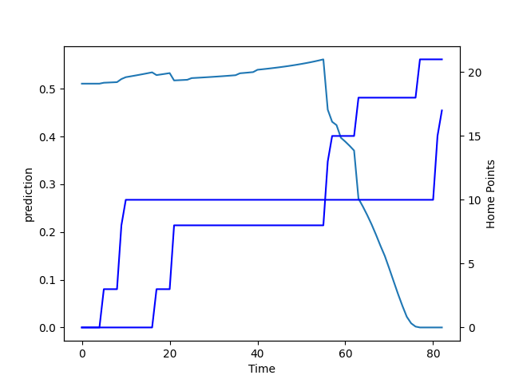

---  
layout: page  
title: Bay of Plenty at Auckland; 21.0-17.0  
date: 2022-08-20 22:05:00 18:00:00 -0500  
categories: match review  
---
# Prediction: Auckland by 5.5

Auckland by 0.5 on a neutral field

# Pre-Match Prediction: Auckland by 4.6

Bay of Plenty by 0.4 on a neutral pitch
# Projection using minutes played for each player: Auckland by 5.5

Auckland by 0.5 on a neutral field

|   Away Minutes | Away Player            |   Away elo |   Away Percentile |   Number |   Home Percentile |   Home elo | Home Player         |   Home Minutes |
|---------------:|:-----------------------|-----------:|------------------:|---------:|------------------:|-----------:|:--------------------|---------------:|
|             40 | Aidan Ross             |      88.66 |                65 |        1 |                65 |      90.67 | Alex Hodgman        |             59 |
|             57 | Kurt Eklund            |      99.68 |                87 |        2 |                 4 |      71.84 | Leni Apisai         |             25 |
|             67 | Tevita Mafileo         |      85.35 |                61 |        3 |                56 |      86.27 | Marcel Renata       |             67 |
|             36 | Justin Sangster        |      77.21 |                25 |        4 |                16 |      78.31 | Connor Vest         |             82 |
|             82 | Manaaki Selby-Rickit   |      66.82 |                 3 |        5 |                48 |      83.84 | Hamish Dalzell      |             59 |
|             82 | Naitoa Ah Kuoi         |      83    |                61 |        6 |                35 |      80.93 | Vaiolini Ekuasi     |             64 |
|             82 | Jacob Norris           |      97.83 |                86 |        7 |                32 |      80.81 | Adrian Choat        |             82 |
|             52 | Zane Kapeli            |      81.4  |                50 |        8 |                33 |      81.35 | Jackson Pugh        |             82 |
|             57 | Jamie Dobie            |      79.69 |                41 |        9 |                15 |      77.84 | Taufa Funaki        |             74 |
|             82 | Kaleb Trask            |      83.35 |                57 |       10 |                76 |      97.07 | Harry Plummer       |             74 |
|             82 | Nigel Ah Wong          |      86.38 |                66 |       11 |                79 |      98.51 | Salesi Rayasi       |             82 |
|             69 | Kaveinga Finau         |      82.36 |                52 |       12 |                 9 |      75.14 | Roger Tuivasa-Sheck |             82 |
|             82 | Joey Walton            |      88.33 |                67 |       13 |                33 |      81.03 | AJ Lam              |             74 |
|             82 | Emoni Narawa           |      88.78 |                70 |       14 |                14 |      77.37 | Tomas Aoake         |             82 |
|             57 | Gillies Kaka           |      81.93 |                50 |       15 |                71 |      96.06 | Jordan Trainor      |             82 |
|             42 | Haereiti Hetet         |      84.46 |                56 |       17 |                37 |      80.02 | Jordan Lay          |             23 |
|             30 | Nikora Broughton       |      78.34 |                24 |       19 |                43 |      81.37 | Jamie Lane          |             23 |
|             46 | Penitoa Finau          |      72.42 |                10 |       20 |                38 |      79.9  | Niko Jones          |             18 |
|             25 | Te Toiroa Tahuriorangi |      80.53 |                39 |       21 |                40 |      80.6  | Manu Paea           |              8 |
|             25 | Wharenui Hawera        |      66.95 |                 1 |       22 |                73 |      93.17 | Simon Hickey        |              8 |
|             13 | Taylor Haugh           |      77.33 |                20 |       23 |                53 |      84.16 | Corey Evans         |              8 |

