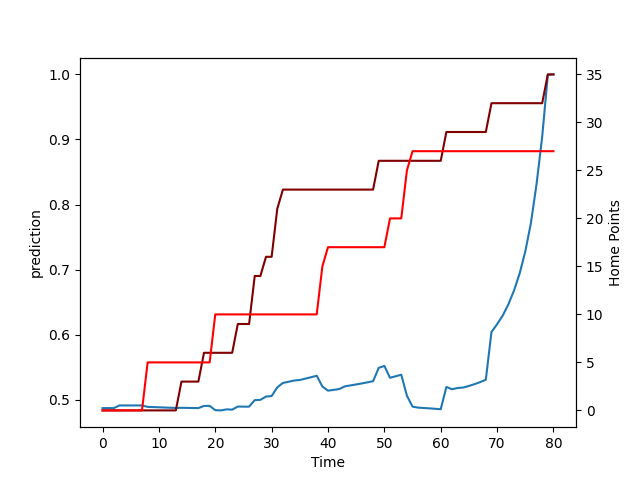

---  
layout: page  
title: Tasman at North Harbour; 27.0-35.0  
date: 2022-08-20 01:05:00 18:00:00 -0500  
categories: match review  
---
# Prediction: North Harbour by 2.3

Tasman by 2.7 on a neutral field

# Pre-Match Prediction: Tasman by 2.2

Tasman by 2.8 on a neutral pitch
# Projection using minutes played for each player: North Harbour by 2.3

Tasman by 2.7 on a neutral field

|   Away Minutes | Away Player             |   Away elo |   Away Percentile |   Number |   Home Percentile |   Home elo | Home Player     |   Home Minutes |
|---------------:|:------------------------|-----------:|------------------:|---------:|------------------:|-----------:|:----------------|---------------:|
|             51 | Luca Inch               |      80.43 |                38 |        1 |                55 |      82.97 | Fatongia Paea   |             51 |
|             61 | Andrew Makalio          |      82.94 |                52 |        2 |                60 |      84.44 | Ray Niuia       |             43 |
|             62 | Samuel Matenga          |      79.47 |                24 |        3 |                41 |      80.06 | Nic Mayhew      |             61 |
|             80 | Te Ahiwaru Cirikidaveta |      81.02 |                39 |        4 |                34 |      79.18 | Isoa Nasilasila |             43 |
|              3 | Quinten Strange         |      79.3  |                33 |        5 |                43 |      80.72 | Michael Curry   |             56 |
|             35 | Max Hicks               |      79.03 |                33 |        6 |                61 |      83.1  | Tamarau McGahan |             80 |
|             80 | Braden Stewart          |      81.93 |                24 |        7 |                59 |      82.63 | Jed Melvin      |             80 |
|             80 | Sione Havili Talitui    |      81.43 |                44 |        8 |                57 |      84.88 | Cameron Suafoa  |             80 |
|             71 | Noah Hotham             |      77.79 |                 9 |        9 |                 1 |      67.39 | Jamie Booth     |             54 |
|             80 | Campbell Parata         |      77.07 |                 8 |       10 |                63 |      88.15 | Bryn Gatland    |             80 |
|             80 | Leicester Fainga'anuku  |      89.96 |                70 |       11 |                59 |      84.16 | Tevita Li       |             80 |
|             80 | Alex Nankivell          |      85.08 |                54 |       12 |                25 |      77.47 | Henry Taefu     |             80 |
|             80 | Levi Aumua              |      80.84 |                36 |       13 |                 0 |      61.6  | Fine Inisi      |             77 |
|             64 | Timoci Tavatavanawai    |      78.14 |                21 |       14 |                47 |      79.97 | Kade Banks      |             64 |
|             80 | Sevu Reece              |      99.48 |                86 |       15 |                48 |      82.13 | Shaun Stevenson |             80 |
|             19 | Quentin MacDonald       |      91.27 |                69 |       16 |                27 |      78.09 | Luteru Tolai    |             37 |
|             29 | Kershawl Sykes-Martin   |      80    |                17 |       17 |                55 |      83.91 | Kalolo Tuiloma  |             19 |
|             18 | Atu Moli                |      83.32 |                52 |       18 |                67 |      90.13 | Alex Fidow      |             29 |
|             77 | Mahroni Ngakuru         |      74    |                 8 |       19 |                54 |      83.85 | Danny Drake     |             37 |
|              0 | William Havili          |      74.76 |                13 |       23 |                41 |      81.01 | Tom Barham      |             16 |

