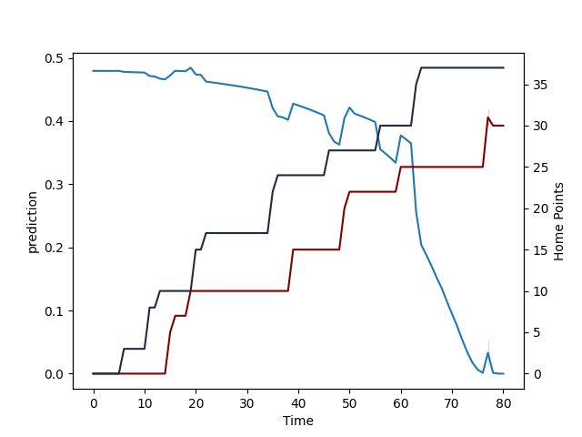

---  
layout: page  
title: Otago at Southland; 37.0-32.0  
date: 2022-08-20 22:05:00 18:00:00 -0500  
categories: match review  
---
# Prediction: Southland by 5.0

Otago by 0.0 on a neutral field

# Pre-Match Prediction: Otago by 4.5

Otago by 0.5 on a neutral pitch
# Projection using minutes played for each player: Southland by 5.0

Otago by 0.0 on a neutral field

|   Away Minutes | Away Player            |   Away elo |   Away Percentile |   Number |   Home Percentile |   Home elo | Home Player      |   Home Minutes |
|---------------:|:-----------------------|-----------:|------------------:|---------:|------------------:|-----------:|:-----------------|---------------:|
|             56 | Abraham Pole           |      76.74 |                18 |        1 |                 1 |      65.93 | Joe Walsh        |             56 |
|             60 | Henry Bell             |      81.53 |                55 |        2 |                 6 |      74.24 | Sam Stewart      |             56 |
|             63 | Jermaine Ainsley       |      77.17 |                20 |        3 |                 0 |      64.85 | Morgan Mitchell  |             71 |
|             80 | Josh Dickson           |      78.27 |                29 |        4 |                35 |      81.64 | Joe Robins       |             80 |
|             80 | Fabian Holland         |      82.32 |                51 |        5 |                57 |      85.54 | Josh Bekhuis     |             80 |
|             57 | Oliver Haig            |      83.7  |                61 |        6 |                59 |      85.63 | Grayson Knapp    |             50 |
|             71 | James Lentjes          |      78.35 |                32 |        7 |                12 |      76.91 | Matt James       |             64 |
|             51 | Christian Lio-Willie   |      79.19 |                37 |        8 |                42 |      82.66 | Arese Poliko     |             77 |
|             56 | Kemara Hauiti-Parapara |      83.78 |                54 |        9 |                25 |      79.68 | Jahvis Wallace   |             66 |
|             80 | Josh Ioane             |      75.05 |                15 |       10 |                56 |      85.18 | Marty Banks      |             80 |
|             80 | Vilimoni Koroi         |      72.16 |                 8 |       11 |                48 |      83.13 | Matt Whaanga     |             64 |
|             37 | Thomas Umaga-Jensen    |      83.08 |                52 |       12 |                60 |      87.23 | Scott Gregory    |             80 |
|             80 | Josh Timu              |      68.21 |                 3 |       13 |                 4 |      71.33 | Isaac Te Tamaki  |             80 |
|             51 | Freedom Vahaakolo      |      74.09 |                12 |       14 |                33 |      78.84 | Viliami Fine     |             67 |
|             80 | Sam Gilbert            |      81.23 |                45 |       15 |                11 |      74.68 | Rory van Vugt    |             80 |
|             20 | Ricky Jackson          |      79.79 |                39 |       16 |                52 |      82.21 | Jacob Payne      |             24 |
|             24 | Josh Hohneck           |      91.19 |                69 |       17 |                 2 |      69.91 | Shaun Stodart    |             24 |
|             32 | Samuel Fischli         |      80.47 |                42 |       19 |                15 |      75.61 | Charles Alaimalo |             33 |
|             24 | James Arscott          |      81.14 |                42 |       21 |                 3 |      69.73 | Jay Renton       |             14 |
|             29 | Cameron Millar         |      83.88 |                54 |       22 |                67 |      90.31 | Robbie Robinson  |             18 |

