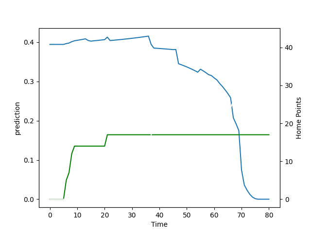

---  
layout: page  
title: Hawke's Bay at Manawatu; 43.0-17.0  
date: 2022-08-21 00:35:00 18:00:00 -0500  
categories: match review  
---
# Prediction: Hawke's Bay by 9.3

Hawke's Bay by 14.3 on a neutral field

# Pre-Match Prediction: Hawke's Bay by 8.5

Hawke's Bay by 13.5 on a neutral pitch
# Projection using minutes played for each player: Hawke's Bay by 9.3

Hawke's Bay by 14.3 on a neutral field

|   Away Minutes | Away Player          |   Away elo |   Away Percentile |   Number |   Home Percentile |   Home elo | Home Player       |   Home Minutes |
|---------------:|:---------------------|-----------:|------------------:|---------:|------------------:|-----------:|:------------------|---------------:|
|             67 | Pouri Rakete-Stones  |      75.2  |                12 |        1 |                37 |      81.17 | Harrison Allan    |             62 |
|             46 | Kianu Kereru-Symes   |      80.22 |                43 |        2 |                 9 |      74.95 | Siua Maile        |             59 |
|             71 | Joe Apikotoa         |      83.13 |                54 |        3 |                 2 |      72.72 | Sean Paranihi     |             62 |
|             80 | Isaia Walker-Leawere |      95.1  |                75 |        4 |                 3 |      72.89 | Micaiah Torrence  |             67 |
|             80 | Tom Parsons          |      86.89 |                61 |        5 |                 1 |      65.82 | Veikoso Poloniati |             80 |
|             75 | Marino Mikaele-Tu'u  |      73.27 |                 9 |        6 |                16 |      76.84 | Te Kamaka Howden  |             80 |
|             61 | Solomone Funaki      |      68.02 |                 2 |        7 |                 3 |      73.07 | Johnny Galloway   |             62 |
|             80 | Devan Flanders       |      84.4  |                56 |        8 |                 5 |      72.15 | Brayden Iose      |             80 |
|             55 | Brad Weber           |     100.4  |                86 |        9 |                12 |      76.1  | Luke Campbell     |             59 |
|             80 | Lincoln McClutchie   |      80.27 |                43 |       10 |                57 |      85.56 | Brett Cameron     |             71 |
|             55 | Neria Foma'i         |      85.3  |                62 |       11 |                 8 |      73.4  | Ed Fidow          |             76 |
|             80 | Danny Toala          |      82.41 |                50 |       12 |                 2 |      67.56 | Jason Emery       |             80 |
|             80 | Stacey Ili           |      89.62 |                67 |       13 |                 2 |      71.63 | Louis Rogers      |             80 |
|             36 | Jonah Lowe           |      77.34 |                25 |       14 |                 0 |      63.52 | Tima Fainga'anuku |             80 |
|             80 | Chase Tiatia         |      87.92 |                62 |       15 |                 5 |      75.66 | Drew Wild         |             80 |
|             34 | Tyrone Thompson      |      77.7  |                24 |       16 |                31 |      77.62 | Leif Schwenke     |             21 |
|             13 | Mark Braidwood       |      80.55 |                41 |       17 |                 4 |      72.25 | Joseph Gavigan    |             18 |
|              9 | Joel Hintz           |      85.33 |                60 |       18 |                11 |      74.32 | Flyn Yates        |             18 |
|             25 | Folau Fakatava       |      74.6  |                15 |       21 |                34 |      78.94 | Logan Henry       |             21 |
|             44 | Lolagi Visinia       |      79.57 |                39 |       23 |                45 |      82.97 | Adam Boult        |              4 |

