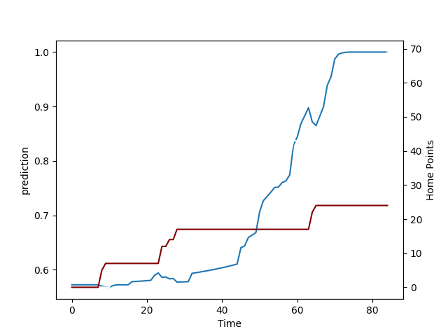

---  
layout: page  
title: Southland at Hawke's Bay; 24.0-69.0  
date: 2022-09-09 22:05:00 18:00:00 -0500  
categories: match review  
---
# Prediction: Hawke's Bay by 14.9

Hawke's Bay by 9.9 on a neutral field

# Pre-Match Prediction: Hawke's Bay by 15.8

Hawke's Bay by 10.8 on a neutral pitch
# Projection using minutes played for each player: Hawke's Bay by 14.9

Hawke's Bay by 9.9 on a neutral field

|   Away Minutes | Away Player      |   Away elo |   Away Percentile |   Number |   Home Percentile |   Home elo | Home Player          |   Home Minutes |
|---------------:|:-----------------|-----------:|------------------:|---------:|------------------:|-----------:|:---------------------|---------------:|
|             55 | Joe Walsh        |      90.05 |                19 |        1 |                31 |      93.41 | Pouri Rakete-Stones  |             65 |
|             56 | Sam Stewart      |      94.54 |                24 |        2 |                 0 |      74.6  | Tyrone Thompson      |             60 |
|             65 | Morgan Mitchell  |      90.06 |                19 |        3 |                78 |     101.13 | Joe Apikotoa         |             65 |
|             56 | Grayson Knapp    |      80.49 |                 7 |        4 |                89 |     108.5  | Isaia Walker-Leawere |             60 |
|             84 | Josh Bekhuis     |      88.19 |                16 |        5 |                72 |      99.27 | Tom Parsons          |             84 |
|             84 | Blair Ryall      |      79.02 |                 3 |        6 |                28 |      89.19 | Marino Mikaele-Tu'u  |             84 |
|             55 | Matt James       |      77.23 |                 2 |        7 |                43 |      94.84 | Josh Kaifa           |             61 |
|             84 | Arese Poliko     |      82.16 |                 7 |        8 |                18 |      82.74 | Devan Flanders       |             74 |
|             72 | Jay Renton       |      90.83 |                18 |        9 |                93 |     110.06 | Brad Weber           |             60 |
|             68 | Marty Banks      |      99.01 |                40 |       10 |                 7 |      76.83 | Lincoln McClutchie   |             84 |
|             84 | Rory van Vugt    |      70.59 |                 0 |       11 |                71 |      99.25 | Neria Foma'i         |             61 |
|             84 | Scott Gregory    |      81.74 |                10 |       12 |                12 |      78.35 | Danny Toala          |             84 |
|             72 | Matt Whaanga     |      76.86 |                 1 |       13 |                88 |     105.96 | Stacey Ili           |             57 |
|             84 | Viliami Fine     |      78.56 |                 1 |       14 |                12 |      78.48 | Ollie Sapsford       |             84 |
|             84 | Robbie Robinson  |     104.38 |                70 |       15 |                83 |     102.28 | Chase Tiatia         |             84 |
|             28 | Jacob Payne      |      80.51 |                 9 |       16 |                12 |      81.49 | Kianu Kereru-Symes   |             24 |
|             29 | Paula Latu       |      77.55 |                 0 |       17 |                63 |      99.61 | Mark Braidwood       |             19 |
|             28 | Joe Robins       |      77.17 |                 2 |       19 |                94 |     115.47 | Bryn Evans           |             24 |
|             29 | Hayden Michaels  |      81.27 |                 7 |       20 |                12 |      80.1  | Solomone Funaki      |             33 |
|             12 | Jack MacLeod     |      79.02 |                 7 |       21 |                18 |      87.34 | Ere Enari            |             24 |
|             12 | William Tufui    |      77.78 |                 1 |       22 |                25 |      89.76 | Nick Grigg           |             27 |
|             16 | Solomon Alaimalo |     112.44 |                91 |       23 |                 1 |      74.57 | Anzelo Tuitavuki     |             23 |

