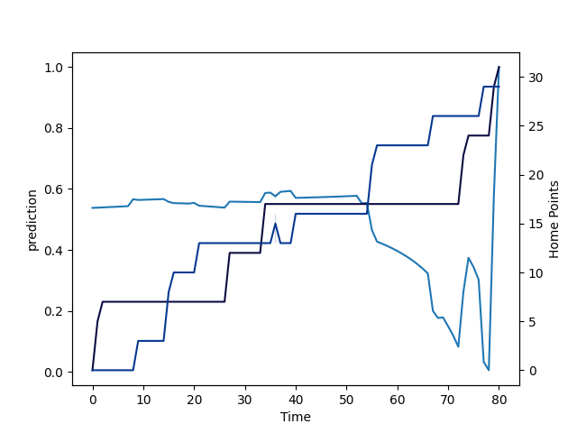

---  
layout: page  
title: Bath Rugby at Bristol Rugby; 29.0-31.0  
date: 2022-09-10 12:30:00 18:00:00 -0500  
categories: match review  
---
# Prediction: Bristol Rugby by 11.6

Bristol Rugby by 6.6 on a neutral field

# Pre-Match Prediction: Bristol Rugby by 10.1

Bristol Rugby by 5.1 on a neutral pitch
# Projection using minutes played for each player: Bristol Rugby by 11.6

Bristol Rugby by 6.6 on a neutral field

|   Away Minutes | Away Player           |   Away elo |   Away Percentile |   Number |   Home Percentile |   Home elo | Home Player     |   Home Minutes |
|---------------:|:----------------------|-----------:|------------------:|---------:|------------------:|-----------:|:----------------|---------------:|
|             20 | Beno Obano            |      77.83 |                26 |        1 |                66 |      91.69 | Ellis Genge     |             74 |
|             82 | Tom Dunn              |      89.03 |                69 |        2 |                44 |      82.37 | Bryan Byrne     |             53 |
|             79 | Aranos Coetzee        |      90.05 |                69 |        3 |                69 |      93.81 | Kyle Sinckler   |             67 |
|             77 | Dave Attwood          |     118.64 |                99 |        4 |                57 |      87.29 | Joe Joyce       |             67 |
|             82 | Josh McNally          |      68.88 |                 5 |        5 |                39 |      82.8  | Chris Vui       |             82 |
|             82 | Josh Bayliss          |      69.62 |                 5 |        6 |                16 |      78.86 | Sam Jeffries    |             82 |
|              8 | Chris Cloete          |     100.81 |                89 |        7 |                11 |      77.08 | Jake Heenan     |             67 |
|             56 | Jaco Coetzee          |      76.85 |                28 |        8 |                43 |      83.36 | Magnus Bradbury |             82 |
|             82 | Ben Spencer           |      87.97 |                65 |        9 |                63 |      90.94 | Harry Randall   |             53 |
|             82 | Piers Francis         |      88.34 |                67 |       10 |                58 |      87.22 | Callum Sheedy   |             69 |
|             69 | Matt Gallagher        |      90.54 |                73 |       11 |                34 |      81.01 | Richard Lane    |             77 |
|             82 | Cameron Redpath       |      81.42 |                53 |       12 |                60 |      88.67 | Sam Bedlow      |             82 |
|             82 | Will Butt             |      75.45 |                25 |       13 |                 7 |      74.28 | Piers O'Conor   |             82 |
|             82 | Gabriel Hamer-Webb    |      84.15 |                64 |       14 |                99 |     124.44 | Luke Morahan    |             82 |
|             82 | Tom de Glanville      |      72.54 |                11 |       15 |                68 |      93.01 | Charles Piutau  |             82 |
|              0 | Niall Annett          |      71.97 |                 5 |       16 |                17 |      76.49 | Will Capon      |             29 |
|             62 | Lewis Boyce           |      74.43 |                 9 |       17 |                60 |      86.17 | Jake Woolmore   |              8 |
|              3 | Johannes Jonker       |      71.97 |                 4 |       18 |                61 |      87.04 | Max Lahiff      |             15 |
|              5 | Will Spencer          |      79.05 |                31 |       19 |                46 |      81.09 | Ed Holmes       |             15 |
|             26 | Ewan Richards         |      72.32 |                 7 |       20 |                18 |      77.02 | Samuel Lewis    |             15 |
|              0 | Louis Schreuder       |      82.65 |                49 |       21 |                 1 |      66.47 | Andy Uren       |             29 |
|             13 | Orlando Bailey        |      69.73 |                 4 |       22 |                82 |      97.64 | AJ MacGinty     |             13 |
|             74 | Richard de Carpentier |      74.96 |                11 |       23 |                13 |      74.72 | Jack Bates      |              5 |

