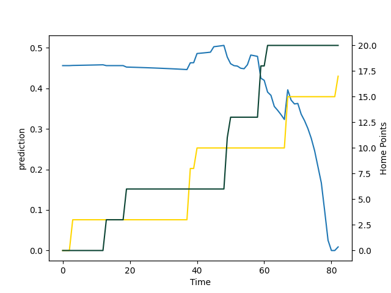

---  
layout: page  
title: Leicester Tigers at Exeter Chiefs; 20.0-24.0  
date: 2022-09-10 10:00:00 18:00:00 -0500  
categories: match review  
---
# Prediction: Leicester Tigers by 2.7

Leicester Tigers by 7.7 on a neutral field

# Pre-Match Prediction: Leicester Tigers by 5.0

Leicester Tigers by 10.0 on a neutral pitch
# Projection using minutes played for each player: Leicester Tigers by 2.7

Leicester Tigers by 7.7 on a neutral field

|   Away Minutes | Away Player          |   Away elo |   Away Percentile |   Number |   Home Percentile |   Home elo | Home Player       |   Home Minutes |
|---------------:|:---------------------|-----------:|------------------:|---------:|------------------:|-----------:|:------------------|---------------:|
|             55 | James Cronin         |     115.99 |                96 |        1 |                79 |     100.92 | Alec Hepburn      |             82 |
|             82 | Charlie Clare        |      97.28 |                35 |        2 |                92 |     107.48 | Jack Yeandle      |             71 |
|             70 | Dan Cole             |     113.68 |                94 |        3 |                28 |      92.8  | Marcus Street     |             53 |
|             82 | Harry Wells          |     123.55 |                98 |        4 |                15 |      81.61 | Jack Dunne        |             56 |
|             68 | Eli Snyman           |      82.43 |                10 |        5 |                91 |     109.31 | Jonny Gray        |             82 |
|             82 | George Martin        |      89.32 |                24 |        6 |                87 |     103.87 | Jannes Kirsten    |             82 |
|             55 | Tommy Reffell        |     106.49 |                85 |        7 |                13 |      79.22 | Christ Tshiunza   |             56 |
|             82 | Hanro Liebenberg     |     124.65 |                98 |        8 |                 1 |      71.97 | Richard Capstick  |             82 |
|             50 | Ben Youngs           |     116.92 |                96 |        9 |                88 |     105.41 | Stu Townsend      |             51 |
|             40 | Freddie Burns        |     113.95 |                93 |       10 |                43 |      94.38 | Harvey Skinner    |             82 |
|             63 | Hosea Saumaki        |      74.92 |                 0 |       11 |                97 |     116.13 | Olly Woodburn     |             71 |
|             82 | Jimmy Gopperth       |     103.81 |                73 |       12 |                 4 |      76.96 | Solomone Kata     |             45 |
|             82 | Matt Scott           |     106.64 |                82 |       13 |                81 |     102.5  | Ian Whitten       |             82 |
|             82 | Harry Potter         |      88.77 |                22 |       14 |                99 |     125.02 | Jack Nowell       |             73 |
|             82 | Chris Ashton         |     142.61 |               100 |       15 |                98 |     120.02 | Joe Simmonds      |             82 |
|              0 | Joe Taufete'e        |     100.03 |                65 |       16 |                72 |     100.58 | Jack Innard       |             11 |
|             27 | Francois van Wyk     |     105.34 |                85 |       17 |                 0 |      74.18 | James Kenny       |              9 |
|             14 | Cameron Henderson    |      77.26 |                 1 |       19 |                85 |     106.35 | Ruben van Heerden |             26 |
|             27 | Olly Cracknell       |      88.39 |                25 |       20 |                98 |     119.86 | Dave Ewers        |             26 |
|             32 | Richard Wigglesworth |     126.34 |                99 |       21 |                34 |      95.9  | Jack Maunder      |             31 |
|             42 | Phil Cokanasiga      |      76.3  |                 1 |       22 |                90 |     109.09 | Rory O'Loughlin   |             37 |
|             19 | Kini Murimurivalu    |     125.62 |                99 |       23 |                22 |      86.61 | Facundo Cordero   |             11 |

