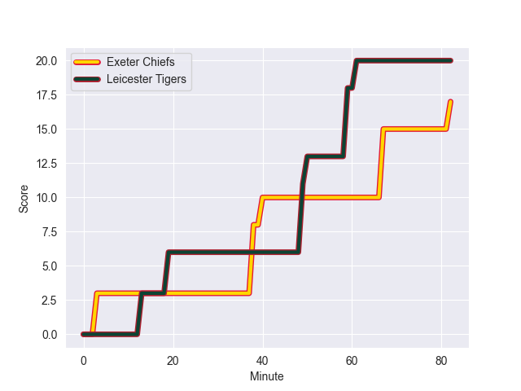
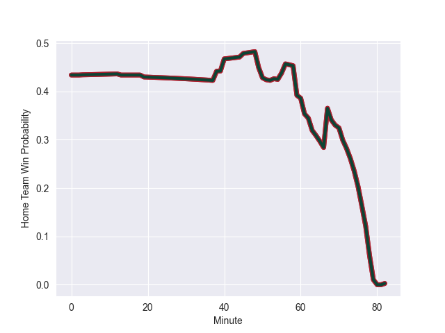

---  
layout: page  
title: Leicester Tigers at Exeter Chiefs; 20.0-24.0  
date: 2022-09-10 10:00:00 18:00:00 -0500  
categories: match review  
---
# Prediction: Leicester Tigers by 6.5

Leicester Tigers by 11.5 on a neutral field
## Scores over Time

## Win Probability over Time

# Pre-Match Prediction: Leicester Tigers by 8.0

Leicester Tigers by 13.0 on a neutral pitch

|   Away Minutes | Away Player          |   Away elo |   Away Percentile |   Number |   Home Percentile |   Home elo | Home Player      |   Home Minutes |
|---------------:|:---------------------|-----------:|------------------:|---------:|------------------:|-----------:|:-----------------|---------------:|
|             55 | James Cronin         |      93.84 |                87 |        1 |                46 |      80.78 | Alec Hepburn     |             82 |
|             82 | Charlie Clare        |      78.93 |                40 |        2 |                90 |      95.02 | Jack Yeandle     |             71 |
|             70 | Dan Cole             |      96.19 |                90 |        3 |                 5 |      71.7  | Marcus Street    |             53 |
|             82 | Harry Wells          |     106.11 |                96 |        4 |                37 |      79.77 | Jack Dunne       |             56 |
|             68 | Eli Snyman           |      81.58 |                50 |        5 |                82 |      91.79 | Jonny Gray       |             82 |
|             82 | George Martin        |      91.56 |                84 |        6 |                52 |      81.54 | Jannes Kirsten   |             82 |
|             82 | Hanro Liebenberg     |     106.19 |                97 |        8 |                 5 |      68.83 | Richard Capstick |             82 |
|             50 | Ben Youngs           |      98.42 |                87 |        9 |                65 |      84.56 | Stu Townsend     |             51 |
|             40 | Freddie Burns        |     109    |                98 |       10 |                13 |      75.77 | Harvey Skinner   |             82 |
|             63 | Hosea Saumaki        |      71.41 |                 6 |       11 |                90 |      98.84 | Olly Woodburn    |             71 |
|             82 | Jimmy Gopperth       |      99.76 |                90 |       12 |                12 |      75.25 | Solomone Kata    |             45 |
|             82 | Matt Scott           |      94.06 |                81 |       13 |                82 |      94.4  | Ian Whitten      |             82 |
|             82 | Harry Potter         |      82.01 |                53 |       14 |                97 |     109.38 | Jack Nowell      |             73 |
|             82 | Chris Ashton         |     127.65 |                99 |       15 |                89 |     101.32 | Joe Simmonds     |             82 |
|              0 | Joe Taufete'e        |      84.8  |                71 |       16 |                36 |      78.5  | Jack Innard      |             11 |
|             27 | Francois van Wyk     |      91.92 |                84 |       17 |                 9 |      72.69 | James Kenny      |              9 |
|             27 | Olly Cracknell       |      65.84 |                 1 |       20 |                99 |     110.54 | Dave Ewers       |             26 |
|             32 | Richard Wigglesworth |     113.19 |                98 |       21 |                32 |      77.94 | Jack Maunder     |             31 |
|             19 | Kini Murimurivalu    |     109.54 |                97 |       23 |                77 |      88.8  | Facundo Cordero  |             11 |

