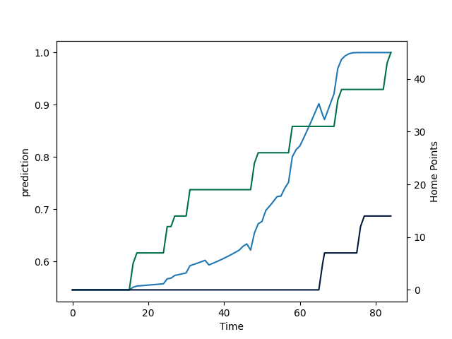

---  
layout: page  
title: Worcester Warriors at London Irish; 14.0-45.0  
date: 2022-09-10 10:00:00 18:00:00 -0500  
categories: match review  
---
# Prediction: London Irish by 9.8

London Irish by 4.8 on a neutral field

# Pre-Match Prediction: London Irish by 11.1

London Irish by 6.1 on a neutral pitch
# Projection using minutes played for each player: London Irish by 9.8

London Irish by 4.8 on a neutral field

|   Away Minutes | Away Player       |   Away elo |   Away Percentile |   Number |   Home Percentile |   Home elo | Home Player                |   Home Minutes |
|---------------:|:------------------|-----------:|------------------:|---------:|------------------:|-----------:|:---------------------------|---------------:|
|             47 | Valery Morozov    |      82.48 |                11 |        1 |                48 |      96.66 | Facundo Gigena             |             50 |
|             47 | Hame Faiva        |      88    |                18 |        2 |                 9 |      79.1  | Matthew Cornish            |             51 |
|             45 | Murray McCallum   |     107.21 |                87 |        3 |                35 |      94.38 | Lovejoy Chawatama          |             60 |
|             84 | Joe Batley        |      93.49 |                26 |        4 |                98 |     119.51 | Rob Simmons                |             84 |
|             84 | Andrew Kitchener  |      92.05 |                23 |        5 |                99 |     123.07 | Adam Coleman               |             55 |
|             84 | Fergus Lee-Warner |      73.97 |                 0 |        6 |                48 |      95.27 | Ben Donnell                |             84 |
|             69 | Cameron Neild     |     102.41 |                72 |        7 |                25 |      86.98 | Tom Pearson                |             84 |
|             56 | Matt Kvesic       |      95.15 |                33 |        8 |                56 |      96.66 | Josh Basham                |             69 |
|             60 | Gareth Simpson    |      78.93 |                 3 |        9 |                26 |      90.65 | Ben White                  |             60 |
|             36 | Billy Searle      |      82.19 |                12 |       10 |                98 |     118.18 | Paddy Jackson              |             60 |
|             84 | Alex Hearle       |      95.2  |                33 |       11 |                20 |      82.24 | Ollie Hassell-Collins      |             84 |
|             84 | Francois Venter   |      95.14 |                33 |       12 |                41 |      93.71 | Benhard Janse van Rensburg |             84 |
|             60 | Ollie Lawrence    |      92.88 |                28 |       13 |                98 |     120.91 | Curtis Rona                |             84 |
|             84 | Perry Humphreys   |     100.68 |                60 |       14 |                12 |      78.65 | Will Joseph                |             84 |
|             84 | James Shillcock   |      98.43 |                42 |       15 |                16 |      81.93 | James Stokes               |             47 |
|             37 | Curtis Langdon    |     104.26 |                85 |       16 |               100 |     127.7  | Agustin Creevy             |             33 |
|             37 | Rory Sutherland   |      99.65 |                63 |       17 |                 0 |      73.02 | Danilo Fischetti           |             34 |
|             39 | Jay Tyack         |      79.94 |                 9 |       18 |                53 |      99.87 | Ciaran Parker              |             24 |
|             15 | Graham Kitchener  |     103.57 |                79 |       19 |                41 |      95.95 | Api Ratuniyarawa           |             29 |
|             28 | Thomas Dodd       |      95.1  |                36 |       20 |                31 |      92.73 | Jack Cooke                 |             15 |
|             48 | Owen Williams     |     107.19 |                87 |       22 |                89 |     108.04 | Luca Morisi                |             24 |
|             24 | Noah Heward       |      84.28 |                18 |       23 |                10 |      79.56 | Henry Arundell             |             37 |

