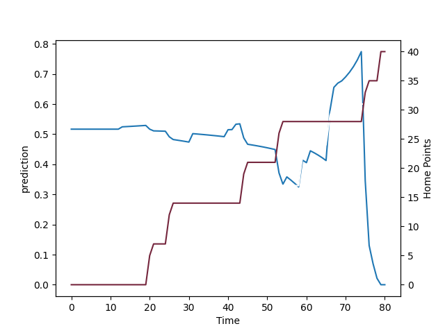

---  
layout: page  
title: Harlequins at Newcastle Falcons; 40.0-31.0  
date: 2022-09-10 10:00:00 18:00:00 -0500  
categories: match review  
---
# Prediction: Newcastle Falcons by 5.1

Newcastle Falcons by 0.1 on a neutral field

# Pre-Match Prediction: Newcastle Falcons by 3.1

Harlequins by 1.9 on a neutral pitch
# Projection using minutes played for each player: Newcastle Falcons by 5.1

Newcastle Falcons by 0.1 on a neutral field

|   Away Minutes | Away Player     |   Away elo |   Away Percentile |   Number |   Home Percentile |   Home elo | Home Player         |   Home Minutes |
|---------------:|:----------------|-----------:|------------------:|---------:|------------------:|-----------:|:--------------------|---------------:|
|             55 | Joe Marler      |     104.53 |                95 |        1 |                28 |      80.08 | Phil Brantingham    |             55 |
|             55 | George Head     |      81.72 |                55 |        2 |                12 |      77.56 | George McGuigan     |             77 |
|             55 | Wilco Louw      |      96.69 |                83 |        3 |                 0 |      65.82 | Trevor Davison      |             68 |
|             80 | George Hammond  |      82.5  |                56 |        4 |                 1 |      67.26 | Greg Peterson       |             77 |
|             69 | Irne Herbst     |      88.73 |                66 |        5 |                 8 |      75.23 | Sebastian de Chaves |             68 |
|             80 | Jack Kenningham |      86.76 |                68 |        6 |                54 |      85.18 | Sean Robinson       |             80 |
|             31 | Tom Lawday      |      74.61 |                12 |        7 |                38 |      82.03 | Jamie Blamire       |             80 |
|             80 | Alex Dombrandt  |      95.97 |                81 |        8 |                93 |     109.39 | Will Welch          |             80 |
|             80 | Lewis Gjaltema  |      79.63 |                47 |        9 |                29 |      80    | Josh Barton         |             55 |
|             80 | Tommaso Allan   |      81.7  |                55 |       10 |                30 |      80.37 | Brett Connon        |             77 |
|             80 | Cadan Murley    |      72.8  |                12 |       11 |                90 |     104.58 | Nathan Earle        |             80 |
|             80 | Lennox Anyanwu  |      79.98 |                48 |       12 |                 6 |      73.82 | Pete Lucock         |             77 |
|             40 | Luke Northmore  |      86.5  |                62 |       13 |                40 |      82.84 | Ben Stevenson       |             80 |
|             80 | Nick David      |      77.2  |                38 |       14 |                79 |      98.4  | Adam Radwan         |             80 |
|             80 | Tyrone Green    |      72.37 |                10 |       15 |                50 |      85.47 | Alex Tait           |             80 |
|             25 | Jack Musk       |      79.37 |                25 |       16 |                19 |      76.97 | Charlie Maddison    |              3 |
|             25 | Simon Kerrod    |      75.78 |                12 |       17 |                63 |      86.95 | Logovi'i Mulipola   |             25 |
|             25 | Will Collier    |      93.03 |                71 |       18 |                30 |      79.33 | Mark Tampin         |             12 |
|             11 | Dino Lamb       |      88.06 |                67 |       19 |                48 |      81.93 | George Merrick      |             12 |
|             49 | Will Evans      |      74.5  |                10 |       20 |                39 |      80.47 | Tom Marshall        |              3 |
|              0 | Will Edwards    |      86.57 |                59 |       22 |                33 |      78.7  | Tian Schoeman       |              3 |
|             40 | Joe Marchant    |      89.71 |                66 |       23 |                12 |      73.82 | George Wacokecoke   |              3 |

