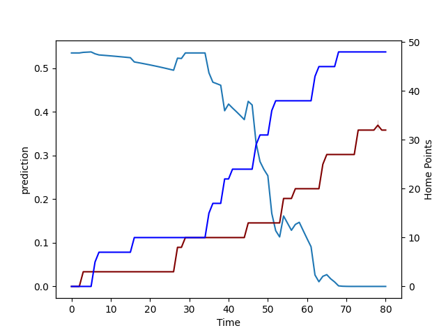

---  
layout: page  
title: Bay of Plenty at North Harbour; 48.0-34.0  
date: 2022-09-10 00:35:00 18:00:00 -0500  
categories: match review  
---
# Prediction: North Harbour by 11.1

North Harbour by 6.1 on a neutral field

# Pre-Match Prediction: North Harbour by 8.1

North Harbour by 3.1 on a neutral pitch
# Projection using minutes played for each player: North Harbour by 11.1

North Harbour by 6.1 on a neutral field

|   Away Minutes | Away Player            |   Away elo |   Away Percentile |   Number |   Home Percentile |   Home elo | Home Player       |   Home Minutes |
|---------------:|:-----------------------|-----------:|------------------:|---------:|------------------:|-----------:|:------------------|---------------:|
|             58 | Aidan Ross             |     107.86 |                92 |        1 |                16 |      86.22 | Fatongia Paea     |             53 |
|             58 | Kurt Eklund            |     108.33 |                92 |        2 |                11 |      82.87 | Luteru Tolai      |             53 |
|             41 | Jeff Thwaites          |      99.49 |                69 |        3 |                43 |      98.55 | Kalolo Tuiloma    |             45 |
|             80 | Justin Sangster        |      76.85 |                 6 |        4 |                22 |      91.45 | Isoa Nasilasila   |             80 |
|             80 | Manaaki Selby-Rickit   |      90.87 |                30 |        5 |                 3 |      79.5  | Felix Kalapu      |             63 |
|             80 | Naitoa Ah Kuoi         |      82.98 |                21 |        6 |                23 |      88.6  | Cameron Suafoa    |             80 |
|             40 | Jacob Norris           |      91.55 |                31 |        7 |                20 |      85.91 | Jed Melvin        |             53 |
|             64 | Nikora Broughton       |      77.84 |                 9 |        8 |                15 |      83.76 | Lotu Inisi        |             49 |
|             70 | Te Toiroa Tahuriorangi |     101.03 |                80 |        9 |                14 |      84.33 | Jamie Booth       |             53 |
|             70 | Wharenui Hawera        |      88.99 |                24 |       10 |                82 |     106.29 | Bryn Gatland      |             80 |
|             80 | Nigel Ah Wong          |     104.83 |                87 |       11 |                95 |     117.5  | Tevita Li         |             80 |
|             80 | Kaveinga Finau         |     100.19 |                76 |       12 |                42 |      98.16 | Henry Taefu       |             80 |
|             68 | Joey Walton            |      83.83 |                20 |       13 |                 9 |      81.38 | Fine Inisi        |             70 |
|             80 | Taylor Haugh           |      75.48 |                 4 |       14 |                91 |     112.25 | Mark Telea        |             80 |
|             80 | Kaleb Trask            |      81.39 |                17 |       15 |                76 |     104.07 | Shaun Stevenson   |             80 |
|             22 | Anaru Rangi            |      95.89 |                37 |       16 |                47 |      97.79 | Ray Niuia         |             27 |
|             22 | Haereiti Hetet         |      86.73 |                17 |       17 |                 8 |      79.5  | Tevita Langi      |             27 |
|             16 | Zane Kapeli            |      97.82 |                51 |       19 |                17 |      84.72 | Danny Drake       |             17 |
|             40 | Penitoa Finau          |      72.77 |                 0 |       20 |                 8 |      79.5  | Wallace Sititi    |             31 |
|             10 | Luke Donaldson         |      81    |                11 |       21 |                 7 |      79.46 | Siaosi Nginingini |             27 |
|             10 | Lucas Cashmore         |      79.5  |                 8 |       22 |                17 |      83.26 | Kade Banks        |             10 |
|             12 | Lalamilo Lalamilo      |      76.29 |                 2 |       23 |                19 |      83.86 | Tamarau McGahan   |             27 |

