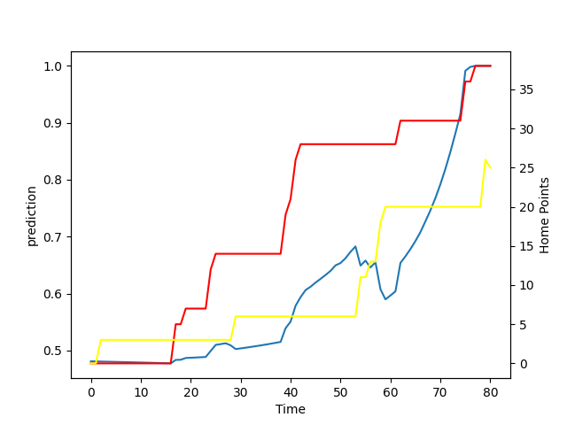

---  
layout: page  
title: Taranaki at Tasman; 27.0-38.0  
date: 2022-09-10 22:05:00 18:00:00 -0500  
categories: match review  
---
# Prediction: Tasman by 1.7

Taranaki by 3.3 on a neutral field

# Pre-Match Prediction: Taranaki by 1.9

Taranaki by 3.1 on a neutral pitch
# Projection using minutes played for each player: Tasman by 1.7

Taranaki by 3.3 on a neutral field

|   Away Minutes | Away Player                   |   Away elo |   Away Percentile |   Number |   Home Percentile |   Home elo | Home Player             |   Home Minutes |
|---------------:|:------------------------------|-----------:|------------------:|---------:|------------------:|-----------:|:------------------------|---------------:|
|             56 | Jared Proffit                 |      74.67 |                 5 |        1 |                15 |      74.53 | Kershawl Sykes-Martin   |             80 |
|             74 | Bradley Slater                |      82.79 |                44 |        2 |                56 |      83.18 | Andrew Makalio          |             25 |
|             50 | Donald Brighouse              |      69.69 |                 2 |        3 |                30 |      78.08 | Isaac Salmon            |             28 |
|             28 | Jesse Parete                  |      71.47 |                 4 |        4 |                35 |      77.67 | Te Ahiwaru Cirikidaveta |             80 |
|             40 | Scott Jury                    |      79.75 |                29 |        5 |                11 |      72.77 | Max Hicks               |             80 |
|             80 | Kaylum Boshier                |      74.88 |                 6 |        6 |                32 |      77.62 | Anton Segner            |             45 |
|             80 | Michael Loft                  |      79.73 |                23 |        7 |                17 |      75.46 | Braden Stewart          |             49 |
|             56 | Pita Gus Sowakula             |      84.81 |                52 |        8 |                30 |      76.61 | Sione Havili            |             80 |
|             44 | Liam Blyde                    |      89.46 |                62 |        9 |                13 |      73.92 | Noah Hotham             |             67 |
|             43 | Daniel Waite                  |      76.17 |                14 |       10 |                11 |      72.63 | William Havili          |             60 |
|             80 | Kini Naholo                   |      89.08 |                64 |       11 |                19 |      74.35 | Macca Springer          |             80 |
|             80 | Teihorangi Walden             |      70.12 |                 2 |       12 |                51 |      81.63 | Alex Nankivell          |             50 |
|             79 | Daniel Rona                   |      83.09 |                42 |       13 |                49 |      80.34 | Levi Aumua              |             80 |
|             70 | Vereniki Tikoisolomone        |      84.12 |                53 |       14 |                 6 |      69.9  | Timoci Tavatavanawai    |             80 |
|             80 | Matt McKenzie                 |      79.72 |                22 |       15 |                50 |      81.11 | Tomasi Alosio           |             80 |
|             30 | Ricky Riccitelli              |      78.98 |                33 |       16 |                73 |      93.96 | Quentin MacDonald       |             55 |
|             30 | Kyle Stewart                  |      80.55 |                34 |       18 |                13 |      76.35 | Samuel Matenga          |             49 |
|             37 | Logan Crowley                 |      72.54 |                 5 |       21 |                22 |      77.78 | Louie Chapman           |             13 |
|             28 | Meihana Grindlay              |      79.24 |                36 |       22 |                 9 |      73.12 | Campbell Parata         |             20 |
|             19 | Isaac Ratumaitavuki-Kneepkens |      78.54 |                28 |       23 |                37 |      79.84 | Fetuli Paea             |             30 |

