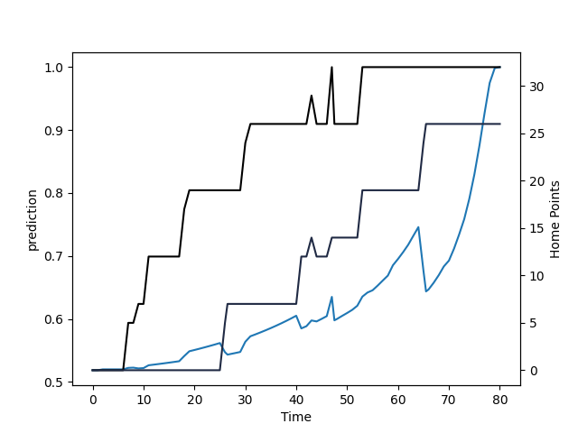

---  
layout: page  
title: Otago at Wellington; 26.0-32.0  
date: 2022-09-10 22:05:00 18:00:00 -0500  
categories: match review  
---
# Prediction: Wellington by 11.4

Wellington by 6.4 on a neutral field

# Pre-Match Prediction: Wellington by 11.8

Wellington by 6.8 on a neutral pitch
# Projection using minutes played for each player: Wellington by 11.4

Wellington by 6.4 on a neutral field

|   Away Minutes | Away Player            |   Away elo |   Away Percentile |   Number |   Home Percentile |   Home elo | Home Player        |   Home Minutes |
|---------------:|:-----------------------|-----------:|------------------:|---------:|------------------:|-----------:|:-------------------|---------------:|
|             65 | Abraham Pole           |      77.95 |                 4 |        1 |                13 |      82.18 | Xavier Numia       |             73 |
|             77 | Henry Bell             |      81.64 |                13 |        2 |                31 |      94.68 | James O'Reilly     |             59 |
|             45 | Saula Mau              |      82.36 |                14 |        3 |                24 |      92.37 | Pek Cowan          |             52 |
|             80 | Josh Dickson           |      97.34 |                50 |        4 |                25 |      91.17 | James Blackwell    |             49 |
|             55 | William Tucker         |      83.43 |                15 |        5 |                63 |      99.67 | Dom Bird           |             80 |
|             80 | Sean Withy             |      83.82 |                20 |        6 |                 2 |      76.27 | Caleb Delany       |             63 |
|             80 | James Lentjes          |      99.7  |                68 |        7 |                77 |     101.98 | Du'Plessis Kirifi  |             80 |
|             66 | Christian Lio-Willie   |      77.83 |                 6 |        8 |                 4 |      77.85 | Peter Lakai        |             80 |
|             26 | James Arscott          |      84.5  |                16 |        9 |                91 |     110.43 | TJ Perenara        |             59 |
|             80 | Josh Ioane             |      88.56 |                20 |       10 |                 3 |      77.71 | Aidan Morgan       |             80 |
|             80 | Vilimoni Koroi         |      92.27 |                32 |       11 |                 2 |      76.26 | Pepesana Patafilo  |             70 |
|              2 | Thomas Umaga-Jensen    |     102.41 |                76 |       12 |                35 |      94.25 | Peter Umaga-Jensen |             80 |
|             80 | Josh Timu              |      86.97 |                21 |       13 |                43 |      96.38 | Billy Proctor      |             80 |
|             80 | Sam Gilbert            |      82.74 |                17 |       14 |                98 |     122.69 | Julian Savea       |             80 |
|             74 | Cameron Millar         |      86.38 |                21 |       15 |                21 |      87.35 | Ruben Love         |             70 |
|             15 | Tau Koloamatangi       |     102.08 |                82 |       17 |                74 |     101.55 | Solomona Sakalia   |              7 |
|             35 | Josh Hohneck           |     104.84 |                84 |       18 |                 8 |      79.8  | PJ Sheck           |             28 |
|             25 | Oliver Haig            |      80.33 |                12 |       19 |                 8 |      78.88 | Taine Plumtree     |             31 |
|             14 | Rupeni Tamani          |      81.77 |                14 |       20 |                 3 |      76.91 | Keelan Whitman     |             17 |
|             54 | Kemara Hauiti-Parapara |     106.27 |                87 |       21 |                88 |     107.98 | Richard Judd       |             21 |
|             28 | Freedom Vahaakolo      |      80.16 |                11 |       22 |                67 |      99.87 | Losi Filipo        |             10 |

