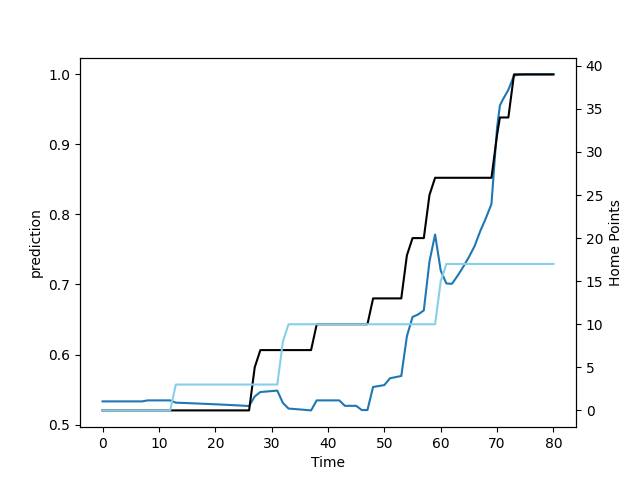

---  
layout: page  
title: Northland at Canterbury; 17.0-46.0  
date: 2022-09-11 00:35:00 18:00:00 -0500  
categories: match review  
---
# Prediction: Canterbury by 10.7

Canterbury by 5.7 on a neutral field

# Pre-Match Prediction: Canterbury by 11.2

Canterbury by 6.2 on a neutral pitch
# Projection using minutes played for each player: Canterbury by 10.7

Canterbury by 5.7 on a neutral field

|   Away Minutes | Away Player           |   Away elo |   Away Percentile |   Number |   Home Percentile |   Home elo | Home Player        |   Home Minutes |
|---------------:|:----------------------|-----------:|------------------:|---------:|------------------:|-----------:|:-------------------|---------------:|
|             59 | Jarred Adams          |      89.64 |                64 |        1 |                25 |      78.01 | Dan Lienert-Brown  |              8 |
|             80 | Bruce Kauika-Petersen |      77.09 |                10 |        2 |                29 |      76.74 | Shilo Klein        |             51 |
|             51 | Coree Te Whata-Colley |      79.73 |                26 |        3 |                77 |      94.68 | Owen Franks        |             43 |
|             80 | Allan Craig           |      83.61 |                44 |        4 |                65 |      88.73 | Luke Romano        |             51 |
|             57 | Liam Hallam-Eames     |      76.76 |                12 |        5 |                33 |      77.11 | Sam Darry          |             80 |
|             48 | Rob Rush              |      82.36 |                45 |        6 |                59 |      82.52 | Corey Kellow       |             57 |
|             67 | Jonah Mau'u           |      83.26 |                47 |        7 |                82 |      95.07 | Tom Christie       |             80 |
|             80 | Matt Polwart-Matich   |      90.19 |                63 |        8 |                56 |      82.86 | Billy Harmon       |             80 |
|             46 | Lisati Milo-Harris    |      77.24 |                15 |        9 |                90 |     101.12 | Willi Heinz        |             56 |
|             80 | Rivez Reihana         |      79.88 |                24 |       10 |                50 |      80.04 | Fergus Burke       |             71 |
|             67 | Heremaia Murray       |      84.1  |                52 |       11 |                95 |     105.43 | George Bridge      |             62 |
|             57 | Blake Hohaia          |      82.34 |                41 |       12 |                41 |      78.4  | Rameka Poihipi     |             80 |
|             80 | Tamati Tua            |      88.53 |                59 |       13 |                63 |      85.88 | Dallas McLeod      |             80 |
|             80 | Jone Macilai-Tori     |      84.51 |                52 |       14 |                60 |      82.42 | Ngatungane Punivai |             80 |
|             80 | Pisi Leilua           |      80.42 |                26 |       15 |                69 |      88.9  | Chay Fihaki        |             80 |
|             13 | Ross Wright           |      76.9  |                17 |       16 |                69 |      91.49 | Brodie McAlister   |             29 |
|             21 | Esile Fono            |      81.39 |                44 |       17 |                30 |      80.52 | Tamaiti Williams   |             72 |
|             23 | Josh Goodhue          |      80.1  |                37 |       19 |                44 |      81.35 | Dom Gardiner       |             29 |
|             32 | Jaycob Matiu          |      67.6  |                 3 |       20 |                43 |      81.24 | Liam Allen         |             23 |
|             34 | Sam Nock              |      87.87 |                61 |       21 |                75 |      95.75 | Mitch Drummond     |             24 |

