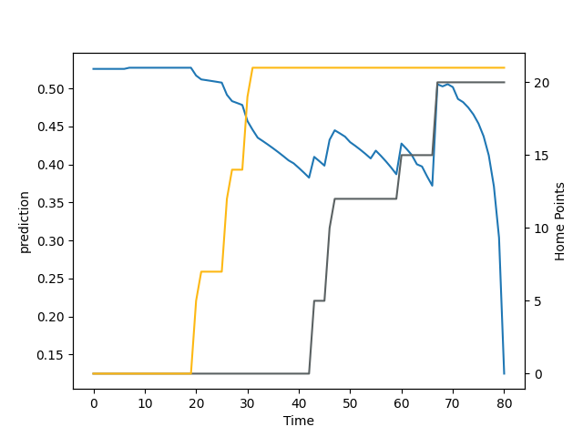

---  
layout: page  
title: Wasps at Gloucester Rugby; 21.0-27.0  
date: 2022-09-11 10:00:00 18:00:00 -0500  
categories: match review  
---
# Prediction: Gloucester Rugby by 9.5

Gloucester Rugby by 4.5 on a neutral field

# Pre-Match Prediction: Gloucester Rugby by 7.6

Gloucester Rugby by 2.6 on a neutral pitch
# Projection using minutes played for each player: Gloucester Rugby by 9.5

Gloucester Rugby by 4.5 on a neutral field

|   Away Minutes | Away Player      |   Away elo |   Away Percentile |   Number |   Home Percentile |   Home elo | Home Player         |   Home Minutes |
|---------------:|:-----------------|-----------:|------------------:|---------:|------------------:|-----------:|:--------------------|---------------:|
|             63 | Robin Hislop     |      98.19 |                46 |        1 |                50 |      97.62 | Harry Elrington     |             60 |
|             50 | Tom Cruse        |      97.54 |                44 |        2 |                95 |     113.19 | Jack Singleton      |             60 |
|             68 | John Ryan        |     105.47 |                84 |        3 |                75 |     101.3  | Fraser Balmain      |             63 |
|             80 | Joe Launchbury   |     118.37 |                96 |        4 |                75 |     101.65 | Freddie Clarke      |             80 |
|             72 | Kiran McDonald   |     100.15 |                65 |        5 |                14 |      82.16 | Alex Craig          |             65 |
|             80 | Tom Willis       |      86.64 |                22 |        6 |                97 |     117.42 | Ruan Ackermann      |             80 |
|             39 | Brad Shields     |     105.56 |                86 |        7 |                13 |      80    | Harry Taylor        |             80 |
|             80 | Alfie Barbeary   |      80.74 |                10 |        8 |                62 |      99.27 | Ben Morgan          |             32 |
|             55 | Dan Robson       |     119.19 |                98 |        9 |                74 |     100.81 | Charlie Chapman     |             60 |
|             80 | Charlie Atkinson |      75.3  |                 0 |       10 |                95 |     114.38 | Adam Hastings       |             80 |
|             80 | Josh Bassett     |     101.63 |                73 |       11 |                96 |     115.5  | Ollie Thorley       |             80 |
|             69 | Burger Odendaal  |     120.49 |                97 |       12 |                73 |     101.26 | Mark Atkinson       |             64 |
|             80 | Sam Spink        |      80.32 |                10 |       13 |                85 |     105.29 | Chris Harris        |             80 |
|             72 | Zach Kibirige    |      87.96 |                23 |       14 |                25 |      88.32 | Louis Rees-Zammit   |             80 |
|              7 | Matteo Minozzi   |     101.65 |                75 |       15 |                80 |     102.16 | Lloyd Evans         |             80 |
|             30 | Dan Frost        |     101.99 |                77 |       16 |                85 |     104.14 | Santiago Socino     |             20 |
|             20 | Biyi Alo         |     108.44 |                91 |       18 |                34 |      95.41 | Jamal Ford-Robinson |             17 |
|              8 | Ben Morris       |      97.79 |                52 |       19 |                 4 |      78.31 | Cameron Jordan      |             15 |
|             41 | Jack Willis      |     102.59 |                80 |       20 |                17 |      89.38 | Albert Tuisue       |             48 |
|             25 | Will Porter      |      92.07 |                25 |       21 |                69 |     100.2  | Ben Meehan          |             20 |
|             11 | Ryan Mills       |     110.67 |                91 |       22 |                93 |     112.28 | Billy Twelvetrees   |             16 |
|             73 | Ali Crossdale    |      99.21 |                62 |       23 |                15 |      82.87 | Kyle Moyle          |              0 |

