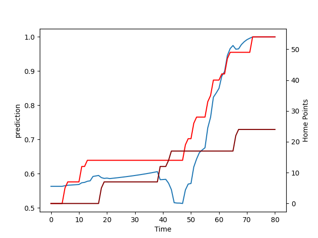

---  
layout: page  
title: Southland at Waikato; 24.0-54.0  
date: 2022-09-14 03:05:00 18:00:00 -0500  
categories: match review  
---
# Prediction: Waikato by 8.7

Waikato by 3.7 on a neutral field

# Pre-Match Prediction: Waikato by 10.2

Waikato by 5.2 on a neutral pitch
# Projection using minutes played for each player: Waikato by 8.7

Waikato by 3.7 on a neutral field

|   Away Minutes | Away Player      |   Away elo |   Away Percentile |   Number |   Home Percentile |   Home elo | Home Player          |   Home Minutes |
|---------------:|:-----------------|-----------:|------------------:|---------:|------------------:|-----------:|:---------------------|---------------:|
|             61 | Paula Latu       |      76.85 |                 0 |        1 |                 8 |      78.74 | Rob Cobb             |             46 |
|             58 | Sam Stewart      |      93.19 |                24 |        2 |                17 |      83.68 | Pita Anae Ah-Sue     |             68 |
|             15 | Niko Manaena     |      80    |                 8 |        3 |                15 |      82.16 | Solomone Tukuafu     |             46 |
|             80 | Caleb Aperahama  |      80.82 |                 5 |        4 |                15 |      81.1  | James Thompson       |             80 |
|             80 | Josh Bekhuis     |      86.16 |                16 |        5 |                83 |     103.31 | Hamilton Burr        |             80 |
|             21 | Joe Robins       |      76.49 |                 2 |        6 |                99 |     122.61 | Liam Messam          |             44 |
|             80 | Hayden Michaels  |      80.57 |                 7 |        7 |                72 |      99.24 | Mitchell Jacobson    |             58 |
|             49 | Arese Poliko     |      80.14 |                 7 |        8 |                18 |      82.13 | Te Rama Reuben       |             80 |
|             64 | Jay Renton       |      89.09 |                18 |        9 |                16 |      82.6  | Cortez Ratima        |             67 |
|             58 | Marty Banks      |      97.37 |                40 |       10 |                14 |      80    | Taha Kemara          |             80 |
|             80 | Solomon Alaimalo |     112.05 |                91 |       11 |                21 |      83.26 | Daniel Sinkinson     |             69 |
|             80 | William Tufui    |      77.49 |                 1 |       12 |                48 |      95.34 | Alapati Leiua        |             75 |
|             80 | Viliami Fine     |      76.54 |                 1 |       13 |                16 |      80.12 | Tana Tuhakaraina     |             80 |
|             80 | Michael Manson   |      79.47 |                 4 |       14 |                21 |      84.04 | Liam Coombes-Fabling |             59 |
|             64 | Robbie Robinson  |     102.35 |                70 |       15 |                13 |      79.95 | Tepaea Cook-Savage   |             53 |
|             22 | Jacob Payne      |      79.84 |                 9 |       16 |                99 |     124.61 | Rhys Marshall        |             12 |
|             19 | Joe Walsh        |      88.72 |                19 |       17 |                17 |      83.89 | Ollie Norris         |             34 |
|             65 | Morgan Mitchell  |      88.49 |                19 |       18 |                11 |      81.89 | George Dyer          |             34 |
|             59 | Grayson Knapp    |      79.14 |                 7 |       19 |                13 |      81.32 | Jack Lam             |             36 |
|             16 | Jakob Morrison   |      78.88 |                 6 |       21 |                14 |      82.44 | Rhys Dickinson       |             24 |
|             22 | Jack MacLeod     |      78.73 |                 7 |       22 |                94 |     113.93 | Damian McKenzie      |             27 |
|             16 | Rory van Vugt    |      68.57 |                 0 |       23 |                79 |     102.82 | D'Angelo Leuila      |             26 |

