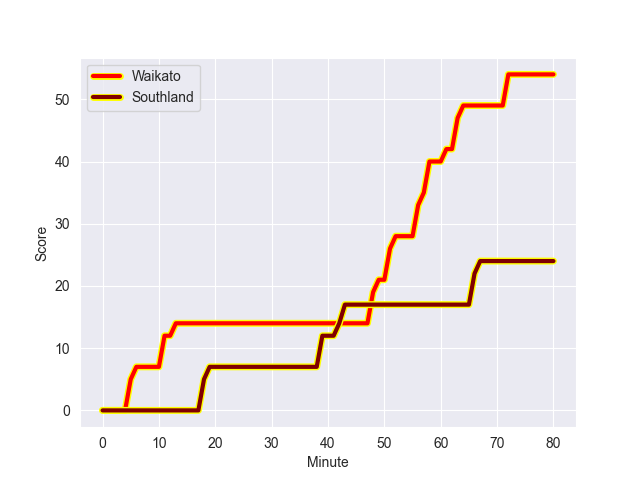
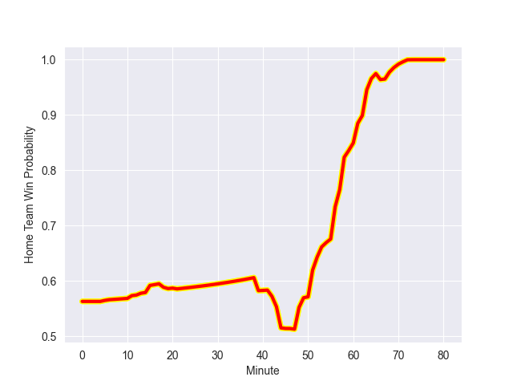

---  
layout: page  
title: Southland at Waikato; 24.0-54.0  
date: 2022-09-14 03:05:00 18:00:00 -0500  
categories: match review  
---
# Prediction: Waikato by 16.0

Waikato by 11.0 on a neutral field
## Scores over Time

## Win Probability over Time

# Pre-Match Prediction: Waikato by 17.3

Waikato by 12.3 on a neutral pitch

|   Away Minutes | Away Player      |   Away elo |   Away Percentile |   Number |   Home Percentile |   Home elo | Home Player        |   Home Minutes |
|---------------:|:-----------------|-----------:|------------------:|---------:|------------------:|-----------:|:-------------------|---------------:|
|             61 | Paula Latu       |      76.22 |                23 |        1 |                24 |      77.21 | Rob Cobb           |             46 |
|             58 | Sam Stewart      |      71.42 |                 5 |        2 |                69 |      84.29 | Pita Anae Ah-Sue   |             68 |
|             80 | Caleb Aperahama  |      78.66 |                36 |        4 |                50 |      81.25 | James Thompson     |             80 |
|             80 | Josh Bekhuis     |      73.43 |                13 |        5 |                51 |      81.4  | Hamilton Burr      |             80 |
|             21 | Joe Robins       |      76.17 |                26 |        6 |               100 |     130.51 | Liam Messam        |             44 |
|             80 | Hayden Michaels  |      82.54 |                61 |        7 |                45 |      80.61 | Mitchell Jacobson  |             58 |
|             49 | Arese Poliko     |      79.06 |                33 |        8 |                51 |      82.78 | Te Rama Reuben     |             80 |
|             64 | Jay Renton       |      69.79 |                 2 |        9 |                72 |      88.01 | Cortez Ratima      |             67 |
|             80 | Solomon Alaimalo |     103.74 |                93 |       11 |                67 |      85.96 | Daniel Sinkinson   |             69 |
|             64 | Robbie Robinson  |      80.85 |                42 |       15 |                34 |      79.08 | Tepaea Cook-Savage |             53 |
|             22 | Jacob Payne      |      80.39 |                51 |       16 |                98 |     110.16 | Rhys Marshall      |             12 |
|             19 | Joe Walsh        |      63.31 |                 1 |       17 |                62 |      81.11 | Ollie Norris       |             34 |
|             65 | Morgan Mitchell  |      59.34 |                 0 |       18 |                41 |      80.18 | George Dyer        |             34 |
|             59 | Grayson Knapp    |      80.24 |                46 |       19 |                 3 |      63.75 | Jack Lam           |             36 |
|             16 | Jakob Morrison   |      78.7  |                37 |       21 |                60 |      82.94 | Rhys Dickinson     |             24 |
|             22 | Jack MacLeod     |      77.32 |                27 |       22 |                90 |     103.78 | Damian McKenzie    |             27 |
|             16 | Rory van Vugt    |      71.19 |                 5 |       23 |                72 |      89.51 | D'Angelo Leuila    |             26 |

