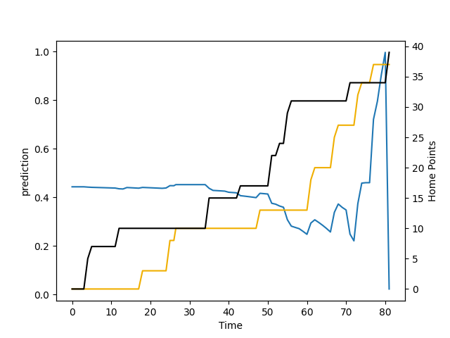

---  
layout: page  
title: New Zealand at Australia; 39.0-37.0  
date: 2022-09-15 05:45:00 18:00:00 -0500  
categories: match review  
---
# Prediction: New Zealand by 5.2

New Zealand by 10.2 on a neutral field

# Pre-Match Prediction: New Zealand by 6.4

New Zealand by 11.4 on a neutral pitch
# Projection using minutes played for each player: New Zealand by 5.2

New Zealand by 10.2 on a neutral field

|   Away Minutes | Away Player         |   Away elo |   Away Percentile |   Number |   Home Percentile |   Home elo | Home Player      |   Home Minutes |
|---------------:|:--------------------|-----------:|------------------:|---------:|------------------:|-----------:|:-----------------|---------------:|
|             51 | Ethan de Groot      |      79.68 |                29 |        1 |                72 |      92.79 | James Slipper    |             40 |
|             62 | Samisoni Taukei'aho |      86.53 |                60 |        2 |                61 |      85.11 | Dave Porecki     |             57 |
|             58 | Tyrel Lomax         |      91.47 |                67 |        3 |                76 |      94.35 | Allan Alaalatoa  |             72 |
|             81 | Brodie Retallick    |      99.99 |                82 |        4 |                32 |      77.61 | Jed Holloway     |             81 |
|             81 | Samuel Whitelock    |     119.39 |                99 |        5 |                38 |      79.32 | Matt Philip      |             51 |
|             81 | Scott Barrett       |     100.19 |                85 |        6 |                18 |      76.34 | Rob Leota        |             35 |
|             24 | Sam Cane            |     106.06 |                94 |        7 |                89 |      99.68 | Pete Samu        |             81 |
|             69 | Hoskins Sotutu      |      90.58 |                65 |        8 |                70 |      89.97 | Rob Valetini     |             81 |
|             75 | Aaron Smith         |      92.79 |                68 |        9 |                17 |      75.44 | Jake Gordon      |             62 |
|             81 | Richie Mo'unga      |     107.32 |                94 |       10 |                90 |     100.47 | Bernard Foley    |             81 |
|             81 | Caleb Clarke        |      75.65 |                 9 |       11 |                68 |      87.69 | Marika Koroibete |             81 |
|             14 | David Havili        |     106.33 |                94 |       12 |                62 |      86.21 | Lalakai Foketi   |             81 |
|             81 | Rieko Ioane         |      78.87 |                22 |       13 |                72 |      92.13 | Len Ikitau       |             53 |
|             81 | Will Jordan         |      95.75 |                76 |       14 |                60 |      83.17 | Tom Wright       |             81 |
|             81 | Jordie Barrett      |     103.01 |                88 |       15 |                74 |      93.2  | Andrew Kellaway  |             81 |
|             19 | Dane Coles          |     116.78 |                99 |       16 |                77 |      96.04 | Folau Fainga'a   |             24 |
|             30 | George Bower        |      78.79 |                25 |       17 |                50 |      85.25 | Scott Sio        |             41 |
|             23 | Fletcher Newell     |      77.91 |                12 |       18 |                49 |      81.29 | Pone Fa'amausili |              9 |
|             12 | Akira Ioane         |     100.74 |                88 |       19 |                47 |      82.4  | Darcy Swain      |             46 |
|             57 | Dalton Papalii      |     102.4  |                90 |       20 |                57 |      83.63 | Fraser McReight  |             30 |
|              6 | Finlay Christie     |      89.15 |                61 |       21 |                99 |     122.29 | Nic White        |             28 |
|             45 | Beauden Barrett     |     108.73 |                95 |       22 |                60 |      87.53 | Reece Hodge      |              0 |
|             22 | Quinn Tupaea        |      91.94 |                70 |       23 |                71 |      91.44 | Jordan Petaia    |             19 |

