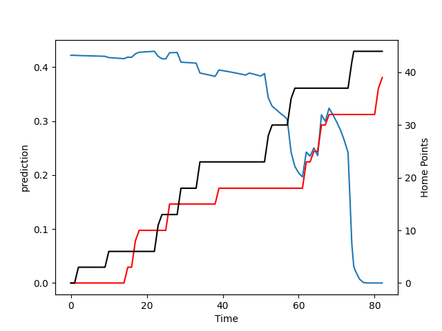

---  
layout: page  
title: Canterbury at Counties Manukau; 44.0-39.0  
date: 2022-09-16 22:05:00 18:00:00 -0500  
categories: match review  
---
# Prediction: Canterbury by 8.7

Canterbury by 13.7 on a neutral field

# Pre-Match Prediction: Canterbury by 9.6

Canterbury by 14.6 on a neutral pitch
# Projection using minutes played for each player: Canterbury by 8.7

Canterbury by 13.7 on a neutral field

|   Away Minutes | Away Player        |   Away elo |   Away Percentile |   Number |   Home Percentile |   Home elo | Home Player         |   Home Minutes |
|---------------:|:-------------------|-----------:|------------------:|---------:|------------------:|-----------:|:--------------------|---------------:|
|             71 | Tamaiti Williams   |      82.56 |                44 |        1 |                 1 |      66.62 | Ezekiel Lindenmuth  |             53 |
|             63 | Brodie McAlister   |      92.31 |                68 |        2 |                29 |      77.04 | Zuriel Togiatama    |             56 |
|             51 | Owen Franks        |      95.89 |                75 |        3 |                16 |      75.32 | Suetena Asomua      |             68 |
|             59 | Sam Darry          |      79.37 |                26 |        4 |                33 |      77.56 | William Furniss     |             82 |
|             82 | Dom Gardiner       |      82.17 |                39 |        5 |                 8 |      71.6  | Sam Slade           |             82 |
|             82 | Billy Harmon       |      85.13 |                56 |        6 |                 3 |      66.8  | Alex McRobbie       |             61 |
|             59 | Tom Christie       |      97.34 |                79 |        7 |                71 |      89.95 | Sean Reidy          |             29 |
|             82 | Liam Allen         |      81.89 |                39 |        8 |                40 |      78.9  | Sam Tuifua          |             82 |
|             68 | Mitch Drummond     |      96.43 |                74 |        9 |                49 |      81.04 | Cam Roigard         |             68 |
|             68 | Fergus Burke       |      82.04 |                45 |       10 |                18 |      74.68 | Riley Hohepa        |             82 |
|             59 | Manasa Mataele     |      87.62 |                64 |       11 |                24 |      75.75 | Peniasi Malimali    |             82 |
|             82 | Rameka Poihipi     |      80.66 |                33 |       12 |                30 |      76.73 | AJ Alatimu          |             82 |
|             82 | Isaiah Punivai     |      83.66 |                48 |       13 |                61 |      85.79 | Ahsee Tuala         |             68 |
|             82 | Ngatungane Punivai |      84.68 |                56 |       14 |                55 |      81.15 | Tevita Ofa          |             82 |
|             82 | Chay Fihaki        |      91.17 |                66 |       15 |                 3 |      68.89 | Jared Page          |             47 |
|             23 | Luke Romano        |      90.17 |                65 |       19 |                52 |      83.18 | Stefano Leavasa     |             21 |
|             23 | Corey Kellow       |      84.13 |                59 |       20 |                46 |      81.15 | Adam Brash          |             53 |
|             14 | Willi Heinz        |     102.71 |                90 |       21 |                12 |      74.95 | Jonathan Taumateine |             14 |

