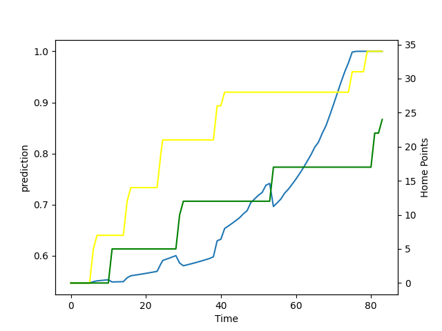

---  
layout: page  
title: Manawatu at Taranaki; 24.0-34.0  
date: 2022-09-16 03:05:00 18:00:00 -0500  
categories: match review  
---
# Prediction: Taranaki by 13.1

Taranaki by 8.1 on a neutral field

# Pre-Match Prediction: Taranaki by 11.9

Taranaki by 6.9 on a neutral pitch
# Projection using minutes played for each player: Taranaki by 13.1

Taranaki by 8.1 on a neutral field

|   Away Minutes | Away Player          |   Away elo |   Away Percentile |   Number |   Home Percentile |   Home elo | Home Player            |   Home Minutes |
|---------------:|:---------------------|-----------:|------------------:|---------:|------------------:|-----------:|:-----------------------|---------------:|
|             46 | Harrison Allan       |      73.58 |                 8 |        1 |                 4 |      73.21 | Jared Proffit          |             57 |
|             53 | Siua Maile           |      70.08 |                 4 |        2 |                18 |      78.2  | Ricky Riccitelli       |             83 |
|             46 | Flyn Yates           |      74.85 |                11 |        3 |                 1 |      68.39 | Donald Brighouse       |             52 |
|             83 | Micaiah Torrence     |      72.24 |                 9 |        4 |                25 |      79.08 | Hemopo Cunningham      |             59 |
|             83 | Ofa Tauatevalu       |      75.81 |                21 |        5 |                21 |      78.7  | Scott Jury             |             81 |
|             51 | Te Kamaka Howden     |      69.31 |                 4 |        6 |                37 |      80.87 | Bradley Slater         |             83 |
|             66 | Johnny Galloway      |      73.15 |                 9 |        7 |                35 |      80.43 | Tom Florence           |             66 |
|             83 | Brayden Iose         |      64.96 |                 3 |        8 |                 7 |      72.8  | Kaylum Boshier         |             41 |
|             66 | Luke Campbell        |      73.47 |                11 |        9 |                 3 |      71.58 | Logan Crowley          |             48 |
|             68 | Brett Cameron        |      84.24 |                58 |       10 |                10 |      75.05 | Daniel Waite           |             83 |
|             68 | Ed Fidow             |      67.18 |                 2 |       11 |                63 |      86.99 | Kini Naholo            |             83 |
|             83 | Jason Emery          |      64.28 |                 1 |       12 |                 2 |      68.04 | Teihorangi Walden      |             83 |
|             83 | Kegan Christian-Goss |      80.97 |                49 |       13 |                21 |      78.51 | Meihana Grindlay       |             83 |
|             83 | Tima Fainga'anuku    |      60.24 |                 0 |       14 |                46 |      82.3  | Vereniki Tikoisolomone |             64 |
|             83 | Drew Wild            |      74.88 |                16 |       15 |                17 |      77.64 | Matt McKenzie          |             58 |
|             17 | Logan Henry          |      80.14 |                37 |       21 |                62 |      88.31 | Liam Blyde             |             35 |
|             15 | Adam Boult           |      81.34 |                47 |       23 |                15 |      75.89 | Adam Lennox            |             25 |

