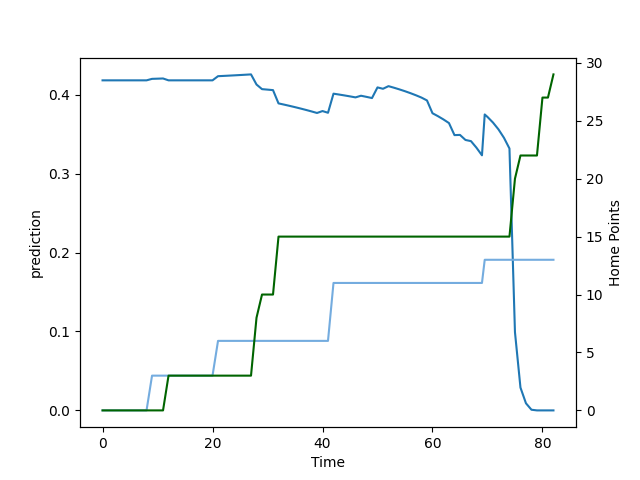

---  
layout: page  
title: South Africa at Argentina; 36.0-20.0  
date: 2022-09-17 15:10:00 18:00:00 -0500  
categories: match review  
---
# Prediction: South Africa by 9.3

South Africa by 14.3 on a neutral field

# Pre-Match Prediction: South Africa by 9.5

South Africa by 14.5 on a neutral pitch
# Projection using minutes played for each player: South Africa by 9.3

South Africa by 14.3 on a neutral field

|   Away Minutes | Away Player       |   Away elo |   Away Percentile |   Number |   Home Percentile |   Home elo | Home Player           |   Home Minutes |
|---------------:|:------------------|-----------:|------------------:|---------:|------------------:|-----------:|:----------------------|---------------:|
|             67 | Steven Kitshoff   |     108.73 |                98 |        1 |                65 |      89.61 | Nahuel Tetaz Chaparro |             47 |
|             82 | Malcolm Marx      |      89.99 |                69 |        2 |                77 |      97.37 | Julian Montoya        |             65 |
|             59 | Frans Malherbe    |      85.67 |                61 |        3 |                 1 |      68.37 | Eduardo Bello         |             47 |
|             82 | Eben Etzebeth     |     103.75 |                93 |        4 |                82 |      99.33 | Matias Alemanno       |             64 |
|             52 | Lood de Jager     |      92.87 |                72 |        5 |                64 |      90.95 | Tomas Lavanini        |             82 |
|             60 | Siya Kolisi       |      91.72 |                74 |        6 |                10 |      75.88 | Juan Martin Gonzalez  |             65 |
|             82 | Franco Mostert    |     100.57 |                90 |        7 |                10 |      76.1  | Marcos Kremer         |             82 |
|             52 | Jasper Wiese      |      91    |                70 |        8 |                89 |     103.7  | Pablo Matera          |             82 |
|             60 | Jaden Hendrikse   |      84.89 |                58 |        9 |                 5 |      72.75 | Gonzalo Bertranou     |             50 |
|             65 | Damian Willemse   |      95.96 |                81 |       10 |                71 |      93.89 | Santiago Carreras     |             76 |
|             82 | Makazole Mapimpi  |     108.54 |                97 |       11 |                38 |      80.16 | Lucio Cinti           |             40 |
|             82 | Damian de Allende |      97.57 |                85 |       12 |                76 |      96.3  | Jeronimo de la Fuente |             82 |
|             76 | Jesse Kriel       |      95.29 |                80 |       13 |                30 |      79.78 | Matias Orlando        |             82 |
|             82 | Canan Moodie      |      94.53 |                79 |       14 |                61 |      86.33 | Emiliano Boffelli     |             82 |
|             82 | Willie le Roux    |     106.09 |                95 |       15 |                10 |      75.73 | Juan Cruz Mallia      |             82 |
|             22 | Deon Fourie       |     105.54 |                94 |       16 |                98 |     115.75 | Agustin Creevy        |             17 |
|             15 | Ox Nche           |      96.47 |                78 |       17 |                63 |      87.58 | Thomas Gallo          |             35 |
|             23 | Trevor Nyakane    |      86.59 |                60 |       18 |                19 |      77.35 | Joel Sclavi           |             35 |
|             30 | Elrigh Louw       |      90.47 |                70 |       19 |                20 |      78.02 | Guido Petti           |             18 |
|             30 | Kwagga Smith      |      83.01 |                56 |       20 |                54 |      81.87 | Rodrigo Bruni         |             17 |
|             22 | Faf de Klerk      |      97.12 |                78 |       21 |                63 |      89.37 | Tomas Cubelli         |             42 |
|              6 | Andre Esterhuizen |      95.42 |                77 |       22 |                97 |     111.26 | Benjamin Urdapilleta  |              6 |
|             17 | Francois Steyn    |     107.89 |                96 |       23 |                92 |     103.2  | Matias Moroni         |             32 |

