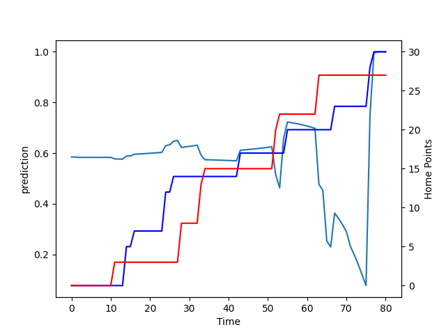

---  
layout: page  
title: Tasman at Auckland; 27.0-30.0  
date: 2022-09-17 00:35:00 18:00:00 -0500  
categories: match review  
---
# Prediction: Auckland by 19.9

Auckland by 14.9 on a neutral field

# Pre-Match Prediction: Auckland by 12.5

Auckland by 7.5 on a neutral pitch
# Projection using minutes played for each player: Auckland by 19.9

Auckland by 14.9 on a neutral field

|   Away Minutes | Away Player             |   Away elo |   Away Percentile |   Number |   Home Percentile |   Home elo | Home Player         |   Home Minutes |
|---------------:|:------------------------|-----------:|------------------:|---------:|------------------:|-----------:|:--------------------|---------------:|
|             67 | Kershawl Sykes-Martin   |      76.6  |                32 |        1 |                59 |      88.51 | Alex Hodgman        |             71 |
|             80 | Quentin MacDonald       |      95.4  |                82 |        2 |                37 |      82.57 | Soane Vikena        |             80 |
|             54 | Samuel Matenga          |      77.62 |                36 |        3 |                14 |      79.49 | Angus Ta'avao-Matau |             80 |
|             80 | Te Ahiwaru Cirikidaveta |      79.75 |                51 |        4 |                42 |      81.21 | Jamie Lane          |              2 |
|             80 | Max Hicks               |      74.84 |                24 |        5 |                31 |      82.11 | Josh Beehre         |             80 |
|             80 | Viliami Napa'a          |      80.81 |                58 |        6 |                46 |      84.24 | Blake Gibson        |             80 |
|             80 | Fletcher Anderson       |      80.91 |                58 |        7 |                14 |      78.93 | Adrian Choat        |             80 |
|             80 | Sione Talitui           |      79.81 |                51 |        8 |                19 |      79    | Jackson Pugh        |             67 |
|             80 | Noah Hotham             |      75.66 |                30 |        9 |                 6 |      76.06 | Taufa Funaki        |             80 |
|             80 | William Havili          |      74.18 |                22 |       10 |                71 |      95.36 | Harry Plummer       |             71 |
|             80 | Macca Springer          |      76.42 |                38 |       11 |                 8 |      76.08 | Tomas Aoake         |             80 |
|             80 | Alex Nankivell          |      82.92 |                59 |       12 |                 5 |      72.81 | Roger Tuivasa-Sheck |             65 |
|             80 | Levi Aumua              |      82.42 |                57 |       13 |                98 |     115.86 | Bryce Heem          |             80 |
|             77 | Fetuli Paea             |      80.61 |                58 |       14 |                16 |      79.05 | AJ Lam              |             80 |
|             80 | Tomasi Alosio           |      83.19 |                57 |       15 |                72 |      96.7  | Salesi Rayasi       |             80 |
|              0 | Samiuela Moli           |      68.16 |                 3 |       16 |                71 |      93.2  | Robbie Abel         |              0 |
|             13 | Ryan Coxon              |      79.21 |                33 |       17 |                40 |      80.36 | Jordan Lay          |              9 |
|              0 | Louie Chapman           |      78.11 |                22 |       21 |                44 |      81.29 | Manu Paea           |              0 |
|              0 | Campbell Parata         |      73.64 |                 9 |       22 |                74 |      93.82 | Simon Hickey        |              9 |
|              3 | Timoci Tavatavanawai    |      71.97 |                 6 |       23 |                54 |      84.05 | Corey Evans         |             15 |

