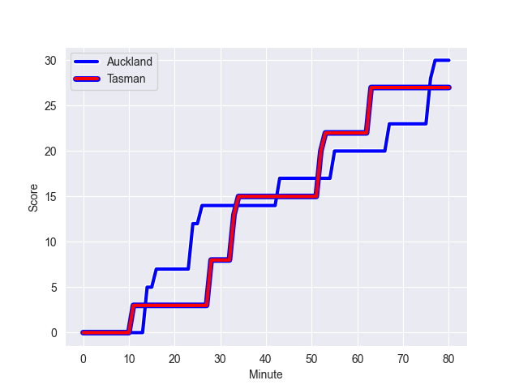
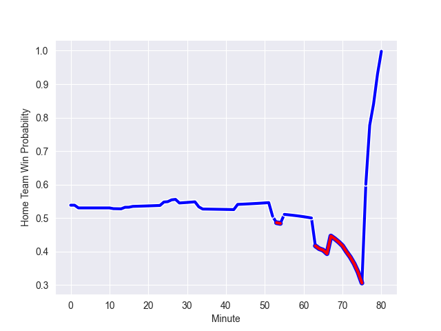

---  
layout: page  
title: Tasman at Auckland; 27.0-30.0  
date: 2022-09-17 00:35:00 18:00:00 -0500  
categories: match review  
---
# Prediction: Auckland by 11.7

Auckland by 6.7 on a neutral field
## Scores over Time

## Win Probability over Time

# Pre-Match Prediction: Auckland by 13.8

Auckland by 8.8 on a neutral pitch

|   Away Minutes | Away Player             |   Away elo |   Away Percentile |   Number |   Home Percentile |   Home elo | Home Player         |   Home Minutes |
|---------------:|:------------------------|-----------:|------------------:|---------:|------------------:|-----------:|:--------------------|---------------:|
|             67 | Kershawl Sykes-Martin   |      76.6  |                19 |        1 |                78 |      88.51 | Alex Hodgman        |             71 |
|             80 | Quentin MacDonald       |      95.4  |                89 |        2 |                57 |      82.08 | Soane Vikena        |             80 |
|             54 | Samuel Matenga          |      77.62 |                18 |        3 |                94 |      99.98 | Angus Ta'avao       |              2 |
|             80 | Te Ahiwaru Cirikidaveta |      79.75 |                43 |        4 |                49 |      80.88 | Jamie Lane          |              2 |
|             80 | Max Hicks               |      74.84 |                16 |        5 |                56 |      82.11 | Josh Beehre         |             80 |
|             80 | Sione Talitui           |      79.81 |                36 |        8 |                27 |      78.5  | Jackson Pugh        |             67 |
|             80 | Noah Hotham             |      75.66 |                18 |        9 |                19 |      75.67 | Taufa Funaki        |             80 |
|             80 | William Havili          |      74.18 |                10 |       10 |                82 |      94.97 | Harry Plummer       |             71 |
|             80 | Macca Springer          |      76.42 |                18 |       11 |                17 |      76.08 | Tomas Aoake         |             80 |
|             80 | Alex Nankivell          |      82.92 |                56 |       12 |                 7 |      72.3  | Roger Tuivasa-Sheck |             65 |
|             80 | Levi Aumua              |      82.42 |                55 |       13 |                99 |     115.35 | Bryce Heem          |             80 |
|             77 | Fetuli Paea             |      80.61 |                36 |       14 |                31 |      78.54 | AJ Lam              |             80 |
|             80 | Tomasi Alosio           |      83.19 |                53 |       15 |                86 |      96.19 | Salesi Rayasi       |             80 |
|              0 | Samiuela Moli           |      68.16 |                 3 |       16 |                87 |      93.18 | Robbie Abel         |              0 |
|             13 | Ryan Coxon              |      79.21 |                38 |       17 |                43 |      80.07 | Jordan Lay          |              9 |
|              0 | Louie Chapman           |      78.11 |                30 |       21 |                50 |      81.17 | Manu Paea           |              0 |
|              0 | Campbell Parata         |      73.64 |                 8 |       22 |                80 |      93.7  | Simon Hickey        |              9 |
|              3 | Timoci Tavatavanawai    |      71.97 |                 7 |       23 |                61 |      83.79 | Corey Evans         |             15 |

