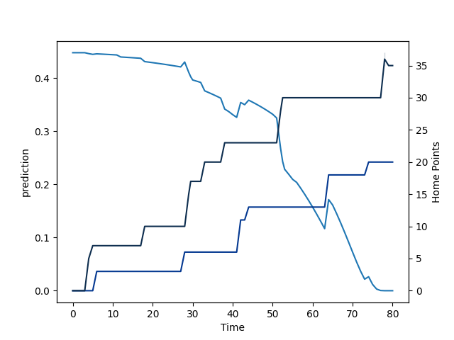

---  
layout: page  
title: Sale Sharks at Bath Rugby; 37.0-20.0  
date: 2022-09-17 10:00:00 18:00:00 -0500  
categories: match review  
---
# Prediction: Sale Sharks by 4.1

Sale Sharks by 9.1 on a neutral field

# Pre-Match Prediction: Sale Sharks by 3.8

Sale Sharks by 8.8 on a neutral pitch
# Projection using minutes played for each player: Sale Sharks by 4.1

Sale Sharks by 9.1 on a neutral field

|   Away Minutes | Away Player         |   Away elo |   Away Percentile |   Number |   Home Percentile |   Home elo | Home Player           |   Home Minutes |
|---------------:|:--------------------|-----------:|------------------:|---------:|------------------:|-----------:|:----------------------|---------------:|
|             63 | Simon McIntyre      |      87.31 |                65 |        1 |                 9 |      76.11 | Lewis Boyce           |             53 |
|             65 | Akker van der Merwe |      99.12 |                87 |        2 |                66 |      91.26 | Tom Dunn              |             76 |
|             80 | Nic Schonert        |      72.32 |                 8 |        3 |                68 |      92.2  | Aranos Coetzee        |             53 |
|             51 | Cobus Wiese         |      89.78 |                67 |        4 |                99 |     120.73 | Dave Attwood          |             80 |
|             80 | Jonny Hill          |      86.56 |                62 |        5 |                 4 |      71.1  | Josh McNally          |             56 |
|             80 | Jean-Luc du Preez   |     115.75 |                99 |        6 |                 4 |      71.85 | Josh Bayliss          |             80 |
|             68 | Ben Curry           |      80.21 |                50 |        7 |                28 |      80    | Wesley White          |             74 |
|             74 | Daniel du Preez     |     102.49 |                90 |        8 |                21 |      78.37 | Jaco Coetzee          |             40 |
|             78 | Gus Warr            |      78.51 |                39 |        9 |                63 |      90.2  | Ben Spencer           |             30 |
|             80 | Robert du Preez     |      76.42 |                30 |       10 |                64 |      90.57 | Piers Francis         |             80 |
|             80 | Tom O'Flaherty      |      92.3  |                75 |       11 |                 0 |      65.68 | Will Muir             |             76 |
|             80 | Manu Tuilagi        |     111.96 |                98 |       12 |                46 |      83.65 | Cameron Redpath       |             80 |
|             80 | Sam James           |      99.46 |                89 |       13 |                92 |     105.92 | Jonathan Joseph       |             80 |
|             12 | Tom Roebuck         |      75.89 |                17 |       14 |                56 |      84.79 | Joe Cokanasiga        |             80 |
|             44 | Luke James          |      86.69 |                60 |       15 |                 6 |      74.76 | Tom de Glanville      |             80 |
|             15 | Ewan Ashman         |      80.57 |                43 |       16 |                36 |      79.4  | Tom Doughty           |              4 |
|             29 | Ross Harrison       |      93.49 |                70 |       17 |                17 |      76.11 | Juan Schoeman         |             27 |
|              6 | Jono Ross           |      91.46 |                71 |       19 |                31 |      79.19 | Will Spencer          |              6 |
|             29 | Tom Curry           |      86.41 |                64 |       20 |                41 |      80.57 | GJ van Velze          |             24 |
|              2 | Joe Simpson         |     102.41 |                92 |       21 |                49 |      82.65 | Louis Schreuder       |             50 |
|              0 | Tom Curtis          |      78.22 |                23 |       22 |                 4 |      70.09 | Orlando Bailey        |              4 |
|             36 | Arron Reed          |      90.07 |                69 |       23 |                11 |      76.97 | Richard de Carpentier |             40 |

