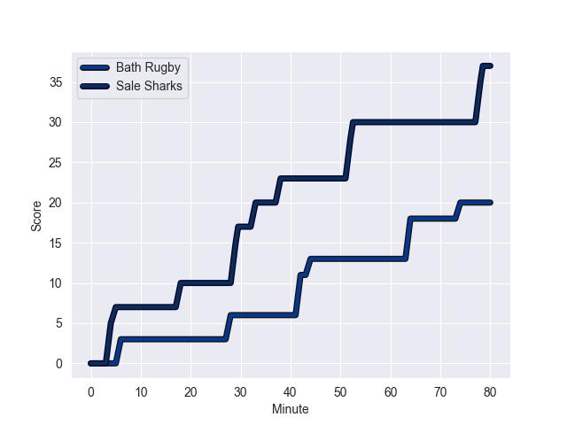
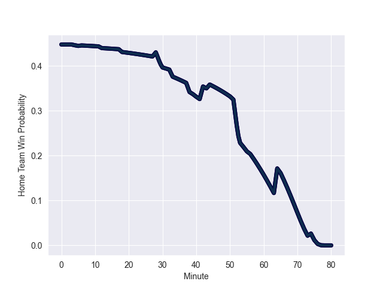

---  
layout: page  
title: Sale Sharks at Bath Rugby; 37.0-20.0  
date: 2022-09-17 10:00:00 18:00:00 -0500  
categories: match review  
---
# Prediction: Sale Sharks by 4.1

Sale Sharks by 9.1 on a neutral field
## Scores over Time

## Win Probability over Time

# Pre-Match Prediction: Sale Sharks by 3.8

Sale Sharks by 8.8 on a neutral pitch

|   Away Minutes | Away Player         |   Away elo |   Away Percentile |   Number |   Home Percentile |   Home elo | Home Player           |   Home Minutes |
|---------------:|:--------------------|-----------:|------------------:|---------:|------------------:|-----------:|:----------------------|---------------:|
|             63 | Simon McIntyre      |      87.31 |                75 |        1 |                11 |      76.11 | Lewis Boyce           |             53 |
|             65 | Akker van der Merwe |      99.12 |                94 |        2 |                83 |      91.26 | Tom Dunn              |             76 |
|             80 | Nic Schonert        |      72.32 |                 6 |        3 |                85 |      92.2  | Aranos Coetzee        |             53 |
|             51 | Cobus Wiese         |      89.78 |                77 |        4 |                99 |     120.73 | Dave Attwood          |             80 |
|             80 | Jonny Hill          |      86.56 |                73 |        5 |                 7 |      71.1  | Josh McNally          |             56 |
|             80 | Jean-Luc du Preez   |     115.75 |                99 |        6 |                 7 |      71.85 | Josh Bayliss          |             80 |
|             74 | Daniel du Preez     |     102.49 |                89 |        8 |                27 |      78.37 | Jaco Coetzee          |             40 |
|             78 | Gus Warr            |      78.51 |                37 |        9 |                78 |      90.2  | Ben Spencer           |             30 |
|             80 | Robert du Preez     |      76.42 |                20 |       10 |                73 |      90.57 | Piers Francis         |             80 |
|             80 | Tom O'Flaherty      |      92.3  |                80 |       11 |                 2 |      65.68 | Will Muir             |             76 |
|             80 | Manu Tuilagi        |     111.96 |                98 |       12 |                59 |      83.65 | Cameron Redpath       |             80 |
|             80 | Sam James           |      99.46 |                90 |       13 |                95 |     105.92 | Jonathan Joseph       |             80 |
|             12 | Tom Roebuck         |      75.89 |                14 |       14 |                65 |      84.79 | Joe Cokanasiga        |             80 |
|             44 | Luke James          |      86.69 |                65 |       15 |                13 |      74.76 | Tom de Glanville      |             80 |
|             15 | Ewan Ashman         |      80.57 |                48 |       16 |                41 |      79.4  | Tom Doughty           |              4 |
|             29 | Ross Harrison       |      93.49 |                86 |       17 |                22 |      76.11 | Juan Schoeman         |             27 |
|              6 | Jono Ross           |      91.46 |                83 |       19 |                38 |      79.19 | Will Spencer          |              6 |
|              2 | Joe Simpson         |     102.41 |                92 |       21 |                58 |      82.65 | Louis Schreuder       |             50 |
|             36 | Arron Reed          |      90.07 |                76 |       23 |                15 |      76.97 | Richard de Carpentier |             40 |

