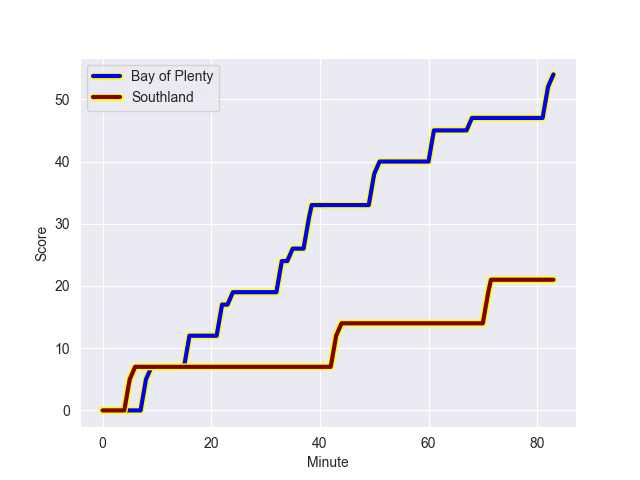
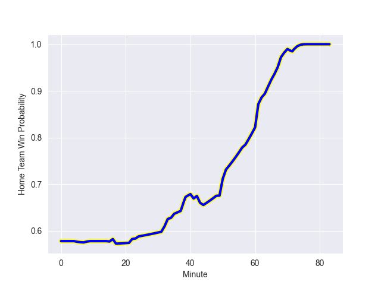

---  
layout: page  
title: Southland at Bay of Plenty; 21.0-54.0  
date: 2022-09-17 22:05:00 18:00:00 -0500  
categories: match review  
---
# Prediction: Bay of Plenty by 18.7

Bay of Plenty by 13.7 on a neutral field
## Scores over Time

## Win Probability over Time

# Pre-Match Prediction: Bay of Plenty by 21.3

Bay of Plenty by 16.3 on a neutral pitch

|   Away Minutes | Away Player      |   Away elo |   Away Percentile |   Number |   Home Percentile |   Home elo | Home Player            |   Home Minutes |
|---------------:|:-----------------|-----------:|------------------:|---------:|------------------:|-----------:|:-----------------------|---------------:|
|             66 | Joe Walsh        |      62.86 |                 1 |        1 |                89 |      94.6  | Aidan Ross             |             49 |
|             61 | Jacob Payne      |      79.86 |                51 |        2 |                96 |     101.87 | Kurt Eklund            |             57 |
|             63 | Morgan Mitchell  |      57.8  |                 0 |        3 |                67 |      84.67 | Tevita Mafileo         |             41 |
|             40 | Caleb Aperahama  |      76.76 |                24 |        4 |                66 |      83.64 | Justin Sangster        |             83 |
|             83 | Josh Bekhuis     |      71.53 |                 8 |        5 |                 6 |      70.12 | Manaaki Selby-Rickit   |             83 |
|             83 | Matt James       |      71.24 |                 5 |        6 |                79 |      89.86 | Naitoa Ah Kuoi         |             83 |
|             83 | Hayden Michaels  |      80.64 |                45 |        7 |                37 |      79.07 | Kohan Herbert          |             41 |
|             63 | Blair Ryall      |      75.37 |                13 |        8 |                47 |      81.16 | Zane Kapeli            |             59 |
|             61 | Jay Renton       |      68.27 |                 1 |        9 |                70 |      86.14 | Te Toiroa Tahuriorangi |             61 |
|             15 | Marty Banks      |      74.92 |                12 |       10 |                30 |      78.46 | Lucas Cashmore         |             83 |
|             41 | Rory van Vugt    |      70.81 |                 5 |       11 |                81 |      92.42 | Nigel Ah Wong          |             83 |
|             83 | Matt Whaanga     |      77.33 |                21 |       12 |                75 |      89.65 | Kaveinga Finau         |             61 |
|             83 | Viliami Fine     |      68.76 |                 2 |       13 |                 9 |      73.98 | Lalamilo Lalamilo      |             83 |
|             68 | Michael Manson   |      77.34 |                23 |       14 |                73 |      88.98 | Emoni Narawa           |             83 |
|             83 | Robbie Robinson  |      79.33 |                36 |       15 |                46 |      82.16 | Gillies Kaka           |             63 |
|             22 | Sam Stewart      |      70.05 |                 3 |       16 |                71 |      86.19 | Anaru Rangi            |             26 |
|             20 | Paula Latu       |      74.77 |                11 |       18 |                39 |      79.54 | Jeff Thwaites          |             42 |
|             43 | Grayson Knapp    |      78.84 |                46 |       19 |                32 |      78.44 | Veveni Lasaqa          |             42 |
|             22 | Jakob Morrison   |      78.32 |                36 |       21 |                41 |      80.08 | Luke Donaldson         |             22 |
|             68 | Jack MacLeod     |      76.8  |                26 |       22 |                 3 |      68.92 | Wharenui Hawera        |             20 |
|             57 | Solomon Alaimalo |     101.84 |                92 |       23 |                77 |      91.12 | Joey Walton            |             22 |

