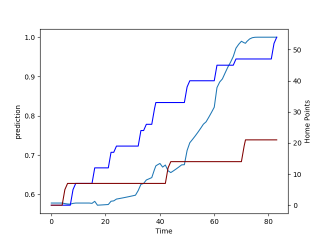

---  
layout: page  
title: Southland at Bay of Plenty; 21.0-54.0  
date: 2022-09-17 22:05:00 18:00:00 -0500  
categories: match review  
---
# Prediction: Bay of Plenty by 18.7

Bay of Plenty by 13.7 on a neutral field

# Pre-Match Prediction: Bay of Plenty by 21.3

Bay of Plenty by 16.3 on a neutral pitch
# Projection using minutes played for each player: Bay of Plenty by 18.7

Bay of Plenty by 13.7 on a neutral field

|   Away Minutes | Away Player      |   Away elo |   Away Percentile |   Number |   Home Percentile |   Home elo | Home Player            |   Home Minutes |
|---------------:|:-----------------|-----------:|------------------:|---------:|------------------:|-----------:|:-----------------------|---------------:|
|             66 | Joe Walsh        |      62.86 |                 0 |        1 |                77 |      94.6  | Aidan Ross             |             49 |
|             61 | Jacob Payne      |      79.86 |                31 |        2 |                91 |     101.87 | Kurt Eklund            |             57 |
|             63 | Morgan Mitchell  |      57.78 |                 0 |        3 |                59 |      84.67 | Tevita Mafileo         |             41 |
|             40 | Caleb Aperahama  |      76.74 |                14 |        4 |                57 |      83.64 | Justin Sangster        |             83 |
|             83 | Josh Bekhuis     |      71.51 |                 3 |        5 |                 6 |      70.12 | Manaaki Selby-Rickit   |             83 |
|             83 | Matt James       |      71.24 |                 3 |        6 |                73 |      89.86 | Naitoa Ah Kuoi         |             83 |
|             83 | Hayden Michaels  |      80.62 |                32 |        7 |                40 |      79.07 | Kohan Herbert          |             41 |
|             63 | Blair Ryall      |      75.37 |                10 |        8 |                50 |      81.16 | Zane Kapeli            |             59 |
|             61 | Jay Renton       |      68.25 |                 1 |        9 |                61 |      86.14 | Te Toiroa Tahuriorangi |             61 |
|             15 | Marty Banks      |      74.91 |                12 |       10 |                43 |      78.46 | Lucas Cashmore         |             83 |
|             41 | Rory van Vugt    |      70.8  |                 3 |       11 |                76 |      92.42 | Nigel Ah Wong          |             83 |
|             83 | Matt Whaanga     |      77.33 |                14 |       12 |                69 |      89.65 | Kaveinga Finau         |             61 |
|             83 | Viliami Fine     |      68.73 |                 2 |       13 |                15 |      73.98 | Lalamilo Lalamilo      |             83 |
|             68 | Michael Manson   |      77.32 |                15 |       14 |                71 |      88.98 | Emoni Narawa           |             83 |
|             83 | Robbie Robinson  |      79.32 |                22 |       15 |                51 |      82.16 | Gillies Kaka           |             63 |
|             22 | Sam Stewart      |      70.03 |                 3 |       16 |                59 |      86.19 | Anaru Rangi            |             26 |
|             20 | Paula Latu       |      74.75 |                 9 |       18 |                35 |      79.54 | Jeff Thwaites          |             42 |
|             43 | Grayson Knapp    |      78.82 |                38 |       19 |                29 |      78.44 | Veveni Lasaqa          |             42 |
|             22 | Jakob Morrison   |      78.31 |                30 |       21 |                35 |      80.08 | Luke Donaldson         |             22 |
|             68 | Jack MacLeod     |      76.79 |                25 |       22 |                 3 |      68.92 | Wharenui Hawera        |             20 |
|             57 | Solomon Alaimalo |     101.81 |                89 |       23 |                69 |      91.12 | Joey Walton            |             22 |

