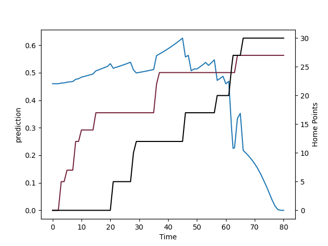

---  
layout: page  
title: Saracens at Harlequins; 30.0-27.0  
date: 2022-09-17 10:00:00 18:00:00 -0500  
categories: match review  
---
# Prediction: Saracens by 2.0

Saracens by 7.0 on a neutral field

# Pre-Match Prediction: Saracens by 0.2

Saracens by 4.8 on a neutral pitch
# Projection using minutes played for each player: Saracens by 2.0

Saracens by 7.0 on a neutral field

|   Away Minutes | Away Player       |   Away elo |   Away Percentile |   Number |   Home Percentile |   Home elo | Home Player     |   Home Minutes |
|---------------:|:------------------|-----------:|------------------:|---------:|------------------:|-----------:|:----------------|---------------:|
|             48 | Eroni Mawi        |      77.19 |                20 |        1 |                95 |     106.1  | Joe Marler      |             60 |
|             48 | Tom Woolstencroft |      85.16 |                60 |        2 |                53 |      83.29 | George Head     |             50 |
|             63 | Christian Judge   |      77.83 |                26 |        3 |                72 |      93.75 | Will Collier    |             20 |
|             80 | Maro Itoje        |      98.94 |                85 |        4 |                54 |      84.79 | George Hammond  |             63 |
|             80 | Hugh Tizard       |      78.86 |                35 |        5 |                65 |      90.71 | Irne Herbst     |             80 |
|             63 | Theo McFarland    |      82.79 |                56 |        6 |                67 |      89.05 | Jack Kenningham |             80 |
|             80 | Ben Earl          |     101.92 |                91 |        7 |                11 |      75.91 | Will Evans      |             80 |
|             76 | Billy Vunipola    |     114.09 |                97 |        8 |                81 |      98.26 | Alex Dombrandt  |             37 |
|             69 | Ivan van Zyl      |      79.23 |                36 |        9 |                43 |      81.92 | Lewis Gjaltema  |             72 |
|             80 | Owen Farrell      |     114.31 |                98 |       10 |                54 |      83.99 | Tommaso Allan   |             80 |
|             80 | Alex Lewington    |      84.78 |                62 |       11 |                10 |      75.09 | Cadan Murley    |             80 |
|             80 | Nick Tompkins     |      96.39 |                81 |       12 |                45 |      82.27 | Lennox Anyanwu  |             73 |
|             76 | Alex Lozowski     |      81.25 |                47 |       13 |                61 |      87.65 | Luke Northmore  |             80 |
|             80 | Max Malins        |      85.99 |                64 |       14 |                70 |      90.85 | Joe Marchant    |             80 |
|             80 | Elliot Daly       |      72.72 |                 8 |       15 |                 9 |      74.66 | Tyrone Green    |             80 |
|             32 | Jamie George      |     112.71 |                98 |       16 |                22 |      77.52 | Jack Walker     |             30 |
|             32 | Mako Vunipola     |     101    |                88 |       17 |                12 |      76.5  | Simon Kerrod    |             20 |
|             17 | Alec Clarey       |      76.11 |                13 |       18 |                83 |      98.27 | Wilco Louw      |             60 |
|             17 | Andy Christie     |      81.82 |                42 |       19 |                67 |      88.37 | Dino Lamb       |             17 |
|              4 | Jackson Wray      |     100.81 |                89 |       20 |                49 |      82.32 | Archie White    |             43 |
|              0 | Manu Vunipola     |      85.6  |                59 |       22 |                59 |      86.57 | Will Edwards    |              0 |

