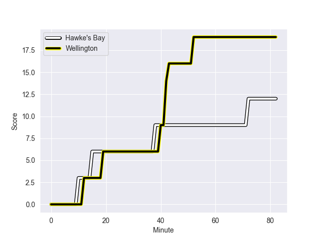
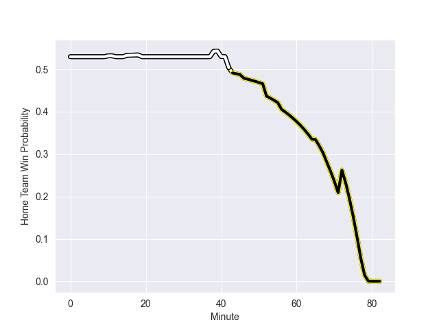

---  
layout: page  
title: Wellington at Hawke's Bay; 19.0-12.0  
date: 2022-09-17 03:05:00 18:00:00 -0500  
categories: match review  
---
# Prediction: Hawke's Bay by 10.2

Hawke's Bay by 5.2 on a neutral field
## Scores over Time

## Win Probability over Time

# Pre-Match Prediction: Hawke's Bay by 11.5

Hawke's Bay by 6.5 on a neutral pitch

|   Away Minutes | Away Player           |   Away elo |   Away Percentile |   Number |   Home Percentile |   Home elo | Home Player          |   Home Minutes |
|---------------:|:----------------------|-----------:|------------------:|---------:|------------------:|-----------:|:---------------------|---------------:|
|             82 | Xavier Numia          |      88.03 |                78 |        1 |                58 |      82.55 | Pouri Rakete-Stones  |             69 |
|             82 | Asafo Aumua           |      95.52 |                90 |        2 |                23 |      77.25 | Tyrone Thompson      |             56 |
|             40 | Pek Cowan             |      79.06 |                36 |        3 |                49 |      81.48 | Joe Apikotoa         |             65 |
|             82 | James Blackwell       |      76.3  |                21 |        4 |                93 |     101.6  | Isaia Walker-Leawere |             65 |
|             82 | Dom Bird              |      79.73 |                43 |        5 |                72 |      86.03 | Tom Parsons          |             82 |
|             74 | Caleb Delany          |      73.9  |                10 |        6 |                43 |      80.31 | Marino Mikaele-Tu'u  |             82 |
|             82 | Du'Plessis Kirifi     |      83.93 |                64 |        7 |                52 |      82.55 | Solomone Funaki      |             61 |
|             82 | Peter Lakai           |      75.75 |                17 |        8 |                62 |      85.33 | Devan Flanders       |             82 |
|             82 | TJ Perenara           |      93.96 |                83 |        9 |                88 |      99.33 | Brad Weber           |             56 |
|             76 | Aidan Morgan          |      75.65 |                14 |       10 |                41 |      79.99 | Lincoln McClutchie   |             82 |
|             82 | Pepesana Patafilo     |      73.83 |                 8 |       11 |                64 |      84.53 | Jonah Lowe           |             82 |
|             68 | Peter Umaga-Jensen    |      74.66 |                12 |       12 |                71 |      88.18 | Danny Toala          |             46 |
|             82 | Billy Proctor         |      79.41 |                35 |       13 |                84 |      95.91 | Stacey Ili           |             82 |
|             82 | Julian Savea          |     105.48 |                95 |       14 |                65 |      84.92 | Ollie Sapsford       |             72 |
|             82 | Ruben Love            |      83.59 |                53 |       15 |                73 |      90.23 | Chase Tiatia         |             82 |
|              0 | James O'Reilly        |      71.41 |                 5 |       16 |                43 |      80.32 | Kianu Kereru-Symes   |             26 |
|             42 | PJ Sheck              |      78.62 |                36 |       17 |                44 |      80.92 | Mark Braidwood       |             13 |
|              0 | Taine Plumtree        |      77.48 |                27 |       19 |                99 |     124.54 | Bryn Evans           |             17 |
|              8 | Keelan Whitman        |      77.94 |                26 |       20 |                59 |      82.73 | Josh Kaifa           |             21 |
|              0 | Richard Judd          |      87.1  |                72 |       21 |                15 |      75.08 | Ere Enari            |             26 |
|              6 | Jackson Garden-Bachop |      75.65 |                14 |       22 |                11 |      75.15 | Nick Grigg           |             36 |
|             14 | Connor Garden-Bachop  |      82.77 |                59 |       23 |                25 |      77.48 | Harry Godfrey        |             10 |

