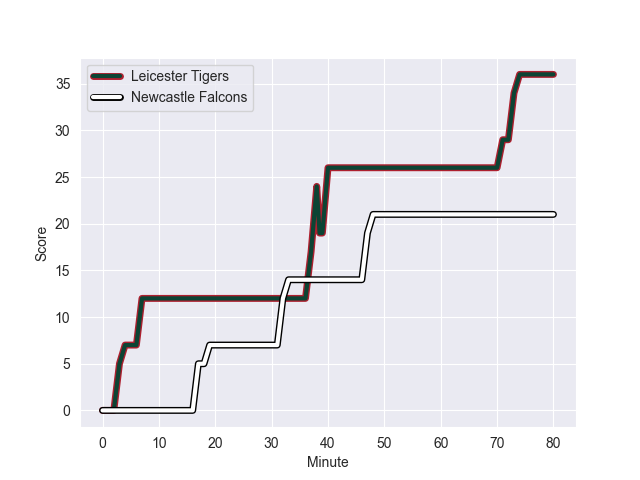
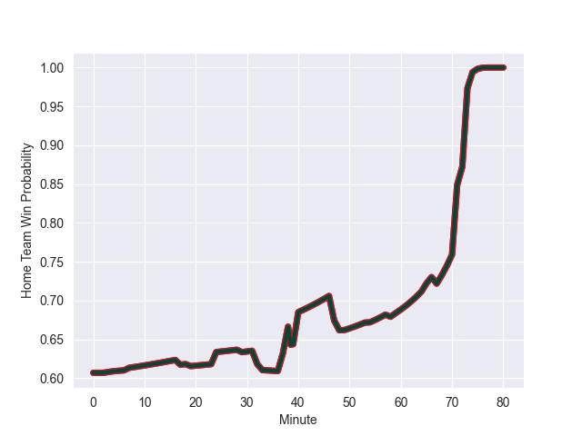

---  
layout: page  
title: Newcastle Falcons at Leicester Tigers; 21.0-36.0  
date: 2022-09-17 10:00:00 18:00:00 -0500  
categories: match review  
---
# Prediction: Leicester Tigers by 23.9

Leicester Tigers by 18.9 on a neutral field
## Scores over Time

## Win Probability over Time

# Pre-Match Prediction: Leicester Tigers by 22.6

Leicester Tigers by 17.6 on a neutral pitch

|   Away Minutes | Away Player             |   Away elo |   Away Percentile |   Number |   Home Percentile |   Home elo | Home Player         |   Home Minutes |
|---------------:|:------------------------|-----------:|------------------:|---------:|------------------:|-----------:|:--------------------|---------------:|
|             67 | Phil Brantingham        |      78.5  |                32 |        1 |                85 |      92.18 | James Cronin        |             58 |
|             71 | George McGuigan         |      75.35 |                13 |        2 |                17 |      76.45 | Charlie Clare       |             75 |
|             67 | Trevor Davison          |      63.87 |                 1 |        3 |                88 |      94.08 | Dan Cole            |             58 |
|             80 | Greg Peterson           |      65.06 |                 2 |        4 |                95 |     103.63 | Harry Wells         |             80 |
|             80 | Sean Robinson           |      82.89 |                60 |        5 |                90 |      98.66 | Calum Green         |             49 |
|             80 | Will Welch              |     107.1  |                93 |        6 |                77 |      89.08 | George Martin       |             71 |
|             65 | Jamie Blamire           |      79.74 |                40 |        7 |                53 |      81.77 | Ollie Chessum       |             80 |
|             59 | Carl Fearns             |      94.33 |                83 |        8 |                91 |     103.72 | Hanro Liebenberg    |             80 |
|             54 | Josh Barton             |      78.43 |                36 |        9 |                85 |      96.91 | Ben Youngs          |             54 |
|             59 | Brett Connon            |      78.17 |                33 |       10 |                87 |      97.29 | Jimmy Gopperth      |             80 |
|             24 | Nathan Earle            |     102.29 |                92 |       11 |                95 |     105.62 | Nemani Nadolo       |             75 |
|             69 | Pete Lucock             |      71.61 |                 6 |       12 |                41 |      80.56 | Guy Porter          |             78 |
|             80 | George Wacokecoke       |      73.73 |                12 |       13 |                78 |      91.59 | Matt Scott          |             67 |
|             80 | Adam Radwan             |      96.11 |                86 |       14 |                38 |      79.54 | Harry Potter        |             80 |
|             80 | Alex Tait               |      83.18 |                52 |       15 |               100 |     125.18 | Chris Ashton        |             80 |
|              9 | Charlie Maddison        |      76.88 |                22 |       16 |                70 |      84.8  | Joe Taufete'e       |              5 |
|             13 | Mark Tampin             |      78.99 |                34 |       18 |                49 |      82.56 | Joe Heyes           |             22 |
|             15 | Sebastian de Chaves     |      73.28 |                12 |       19 |                 0 |      65.03 | Olly Cracknell      |              9 |
|             21 | Connor Collett          |      92.83 |                82 |       20 |                88 |      95.38 | Tommy Reffell       |             31 |
|             26 | Cameron Nordli-Kelemeti |      77.21 |                32 |       21 |                80 |      91.07 | Jack van Poortvliet |             26 |
|             56 | Mateo Carreras          |      75.37 |                13 |       23 |                97 |     108.97 | Kini Murimurivalu   |              5 |

