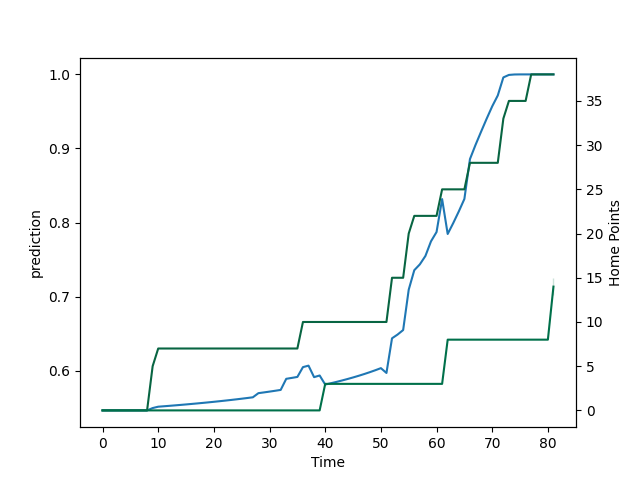

---  
layout: page  
title: London Irish at Northampton Saints; 22.0-38.0  
date: 2022-09-17 09:00:00 18:00:00 -0500  
categories: match review  
---
# Prediction: Northampton Saints by 13.1

Northampton Saints by 8.1 on a neutral field

# Pre-Match Prediction: Northampton Saints by 13.9

Northampton Saints by 8.9 on a neutral pitch
# Projection using minutes played for each player: Northampton Saints by 13.1

Northampton Saints by 8.1 on a neutral field

|   Away Minutes | Away Player                |   Away elo |   Away Percentile |   Number |   Home Percentile |   Home elo | Home Player          |   Home Minutes |
|---------------:|:---------------------------|-----------:|------------------:|---------:|------------------:|-----------:|:---------------------|---------------:|
|             28 | Facundo Gigena             |      76.55 |                13 |        1 |                99 |     116.15 | Alex Waller          |             38 |
|             70 | Matthew Cornish            |      79.61 |                33 |        2 |                61 |      85.15 | Sam Matavesi         |             59 |
|             57 | Lovejoy Chawatama          |      74.35 |                 6 |        3 |                75 |      94.44 | Paul Hill            |             51 |
|             81 | Rob Simmons                |     102.59 |                89 |        4 |                54 |      82.67 | Lukhan Salakaia-Loto |             73 |
|             33 | Adam Coleman               |     108.2  |                95 |        5 |                80 |      96.1  | Alex Moon            |             81 |
|             81 | Ben Donnell                |      79.6  |                30 |        6 |                19 |      76.07 | Alex Coles           |             81 |
|             81 | Tom Pearson                |      90.78 |                69 |        7 |                40 |      79.47 | Aaron Hinkley        |             53 |
|             67 | Matt Rogerson              |      85.04 |                55 |        8 |                53 |      82.57 | Juarno Augustus      |             81 |
|             56 | Ben White                  |      75.64 |                11 |        9 |                83 |      98.21 | Alex Mitchell        |             73 |
|             81 | Paddy Jackson              |      96.29 |                77 |       10 |                70 |      91.29 | James Grayson        |             81 |
|             81 | Ollie Hassell-Collins      |      79.31 |                29 |       11 |                98 |     110.79 | Tom Collins          |             75 |
|             73 | Benhard Janse van Rensburg |      82    |                42 |       12 |                86 |      98.5  | Rory Hutchinson      |             62 |
|             81 | Curtis Rona                |      93    |                70 |       13 |                30 |      77.26 | Matt Proctor         |             81 |
|             59 | Ben Loader                 |      82.53 |                49 |       14 |                69 |      88.99 | Ollie Sleightholme   |             81 |
|             81 | Henry Arundell             |      80.94 |                36 |       15 |                88 |      99.77 | George Furbank       |             81 |
|             11 | Isaac Miller               |      77.2  |                27 |       16 |                93 |     104.26 | Mike Haywood         |             22 |
|             53 | Danilo Fischetti           |      67.43 |                 1 |       17 |                43 |      80.47 | Emmanuel Iyogun      |             42 |
|             24 | Ciaran Parker              |      81.01 |                29 |       18 |                18 |      75.19 | Alfie Petch          |             30 |
|             48 | Api Ratuniyarawa           |      80.63 |                36 |       19 |                55 |      84.91 | Brandon Nansen       |              8 |
|             22 | Will Joseph                |      81.88 |                50 |       23 |                94 |     105.28 | Courtnall Skosan     |              6 |

