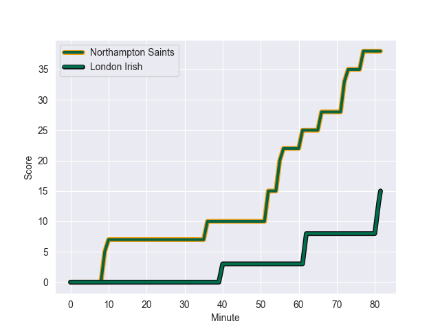
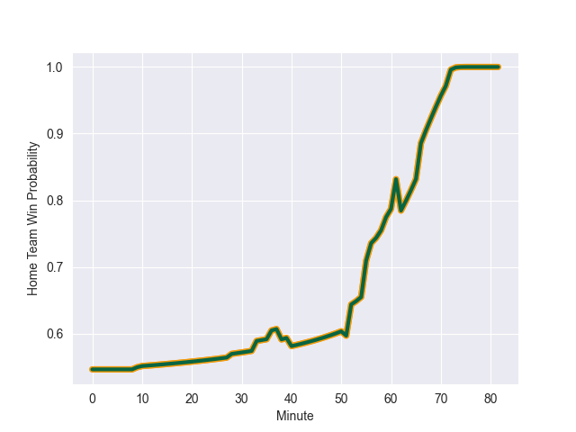

---  
layout: page  
title: London Irish at Northampton Saints; 22.0-38.0  
date: 2022-09-17 09:00:00 18:00:00 -0500  
categories: match review  
---
# Prediction: Northampton Saints by 13.1

Northampton Saints by 8.1 on a neutral field
## Scores over Time

## Win Probability over Time

# Pre-Match Prediction: Northampton Saints by 13.9

Northampton Saints by 8.9 on a neutral pitch

|   Away Minutes | Away Player                |   Away elo |   Away Percentile |   Number |   Home Percentile |   Home elo | Home Player          |   Home Minutes |
|---------------:|:---------------------------|-----------:|------------------:|---------:|------------------:|-----------:|:---------------------|---------------:|
|             28 | Facundo Gigena             |      76.55 |                19 |        1 |                99 |     116.15 | Alex Waller          |             38 |
|             70 | Matthew Cornish            |      79.61 |                42 |        2 |                72 |      85.15 | Sam Matavesi         |             59 |
|             57 | Lovejoy Chawatama          |      74.35 |                10 |        3 |                88 |      94.44 | Paul Hill            |             51 |
|             81 | Rob Simmons                |     102.59 |                95 |        4 |                60 |      82.67 | Lukhan Salakaia-Loto |             73 |
|             33 | Adam Coleman               |     108.2  |                97 |        5 |                86 |      96.1  | Alex Moon            |             81 |
|             81 | Ben Donnell                |      79.6  |                39 |        6 |                20 |      76.07 | Alex Coles           |             81 |
|             81 | Tom Pearson                |      90.78 |                82 |        7 |                39 |      79.47 | Aaron Hinkley        |             53 |
|             67 | Matt Rogerson              |      85.04 |                69 |        8 |                51 |      82.57 | Juarno Augustus      |             81 |
|             56 | Ben White                  |      75.64 |                18 |        9 |                88 |      98.21 | Alex Mitchell        |             73 |
|             81 | Paddy Jackson              |      96.29 |                84 |       10 |                77 |      91.29 | James Grayson        |             81 |
|             81 | Ollie Hassell-Collins      |      79.31 |                36 |       11 |                98 |     110.79 | Tom Collins          |             75 |
|             73 | Benhard Janse van Rensburg |      82    |                51 |       12 |                89 |      98.5  | Rory Hutchinson      |             62 |
|             81 | Curtis Rona                |      93    |                80 |       13 |                21 |      77.26 | Matt Proctor         |             81 |
|             59 | Ben Loader                 |      82.53 |                58 |       14 |                74 |      88.99 | Ollie Sleightholme   |             81 |
|             81 | Henry Arundell             |      80.94 |                41 |       15 |                90 |      99.77 | George Furbank       |             81 |
|             11 | Isaac Miller               |      77.2  |                31 |       16 |                97 |     104.26 | Mike Haywood         |             22 |
|             53 | Danilo Fischetti           |      67.43 |                 1 |       17 |                48 |      80.47 | Emmanuel Iyogun      |             42 |
|             48 | Api Ratuniyarawa           |      80.63 |                43 |       19 |                68 |      84.91 | Brandon Nansen       |              8 |
|             22 | Will Joseph                |      81.88 |                53 |       23 |                94 |     105.28 | Courtnall Skosan     |              6 |

