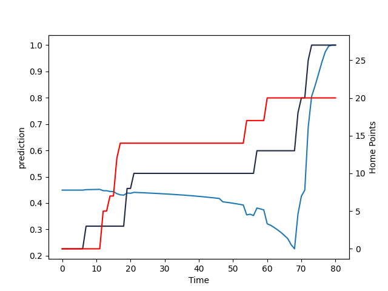

---  
layout: page  
title: Waikato at Otago; 20.0-27.0  
date: 2022-09-17 22:05:00 18:00:00 -0500  
categories: match review  
---
# Prediction: Waikato by 3.9

Waikato by 8.9 on a neutral field

# Pre-Match Prediction: Waikato by 3.4

Waikato by 8.4 on a neutral pitch
# Projection using minutes played for each player: Waikato by 3.9

Waikato by 8.9 on a neutral field

|   Away Minutes | Away Player      |   Away elo |   Away Percentile |   Number |   Home Percentile |   Home elo | Home Player            |   Home Minutes |
|---------------:|:-----------------|-----------:|------------------:|---------:|------------------:|-----------:|:-----------------------|---------------:|
|             61 | Ollie Norris     |      81.74 |                38 |        1 |                53 |      81.51 | Abraham Pole           |             65 |
|             71 | Rhys Marshall    |     109.97 |                96 |        2 |                46 |      79.13 | Henry Bell             |             73 |
|             67 | George Dyer      |      80.81 |                30 |        3 |                28 |      77.01 | Jermaine Ainsley       |             55 |
|             71 | James Tucker     |      97.52 |                75 |        4 |                62 |      85.71 | Fabian Holland         |             80 |
|             80 | Hamilton Burr    |      83.32 |                41 |        5 |                57 |      83.41 | Josh Dickson           |             65 |
|             80 | Samipeni Finau   |      88.37 |                63 |        6 |                65 |      84.64 | Oliver Haig            |             80 |
|             47 | Patrick McCurran |      85.41 |                58 |        7 |                61 |      82.41 | James Lentjes          |             80 |
|             80 | Jack Lam         |      64.62 |                 1 |        8 |                41 |      78.71 | Christian Lio-Willie   |             65 |
|             65 | Xavier Roe       |      79.13 |                19 |        9 |                72 |      92.22 | Kemara Hauiti-Parapara |             67 |
|             80 | Taha Kemara      |      81.92 |                39 |       10 |                57 |      82.81 | Cameron Millar         |             80 |
|             68 | Daniel Sinkinson |      87.11 |                61 |       11 |                55 |      80.58 | Mitchell Scott         |             67 |
|             80 | D'Angelo Leuila  |      90.14 |                63 |       12 |                12 |      72.13 | Josh Ioane             |             80 |
|             80 | Bailyn Sullivan  |      81.81 |                35 |       13 |                13 |      72.44 | Josh Timu              |             80 |
|             57 | Tana Tuhakaraina |      81.97 |                42 |       14 |                46 |      78.73 | Freedom Vahaakolo      |             80 |
|             80 | Damian McKenzie  |     103.92 |                88 |       15 |                55 |      83.42 | Sam Gilbert            |             80 |
|             19 | Rob Cobb         |      78.31 |                25 |       17 |                49 |      81.02 | Tau Koloamatangi       |             15 |
|             13 | Sosefo Kautai    |      87.92 |                64 |       18 |                65 |      89.41 | Josh Hohneck           |             25 |
|              9 | James Thompson   |      83.18 |                52 |       19 |                53 |      83.59 | William Tucker         |             15 |
|             33 | Luke Jacobson    |     103.53 |                90 |       20 |                52 |      82.23 | Sean Withy             |             15 |

