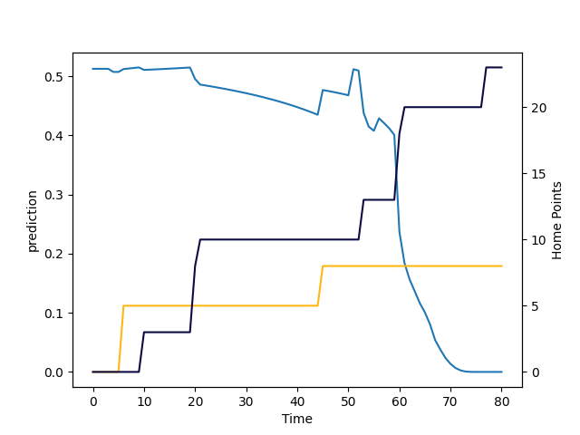

---  
layout: page  
title: Bristol Rugby at Wasps; 23.0-8.0  
date: 2022-09-17 10:00:00 18:00:00 -0500  
categories: match review  
---
# Prediction: Wasps by 7.2

Wasps by 2.2 on a neutral field

# Pre-Match Prediction: Wasps by 7.1

Wasps by 2.1 on a neutral pitch
# Projection using minutes played for each player: Wasps by 7.2

Wasps by 2.2 on a neutral field

|   Away Minutes | Away Player     |   Away elo |   Away Percentile |   Number |   Home Percentile |   Home elo | Home Player      |   Home Minutes |
|---------------:|:----------------|-----------:|------------------:|---------:|------------------:|-----------:|:-----------------|---------------:|
|             54 | Jake Woolmore   |      85.96 |                64 |        1 |                42 |      82.49 | Robin Hislop     |             51 |
|             54 | Will Capon      |      75.7  |                23 |        2 |                11 |      77.31 | Tom Cruse        |             61 |
|             54 | Kyle Sinckler   |      91.99 |                73 |        3 |                63 |      89.99 | John Ryan        |             65 |
|             80 | Joe Joyce       |      85.47 |                62 |        4 |                84 |     101.67 | Joe Launchbury   |             80 |
|             80 | Chris Vui       |      80.57 |                53 |        5 |                39 |      82.96 | Kiran McDonald   |             69 |
|             80 | Sam Jeffries    |      76.64 |                36 |        6 |                 9 |      77.16 | Tom Willis       |             80 |
|             59 | Jake Heenan     |      75.26 |                20 |        7 |                68 |      91.61 | Jack Willis      |             80 |
|             65 | Magnus Bradbury |      81.13 |                52 |        8 |                26 |      80.09 | Alfie Barbeary   |             61 |
|             56 | Harry Randall   |      89.5  |                68 |        9 |                 8 |      75.24 | Will Porter      |             51 |
|             80 | Callum Sheedy   |      85.35 |                63 |       10 |                45 |      83.37 | Charlie Atkinson |             80 |
|              4 | Jack Bates      |      74.58 |                11 |       11 |                76 |      97.04 | Josh Bassett     |             80 |
|             80 | Sam Bedlow      |      86.45 |                66 |       12 |                80 |      98.89 | Burger Odendaal  |             62 |
|             80 | Piers O'Conor   |      72.05 |                12 |       13 |                53 |      86.45 | Sam Spink        |             80 |
|             80 | Luke Morahan    |     122.21 |                99 |       14 |                13 |      77.92 | Zach Kibirige    |             80 |
|             80 | Charles Piutau  |      90.79 |                71 |       15 |                34 |      81.84 | Ali Crossdale    |             67 |
|             26 | Bryan Byrne     |      80.93 |                44 |       16 |                57 |      85.02 | Dan Frost        |             19 |
|             26 | Yann Thomas     |     100.08 |                87 |       17 |                58 |      84.95 | Tom West         |             29 |
|             26 | Max Lahiff      |      86.63 |                62 |       18 |                80 |      97.64 | Biyi Alo         |             15 |
|             15 | Ed Holmes       |      80.68 |                46 |       19 |                18 |      77.23 | Tim Cardall      |             11 |
|              8 | Samuel Lewis    |      76.61 |                18 |       20 |                74 |      92.52 | Nizaam Carr      |             19 |
|             24 | Andy Uren       |      65.68 |                 1 |       21 |                96 |     110.53 | Dan Robson       |             29 |
|             13 | AJ MacGinty     |      97.29 |                82 |       22 |                63 |      88.94 | Ryan Mills       |             18 |
|             76 | Richard Lane    |      78.92 |                34 |       23 |                51 |      81.55 | Will Haydon-Wood |             13 |

