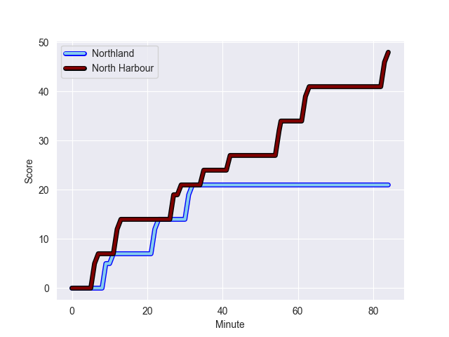
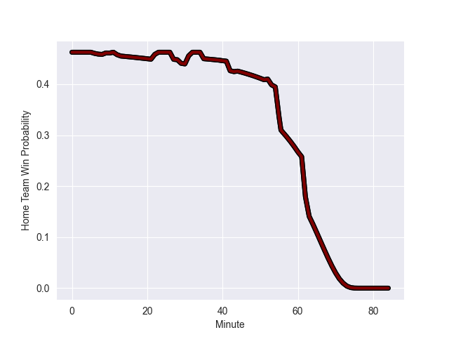

---  
layout: page  
title: North Harbour at Northland; 48.0-21.0  
date: 2022-09-18 00:35:00 18:00:00 -0500  
categories: match review  
---
# Prediction: North Harbour by 1.5

North Harbour by 6.5 on a neutral field
## Scores over Time

## Win Probability over Time

# Pre-Match Prediction: North Harbour by 1.1

North Harbour by 6.1 on a neutral pitch

|   Away Minutes | Away Player       |   Away elo |   Away Percentile |   Number |   Home Percentile |   Home elo | Home Player           |   Home Minutes |
|---------------:|:------------------|-----------:|------------------:|---------:|------------------:|-----------:|:----------------------|---------------:|
|             61 | Tevita Langi      |      78.45 |                39 |        1 |                77 |      87.97 | Jarred Adams          |             53 |
|             44 | Ray Niuia         |      84.95 |                74 |        2 |                12 |      74.83 | Bruce Kauika-Petersen |             72 |
|             84 | Isoa Nasilasila   |      79.69 |                42 |        4 |                45 |      79.44 | Josh Goodhue          |             64 |
|             56 | Danny Drake       |      87.41 |                75 |        5 |                17 |      75.15 | Liam Hallam-Eames     |             84 |
|             77 | Tamarau McGahan   |      82.51 |                62 |        6 |                48 |      81    | Rob Rush              |             84 |
|             84 | Jed Melvin        |      86.1  |                70 |        7 |                71 |      87.92 | Matt Polwart-Matich   |             84 |
|             60 | Lotu Inisi        |      84.67 |                60 |        8 |                43 |      81.43 | Sam McNamara          |             41 |
|             52 | Siaosi Nginingini |      78.39 |                40 |        9 |                72 |      86.91 | Sam Nock              |             56 |
|             84 | Bryn Gatland      |      91.95 |                77 |       10 |                25 |      77.62 | Rivez Reihana         |             56 |
|             84 | Tevita Li         |      97.13 |                87 |       11 |                56 |      82.21 | Heremaia Murray       |             84 |
|             55 | Henry Taefu       |      80.63 |                42 |       12 |                42 |      80.73 | Blake Hohaia          |             84 |
|             61 | Denny Solomona    |      83.1  |                57 |       13 |                66 |      86.26 | Tamati Tua            |             84 |
|             84 | Mark Telea        |      96.82 |                87 |       14 |                56 |      82.25 | Jone Macilai-Tori     |             54 |
|             84 | Shaun Stevenson   |      85.67 |                60 |       15 |                31 |      78.16 | Pisi Leilua           |             84 |
|             40 | Luteru Tolai      |      79.71 |                43 |       16 |                22 |      76.53 | Ross Wright           |             31 |
|             23 | Kalolo Tuiloma    |      79.42 |                39 |       17 |                50 |      80.8  | Esile Fono            |             12 |
|             23 | Alex Fidow        |      85.55 |                69 |       18 |                30 |      78.29 | Coree Te Whata-Colley |             44 |
|             28 | Felix Kalapu      |      77.08 |                26 |       19 |                50 |      81.35 | Allan Craig           |             20 |
|             31 | Cameron Suafoa    |      87.97 |                74 |       20 |                49 |      81.36 | Jonah Mau'u           |             43 |
|             32 | Jamie Booth       |      70.62 |                 4 |       21 |                19 |      75.94 | Lisati Milo-Harris    |             28 |
|             23 | Kade Banks        |      82.07 |                48 |       23 |                46 |      81.33 | Rene Ranger           |             30 |

