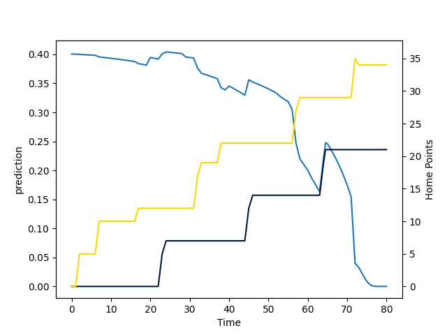

---  
layout: page  
title: Exeter Chiefs at Worcester Warriors; 36.0-21.0  
date: 2022-09-18 10:00:00 18:00:00 -0500  
categories: match review  
---
# Prediction: Exeter Chiefs by 12.5

Exeter Chiefs by 17.5 on a neutral field

# Pre-Match Prediction: Exeter Chiefs by 12.0

Exeter Chiefs by 17.0 on a neutral pitch
# Projection using minutes played for each player: Exeter Chiefs by 12.5

Exeter Chiefs by 17.5 on a neutral field

|   Away Minutes | Away Player          |   Away elo |   Away Percentile |   Number |   Home Percentile |   Home elo | Home Player       |   Home Minutes |
|---------------:|:---------------------|-----------:|------------------:|---------:|------------------:|-----------:|:------------------|---------------:|
|             64 | Alec Hepburn         |      83.25 |                55 |        1 |                 0 |      60.58 | Valery Morozov    |             20 |
|             56 | Jack Yeandle         |      97.17 |                80 |        2 |                55 |      84.16 | Curtis Langdon    |             56 |
|             29 | Marcus Street        |      73.3  |                 6 |        3 |                57 |      85.29 | Murray McCallum   |             61 |
|             53 | Jack Dunne           |      81.46 |                47 |        4 |                 4 |      71.04 | Joe Batley        |             80 |
|             80 | Jonny Gray           |      94.27 |                75 |        5 |                 1 |      67.42 | Andrew Kitchener  |             65 |
|             46 | Jannes Kirsten       |      84.02 |                60 |        6 |                 1 |      66.37 | Fergus Lee-Warner |             80 |
|             80 | Christ Tshiunza      |      78.93 |                39 |        7 |                14 |      76.79 | Cameron Neild     |             80 |
|             80 | Richard Capstick     |      71.3  |                 8 |        8 |                25 |      78.45 | Thomas Dodd       |             56 |
|             53 | Stu Townsend         |      86.1  |                59 |        9 |                13 |      76.25 | Gareth Simpson    |             74 |
|             80 | Harvey Skinner       |      78.25 |                35 |       10 |                73 |      93.92 | Owen Williams     |             56 |
|             80 | Olly Woodburn        |     100.98 |                90 |       11 |                 9 |      74.77 | Alex Hearle       |             80 |
|             40 | Ian Whitten          |      96.87 |                81 |       12 |                45 |      82.3  | Francois Venter   |             80 |
|             80 | Rory O'Loughlin      |      90.72 |                70 |       13 |                 4 |      70.77 | Ollie Lawrence    |             80 |
|             79 | Jack Nowell          |     111.59 |                98 |       14 |                33 |      79.36 | Perry Humphreys   |             58 |
|             80 | Joe Simmonds         |     103.8  |                92 |       15 |                18 |      77.72 | James Shillcock   |             80 |
|             24 | Jack Innard          |      78.84 |                32 |       16 |                 1 |      66.27 | Hame Faiva        |             24 |
|             16 | James Kenny          |      72.97 |                 7 |       17 |                66 |      88.71 | Rory Sutherland   |             60 |
|             51 | Patrick Schickerling |      83.39 |                53 |       18 |                27 |      77.71 | Jay Tyack         |             19 |
|             27 | Ruben van Heerden    |      93.49 |                71 |       19 |                14 |      75.21 | Graham Kitchener  |             15 |
|             34 | Dave Ewers           |     111.33 |                97 |       20 |                69 |      90.89 | Matt Kvesic       |             24 |
|             27 | Jack Maunder         |      78.88 |                23 |       21 |                96 |     110.82 | Will Chudley      |              6 |
|             40 | Solomone Kata        |      76.61 |                18 |       22 |                 0 |      63.79 | Billy Searle      |             24 |
|              1 | Facundo Cordero      |      89.13 |                69 |       23 |                48 |      81.93 | Noah Heward       |             22 |

