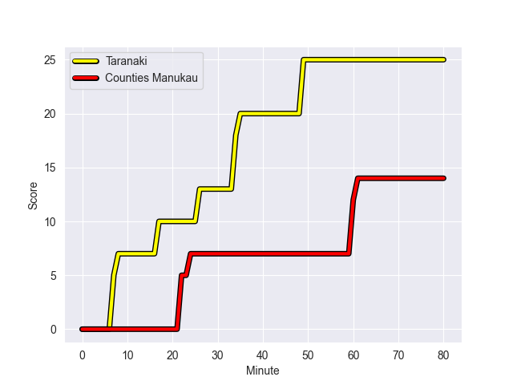
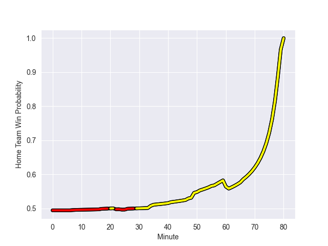

---  
layout: page  
title: Counties Manukau at Taranaki; 14.0-25.0  
date: 2022-09-21 03:05:00 18:00:00 -0500  
categories: match review  
---
# Prediction: Taranaki by 4.1

Counties Manukau by 0.9 on a neutral field
## Scores over Time

## Win Probability over Time

# Pre-Match Prediction: Counties Manukau by 2.9

Counties Manukau by 2.1 on a neutral pitch

|   Away Minutes | Away Player           |   Away elo |   Away Percentile |   Number |   Home Percentile |   Home elo | Home Player                   |   Home Minutes |
|---------------:|:----------------------|-----------:|------------------:|---------:|------------------:|-----------:|:------------------------------|---------------:|
|             58 | Kauvaka Kaivelata     |      81.89 |                49 |        1 |                 6 |      72.21 | Jared Proffit                 |             57 |
|             40 | Penisoni Fineanganofo |      81.15 |                51 |        2 |                19 |      76.75 | Ricky Riccitelli              |             80 |
|             51 | Suetena Asomua        |      76.72 |                20 |        3 |                39 |      79.77 | Kyle Stewart                  |             57 |
|             80 | Alex McRobbie         |      68.05 |                 2 |        4 |                23 |      76.61 | Mickey Wooliams               |             55 |
|             41 | Viliame Rarasea       |      80.49 |                47 |        5 |                32 |      78.05 | Hemopo Cunningham             |             55 |
|             80 | Adam Brash            |      82.24 |                49 |        7 |                37 |      79.28 | Tom Florence                  |             80 |
|             48 | Stefano Leavasa       |      83.61 |                53 |        8 |                 9 |      72.08 | Kaylum Boshier                |             80 |
|             66 | Cam Roigard           |      82.44 |                57 |        9 |                 4 |      70.74 | Logan Crowley                 |             51 |
|             80 | Riley Hohepa          |      76.37 |                19 |       10 |                 8 |      73.6  | Daniel Waite                  |             80 |
|             72 | Peniasi Malimali      |      77.44 |                24 |       11 |                68 |      85.54 | Kini Naholo                   |             55 |
|             41 | Amanaki Savieti       |      80.99 |                43 |       12 |                 1 |      66.59 | Teihorangi Walden             |             66 |
|             80 | Nikolai Foliaki       |      61.09 |                 0 |       13 |                20 |      77.06 | Meihana Grindlay              |             80 |
|             80 | Tevita Ofa            |      82.84 |                60 |       14 |                11 |      74.46 | Josh Setu                     |             80 |
|             39 | Sam Slade             |      73.29 |                13 |       19 |                70 |      85.46 | Mitch Brown                   |             25 |
|             22 | Jonathan Taumateine   |      75.23 |                17 |       21 |                73 |      87.7  | Liam Blyde                    |             29 |
|             24 | Ahsee Tuala           |      87.19 |                67 |       23 |                85 |      95.24 | Jacob Ratumaitavuki-Kneepkens |             33 |

