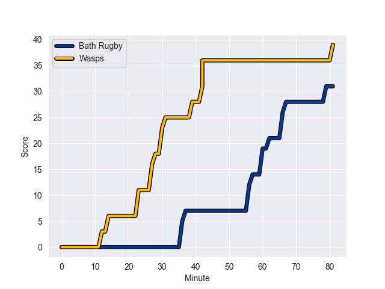
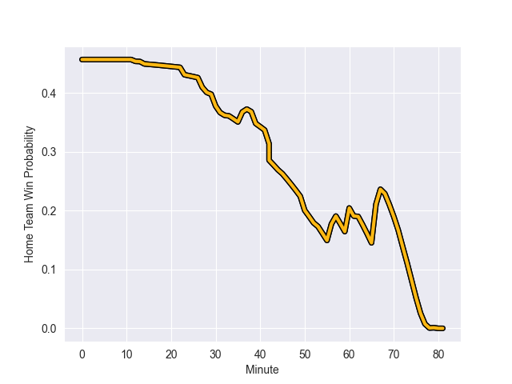

---  
layout: page  
title: Wasps at Bath Rugby; 39.0-31.0  
date: 2022-09-23 14:45:00 18:00:00 -0500  
categories: match review  
---
# Prediction: Wasps by 2.6

Wasps by 7.6 on a neutral field
## Scores over Time

## Win Probability over Time

# Pre-Match Prediction: Wasps by 2.0

Wasps by 7.0 on a neutral pitch

|   Away Minutes | Away Player       |   Away elo |   Away Percentile |   Number |   Home Percentile |   Home elo | Home Player           |   Home Minutes |
|---------------:|:------------------|-----------:|------------------:|---------:|------------------:|-----------:|:----------------------|---------------:|
|             53 | Tom West          |      83.96 |                68 |        1 |                11 |      74.84 | Lewis Boyce           |             50 |
|             33 | Dan Frost         |      84.37 |                69 |        2 |                79 |      89.45 | Tom Dunn              |             68 |
|             53 | Biyi Alo          |      97.13 |                92 |        3 |                 7 |      72.34 | Will Stuart           |             57 |
|             81 | Joe Launchbury    |      98.94 |                91 |        4 |                99 |     118.82 | Dave Attwood          |             62 |
|             50 | Kiran McDonald    |      80.6  |                48 |        5 |                 6 |      69.76 | Josh McNally          |             81 |
|             72 | Nizaam Carr       |      91.88 |                85 |        6 |                57 |      81.22 | Miles Reid            |             81 |
|             81 | Jack Willis       |      88.88 |                78 |        7 |                93 |     101.03 | Chris Cloete          |             18 |
|             81 | Tom Willis        |      74.43 |                10 |        8 |                16 |      76.02 | Richard de Carpentier |             45 |
|             54 | Will Porter       |      73.5  |                12 |        9 |                58 |      81.45 | Louis Schreuder       |             79 |
|             81 | Charlie Atkinson  |      80.63 |                45 |       10 |                 4 |      69.99 | Orlando Bailey        |             81 |
|             77 | Josh Bassett      |      94.31 |                84 |       11 |                 1 |      63.87 | Will Muir             |             81 |
|             68 | Burger Odendaal   |      96.77 |                86 |       12 |                 8 |      73.32 | Max Ojomoh            |             81 |
|             81 | Sam Spink         |      83.72 |                60 |       13 |                94 |     104.01 | Jonathan Joseph       |             81 |
|             18 | Francois Hougaard |     106.17 |                95 |       14 |                61 |      82.88 | Joe Cokanasiga        |             81 |
|             81 | Jacob Umaga       |      89.12 |                71 |       15 |                80 |      92.41 | Matt Gallagher        |             60 |
|             48 | Gabriel Oghre     |      77.67 |                26 |       16 |                42 |      79.3  | Tom Doughty           |             13 |
|             28 | Robin Hislop      |      80.75 |                47 |       17 |                22 |      75.47 | Juan Schoeman         |             31 |
|             28 | John Ryan         |      87.77 |                77 |       18 |                83 |      90.93 | Aranos Coetzee        |             24 |
|             31 | Tim Cardall       |      76.85 |                25 |       19 |                73 |      88.01 | Quinn Roux            |             19 |
|             31 | Dan Robson        |     109.54 |                96 |       21 |                36 |      78.19 | Max Green             |              2 |
|             13 | Ryan Mills        |      88.33 |                71 |       22 |                71 |      88.66 | Piers Francis         |             21 |
|             63 | Zach Kibirige     |      75.19 |                12 |       23 |                 3 |      69.94 | Josh Bayliss          |             63 |

