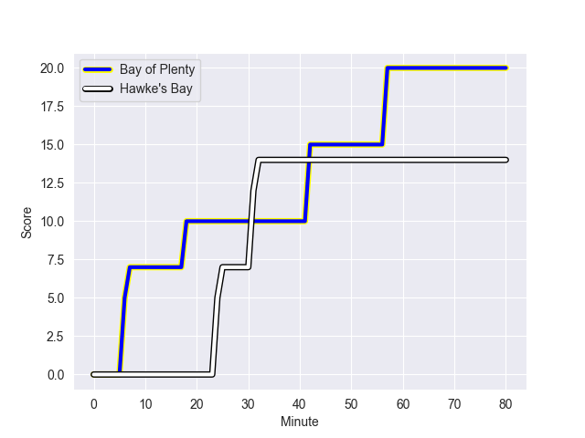
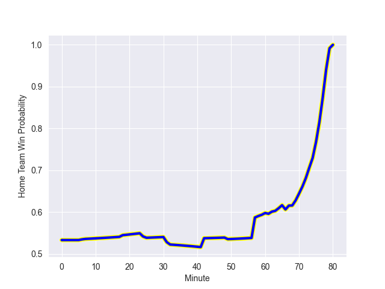

---  
layout: page  
title: Hawke's Bay at Bay of Plenty; 14.0-20.0  
date: 2022-09-23 22:05:00 18:00:00 -0500  
categories: match review  
---
# Prediction: Bay of Plenty by 10.8

Bay of Plenty by 5.8 on a neutral field
## Scores over Time

## Win Probability over Time

# Pre-Match Prediction: Bay of Plenty by 10.3

Bay of Plenty by 5.3 on a neutral pitch

|   Away Minutes | Away Player          |   Away elo |   Away Percentile |   Number |   Home Percentile |   Home elo | Home Player            |   Home Minutes |
|---------------:|:---------------------|-----------:|------------------:|---------:|------------------:|-----------:|:-----------------------|---------------:|
|             74 | Pouri Rakete-Stones  |      78.73 |                34 |        1 |                87 |      93.66 | Aidan Ross             |             66 |
|             74 | Tyrone Thompson      |      73.96 |                10 |        2 |                95 |     101.13 | Kurt Eklund            |             66 |
|             63 | Joe Apikotoa         |      77.78 |                26 |        3 |                70 |      85.73 | Tevita Mafileo         |             66 |
|             63 | Isaia Walker-Leawere |      98.03 |                91 |        4 |                61 |      82.74 | Justin Sangster        |             80 |
|             80 | Tom Parsons          |      81.3  |                50 |        5 |                 5 |      69.22 | Manaaki Selby-Rickit   |             80 |
|             80 | Marino Mikaele-Tu'u  |      75.59 |                14 |        6 |                77 |      88.96 | Naitoa Ah Kuoi         |             80 |
|             68 | Devan Flanders       |      80.88 |                42 |        8 |                20 |      76.91 | Nikora Broughton       |             70 |
|             63 | Brad Weber           |      96.03 |                84 |        9 |                67 |      85.05 | Te Toiroa Tahuriorangi |             80 |
|             80 | Lincoln McClutchie   |      75.26 |                12 |       10 |                58 |      83.89 | Kaleb Trask            |             80 |
|             49 | Jonah Lowe           |      82.07 |                56 |       11 |                80 |      91.52 | Nigel Ah Wong          |             80 |
|             61 | Nick Grigg           |      73.34 |                10 |       12 |                70 |      88.18 | Kaveinga Finau         |             74 |
|             80 | Stacey Ili           |      91.91 |                79 |       13 |                72 |      89.1  | Joey Walton            |             80 |
|             80 | Ollie Sapsford       |      80.49 |                46 |       14 |                79 |      91.12 | Emoni Narawa           |             80 |
|             80 | Chase Tiatia         |      85.5  |                61 |       15 |                54 |      83.79 | Gillies Kaka           |             66 |
|              6 | Mark Braidwood       |      80.01 |                43 |       17 |                68 |      86.14 | Haereiti Hetet         |             14 |
|             17 | Bryn Evans           |     123.39 |                99 |       19 |                45 |      82.08 | Zane Kapeli            |             10 |
|             21 | Solomone Funaki      |      79.83 |                40 |       20 |                 2 |      68.8  | Penitoa Finau          |             12 |
|             17 | Ere Enari            |      73.65 |                15 |       21 |                41 |      80.27 | Luke Donaldson         |              0 |
|             31 | Neria Foma'i         |      92.02 |                80 |       23 |                12 |      75.67 | Lalamilo Lalamilo      |              6 |

