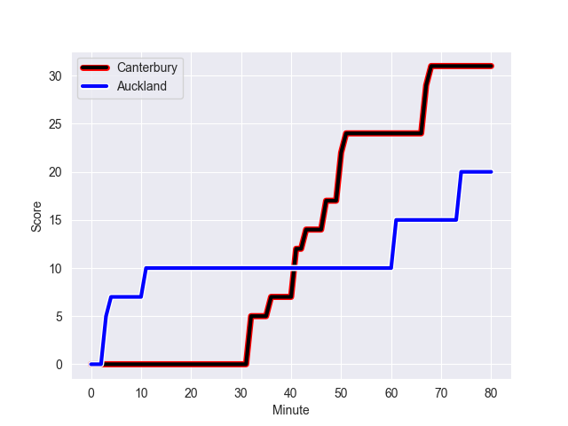
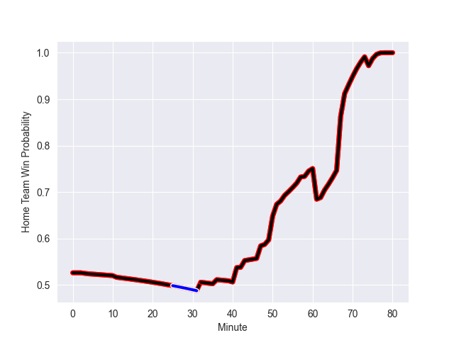

---  
layout: page  
title: Auckland at Canterbury; 20.0-38.0  
date: 2022-09-23 03:05:00 18:00:00 -0500  
categories: match review  
---
# Prediction: Canterbury by 9.2

Canterbury by 4.2 on a neutral field
## Scores over Time

## Win Probability over Time

# Pre-Match Prediction: Canterbury by 8.9

Canterbury by 3.9 on a neutral pitch

|   Away Minutes | Away Player     |   Away elo |   Away Percentile |   Number |   Home Percentile |   Home elo | Home Player      |   Home Minutes |
|---------------:|:----------------|-----------:|------------------:|---------:|------------------:|-----------:|:-----------------|---------------:|
|             57 | Alex Hodgman    |      86.55 |                72 |        1 |                50 |      81.09 | Tamaiti Williams |             53 |
|             77 | Soane Vikena    |      80.36 |                47 |        2 |                82 |      91.02 | Brodie McAlister |             62 |
|             62 | Marcel Renata   |      84.42 |                67 |        3 |                85 |      92.31 | Oli Jager        |             60 |
|             62 | Josh Beehre     |      79.91 |                44 |        4 |                34 |      78.16 | Sam Darry        |             80 |
|             80 | Hamish Dalzell  |      81.66 |                66 |        5 |                47 |      80.48 | Dom Gardiner     |             60 |
|             80 | Blake Gibson    |      82.04 |                56 |        6 |                62 |      83.44 | Billy Harmon     |             80 |
|             80 | Niko Jones      |      79.55 |                40 |        7 |                89 |      96.12 | Tom Christie     |             80 |
|             50 | Jackson Pugh    |      77.16 |                20 |        8 |                38 |      80.2  | Liam Allen       |             49 |
|             58 | Taufa Funaki    |      73.86 |                13 |        9 |                83 |      95.02 | Mitch Drummond   |             49 |
|             80 | Harry Plummer   |      93.41 |                79 |       10 |                45 |      80.63 | Alex Harford     |             80 |
|             80 | Joel Cobb       |      82.11 |                56 |       11 |                96 |     107.18 | George Bridge    |             77 |
|             58 | Corey Evans     |      83.63 |                60 |       12 |                33 |      78.97 | Rameka Poihipi   |             80 |
|             73 | Bryce Heem      |     113.66 |                98 |       13 |                71 |      87.86 | Dallas McLeod    |             63 |
|             80 | AJ Lam          |      76.85 |                21 |       14 |                69 |      86.4  | Manasa Mataele   |             62 |
|             80 | Salesi Rayasi   |      94.49 |                83 |       15 |                74 |      89.48 | Chay Fihaki      |             80 |
|              0 | Robbie Abel     |      93.2  |                87 |       16 |                61 |      82.59 | George Bell      |             18 |
|             23 | Jordan Lay      |      80.12 |                44 |       17 |                72 |      86.42 | Finlay Brewis    |             27 |
|             18 | Connor Vest     |      74.94 |                17 |       19 |                60 |      82.71 | Zach Gallagher   |             20 |
|             30 | Vaiolini Ekuasi |      79.48 |                39 |       20 |                64 |      83.66 | Corey Kellow     |             31 |
|             22 | Manu Paea       |      81.29 |                51 |       21 |                90 |     102.42 | Willi Heinz      |             31 |
|             22 | Simon Hickey    |      93.57 |                80 |       22 |                51 |      81.98 | Isaiah Punivai   |             18 |

