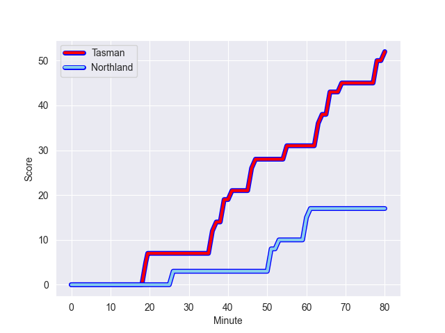
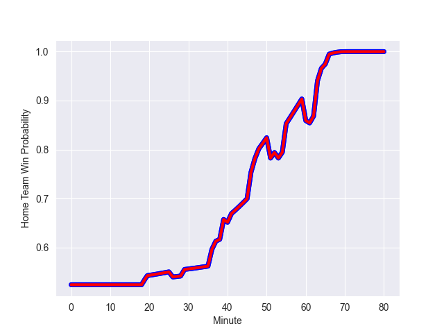

---  
layout: page  
title: Northland at Tasman; 17.0-52.0  
date: 2022-09-23 22:05:00 18:00:00 -0500  
categories: match review  
---
# Prediction: Tasman by 9.2

Tasman by 4.2 on a neutral field
## Scores over Time

## Win Probability over Time

# Pre-Match Prediction: Tasman by 8.5

Tasman by 3.5 on a neutral pitch

|   Away Minutes | Away Player           |   Away elo |   Away Percentile |   Number |   Home Percentile |   Home elo | Home Player             |   Home Minutes |
|---------------:|:----------------------|-----------:|------------------:|---------:|------------------:|-----------:|:------------------------|---------------:|
|             50 | Jarred Adams          |      86.41 |                72 |        1 |                31 |      78.45 | Kershawl Sykes-Martin   |             51 |
|             61 | Matt Moulds           |      76.78 |                20 |        2 |                67 |      83.82 | Andrew Makalio          |             61 |
|             53 | Coree Te Whata-Colley |      77    |                30 |        3 |                78 |      88.2  | Atu Moli                |             51 |
|             48 | Josh Goodhue          |      77.56 |                30 |        4 |                55 |      81.95 | Te Ahiwaru Cirikidaveta |             69 |
|             80 | Sam Caird             |      65.83 |                 2 |        5 |                34 |      78.44 | Quinten Strange         |             69 |
|             80 | Matt Polwart-Matich   |      85.45 |                69 |        6 |                26 |      77.04 | Max Hicks               |             80 |
|             55 | Jonah Mau'u           |      80.1  |                50 |        7 |                60 |      83.11 | Fletcher Anderson       |             80 |
|             80 | Rob Rush              |      78.53 |                32 |        8 |                46 |      82.01 | Sione Talitui           |             80 |
|             48 | Sam Nock              |      85.27 |                67 |        9 |                32 |      77.86 | Noah Hotham             |             65 |
|             63 | Rivez Reihana         |      75.97 |                16 |       10 |                19 |      76.38 | William Havili          |             69 |
|             80 | Heremaia Murray       |      79.74 |                39 |       11 |                31 |      78.62 | Macca Springer          |             80 |
|             41 | Blake Hohaia          |      78.26 |                29 |       12 |                64 |      85.12 | Alex Nankivell          |             80 |
|             80 | Rene Ranger           |      80.45 |                46 |       13 |                62 |      84.63 | Levi Aumua              |             61 |
|             80 | Pisi Leilua           |      75.69 |                16 |       14 |                60 |      82.73 | Fetuli Paea             |             80 |
|             72 | Joshua Moorby         |      80.51 |                41 |       15 |                10 |      73.62 | Taine Robinson          |             80 |
|             19 | Bruce Kauika-Petersen |      72.71 |                 8 |       16 |                92 |      97.6  | Quentin MacDonald       |             19 |
|             27 | Sila Puafisi          |      77.65 |                25 |       18 |                37 |      79.11 | Samuel Matenga          |             29 |
|             32 | Liam Hallam-Eames     |      72.68 |                11 |       19 |                 3 |      67.44 | Mahroni Ngakuru         |             11 |
|             32 | Lisati Milo-Harris    |      75.12 |                20 |       21 |                30 |      78.11 | Louie Chapman           |             15 |
|             25 | Daniel Hawkins        |      65.84 |                 0 |       22 |                 7 |      73.64 | Campbell Parata         |             11 |
|             39 | Tamati Tua            |      83.8  |                60 |       23 |                 7 |      72.06 | Timoci Tavatavanawai    |             19 |

