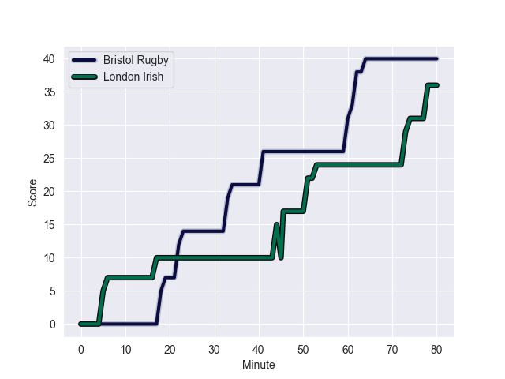
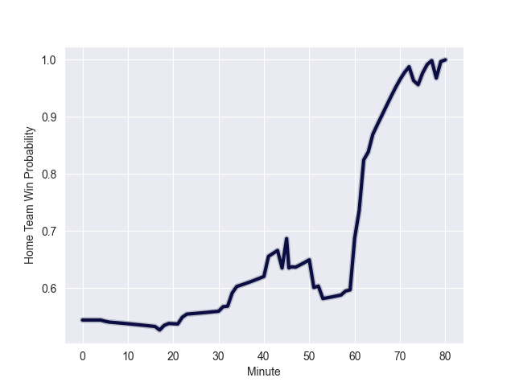

---  
layout: page  
title: London Irish at Bristol Rugby; 36.0-40.0  
date: 2022-09-24 10:00:00 18:00:00 -0500  
categories: match review  
---
# Prediction: Bristol Rugby by 12.6

Bristol Rugby by 7.6 on a neutral field
## Scores over Time

## Win Probability over Time

# Pre-Match Prediction: Bristol Rugby by 12.4

Bristol Rugby by 7.4 on a neutral pitch

|   Away Minutes | Away Player                |   Away elo |   Away Percentile |   Number |   Home Percentile |   Home elo | Home Player    |   Home Minutes |
|---------------:|:---------------------------|-----------:|------------------:|---------:|------------------:|-----------:|:---------------|---------------:|
|             31 | Will Goodrick-Clarke       |      77.62 |                25 |        1 |                81 |      89.68 | Ellis Genge    |             61 |
|             77 | Isaac Miller               |      77.06 |                30 |        2 |                25 |      77.54 | Will Capon     |             58 |
|             45 | Oli Hoskins                |      89.29 |                80 |        3 |                88 |      93.83 | Kyle Sinckler  |             58 |
|             65 | Api Ratuniyarawa           |      79.98 |                43 |        4 |                53 |      81.2  | Ed Holmes      |             80 |
|             80 | Rob Simmons                |     101.51 |                94 |        5 |                75 |      88.2  | Joe Joyce      |             47 |
|             80 | Matt Rogerson              |      84.14 |                59 |        6 |                63 |      83.31 | Chris Vui      |             80 |
|             80 | Tom Pearson                |      89.7  |                78 |        7 |                20 |      77.27 | Jake Heenan    |             61 |
|             64 | Ben White                  |      74.89 |                17 |        9 |                81 |      91.41 | Harry Randall  |             64 |
|             80 | Paddy Jackson              |      95.2  |                83 |       10 |                86 |      97.73 | AJ MacGinty    |             80 |
|             80 | Ollie Hassell-Collins      |      78.22 |                30 |       11 |                33 |      81.51 | Richard Lane   |             80 |
|             80 | Benhard Janse van Rensburg |      81.02 |                43 |       12 |                73 |      89.18 | Sam Bedlow     |             64 |
|             80 | Curtis Rona                |      91.92 |                78 |       13 |                10 |      74.78 | Piers O'Conor  |             80 |
|             76 | Will Joseph                |      81.59 |                55 |       14 |                99 |     124.95 | Luke Morahan   |             80 |
|             68 | Henry Arundell             |      79.85 |                40 |       15 |                80 |      93.52 | Charles Piutau |             74 |
|             49 | Danilo Fischetti           |      66.72 |                 1 |       17 |                77 |      87.8  | Jake Woolmore  |             19 |
|             35 | Lovejoy Chawatama          |      73.59 |                 8 |       18 |                75 |      87.52 | Max Lahiff     |             22 |
|             19 | Ben Donnell                |      78.52 |                32 |       20 |                79 |      89.73 | Daniel Thomas  |             19 |
|             12 | James Stokes               |      79.69 |                39 |       22 |                69 |      88.08 | Callum Sheedy  |             16 |
|              4 | Ben Loader                 |      81.74 |                53 |       23 |                85 |      95.58 | Henry Purdy    |              6 |

