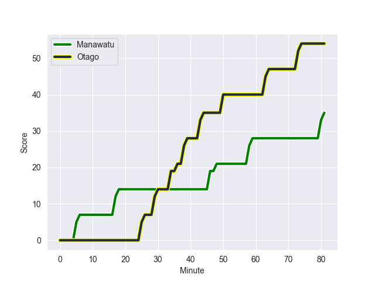
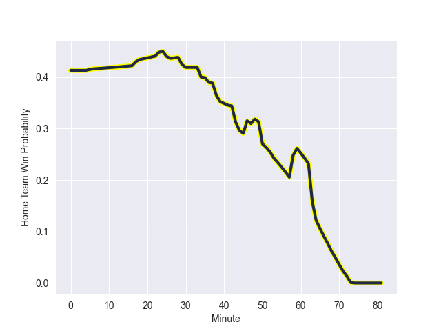

---  
layout: page  
title: Otago at Manawatu; 54.0-35.0  
date: 2022-09-24 21:05:00 18:00:00 -0500  
categories: match review  
---
# Prediction: Otago by 10.2

Otago by 15.2 on a neutral field
## Scores over Time

## Win Probability over Time

# Pre-Match Prediction: Otago by 10.8

Otago by 15.8 on a neutral pitch

|   Away Minutes | Away Player            |   Away elo |   Away Percentile |   Number |   Home Percentile |   Home elo | Home Player          |   Home Minutes |
|---------------:|:-----------------------|-----------:|------------------:|---------:|------------------:|-----------:|:---------------------|---------------:|
|             53 | Abraham Pole           |      82.6  |                59 |        1 |                 7 |      73.55 | Joseph Gavigan       |             50 |
|             74 | Henry Bell             |      80.3  |                47 |        2 |                 2 |      69.1  | Siua Maile           |             23 |
|             53 | Jermaine Ainsley       |      78.73 |                33 |        3 |                 5 |      71.75 | Sean Paranihi        |             42 |
|             72 | Fabian Holland         |      88.21 |                75 |        4 |                 9 |      72.08 | Micaiah Torrence     |             81 |
|             58 | William Tucker         |      83.27 |                61 |        5 |                32 |      78.03 | Ofa Tauatevalu       |             64 |
|             76 | Oliver Haig            |      86.78 |                71 |        6 |                 5 |      70.68 | Te Kamaka Howden     |             51 |
|             81 | Sean Withy             |      81.54 |                49 |        7 |                 8 |      72.52 | Johnny Galloway      |             81 |
|             65 | Christian Lio-Willie   |      79.79 |                34 |        8 |                 3 |      64.8  | Brayden Iose         |             81 |
|             52 | Kemara Hauiti-Parapara |      93.54 |                83 |        9 |                17 |      75.24 | Luke Campbell        |             60 |
|             81 | Cameron Millar         |      84.24 |                59 |       10 |                58 |      83.67 | Brett Cameron        |             60 |
|             81 | Josh Ioane             |      73.47 |                 9 |       12 |                 0 |      64.12 | Jason Emery          |             70 |
|             81 | Mitchell Scott         |      82.67 |                61 |       13 |                43 |      80.8  | Kegan Christian-Goss |             81 |
|             81 | Freedom Vahaakolo      |      80.83 |                47 |       14 |                 0 |      60.07 | Tima Fainga'anuku    |             81 |
|             81 | Sam Gilbert            |      84.76 |                59 |       15 |                14 |      74.71 | Drew Wild            |             81 |
|             28 | Tau Koloamatangi       |      81.27 |                57 |       17 |                 7 |      72.43 | Harrison Allan       |             31 |
|             28 | Josh Hohneck           |      89.69 |                79 |       18 |                17 |      76.09 | Flyn Yates           |             39 |
|             23 | Josh Hill              |      76.09 |                21 |       19 |                 1 |      62.04 | Veikoso Poloniati    |             17 |
|             16 | James Lentjes          |      83.75 |                63 |       20 |                 5 |      71.76 | Potu Leavasa         |             30 |
|             14 | Samuel Fischli         |      80.85 |                47 |       23 |                 1 |      68.32 | Louis Rogers         |             11 |

