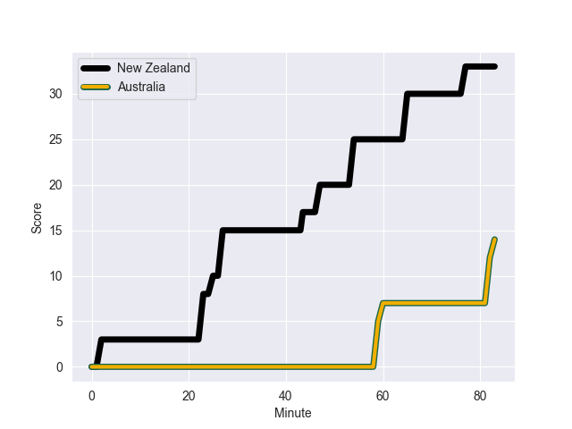
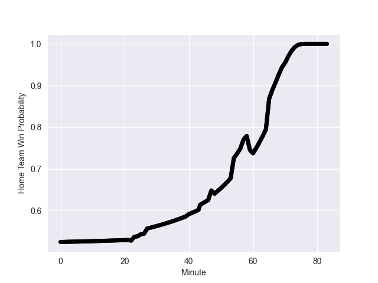

---  
layout: page  
title: Australia at New Zealand; 14.0-40.0  
date: 2022-09-24 03:05:00 18:00:00 -0500  
categories: match review  
---
# Prediction: New Zealand by 9.4

New Zealand by 4.4 on a neutral field
## Scores over Time

## Win Probability over Time

# Pre-Match Prediction: New Zealand by 9.8

New Zealand by 4.8 on a neutral pitch

|   Away Minutes | Away Player      |   Away elo |   Away Percentile |   Number |   Home Percentile |   Home elo | Home Player         |   Home Minutes |
|---------------:|:-----------------|-----------:|------------------:|---------:|------------------:|-----------:|:--------------------|---------------:|
|             40 | James Slipper    |      93.51 |                87 |        1 |                34 |      78.76 | Ethan de Groot      |             57 |
|             58 | Dave Porecki     |      86.14 |                74 |        2 |                54 |      80.98 | Codie Taylor        |             57 |
|             66 | Allan Alaalatoa  |      95.65 |                90 |        3 |                82 |      90.43 | Tyrel Lomax         |             57 |
|             48 | Jed Holloway     |      79.07 |                38 |        4 |                91 |      98.53 | Brodie Retallick    |             68 |
|             83 | Cadeyrn Neville  |     102.49 |                95 |        5 |                99 |     117.93 | Samuel Whitelock    |             83 |
|             83 | Rob Valetini     |      91.43 |                79 |        6 |                93 |     100.52 | Akira Ioane         |             70 |
|             83 | Pete Samu        |     101.14 |                94 |        7 |                94 |     101.37 | Dalton Papalii      |             83 |
|             48 | Harry Wilson     |      90.97 |                83 |        8 |                89 |     101.89 | Ardie Savea         |             83 |
|             48 | Jake Gordon      |      76.55 |                23 |        9 |                81 |      91.44 | Aaron Smith         |             57 |
|             75 | Bernard Foley    |     101.93 |                90 |       10 |                91 |     105.86 | Richie Mo'unga      |             83 |
|             83 | Marika Koroibete |      89.15 |                74 |       11 |                10 |      74.19 | Caleb Clarke        |             83 |
|             22 | Lalakai Foketi   |      87.67 |                69 |       12 |                91 |     101.55 | Jordie Barrett      |             83 |
|             83 | Len Ikitau       |      93.43 |                81 |       13 |                21 |      77.41 | Rieko Ioane         |             83 |
|             83 | Tom Wright       |      84.29 |                65 |       14 |                84 |      94.29 | Will Jordan         |             68 |
|             76 | Andrew Kellaway  |      94.66 |                83 |       15 |                92 |     107.91 | Beauden Barrett     |             70 |
|             25 | Folau Fainga'a   |      96.47 |                90 |       16 |                72 |      85.41 | Samisoni Taukei'aho |             26 |
|             43 | Angus Bell       |      88.37 |                78 |       17 |                95 |     102.2  | Ofa Tu'ungafasi     |             26 |
|             17 | Pone Fa'amausili |      81.45 |                57 |       18 |                84 |      92.14 | Nepo Laulala        |             26 |
|             35 | Nick Frost       |      72.15 |                11 |       19 |                68 |      84.99 | Tupou Vaa'i         |             15 |
|             35 | Fraser McReight  |      84.17 |                63 |       20 |                74 |      89.33 | Hoskins Sotutu      |             13 |
|             35 | Nic White        |     122.8  |                99 |       21 |                73 |      89.04 | Finlay Christie     |             26 |
|             15 | Reece Hodge      |      87.53 |                65 |       22 |                 6 |      71.43 | Roger Tuivasa-Sheck |             13 |
|             61 | Jordan Petaia    |      91.78 |                80 |       23 |                97 |     107.75 | Sevu Reece          |             15 |

